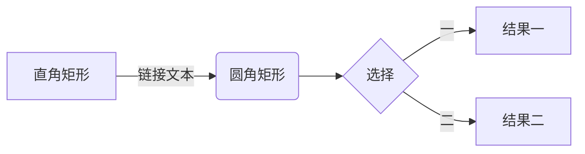

# Markdown实操

# 1.标题

# 标题1

## 标题2

### 标题3

#### 标题4

##### 标题5

###### 标题6

（最多只能到标题6为止）

# 2.段落

编译器里顶行写文本就会生成段落，各个段落之间用空行分割

在文本之间有一个空行，才会生成一个段落

Markdown不支持缩进，只能使用CSS控制缩进，段落前面有超过一个空白符就会生成换行标签，有超过一个换行符，就会生成一个段落（注意是一个段落由不管多少个换行符生成）

# 3.换行

在一行文本后添加两个以上空格，就会生成换行符

同下面的有序列表一样,Marktext看到的是已经编译好的样子,不是代码状态,所以在已经编译好的页面上使用两个空格会让编译器认为你写的就是这么有个性

这是一段文本  这是一段文本

上面这段文字会分成两段显示(只在代码页面这么写会被引擎渲染成这样)

# 4.粗体、斜体和删除线

## 粗体

**这是粗体**

__这是粗体__

使用两个星号或者下划线

## 斜体

*这是一个斜体*

_这是一个斜体_

使用一个星号或者下划线

## 粗斜体

**_使用三个星号或者下划线，再或者下划线星号混用_**

## 删除线

~~使用两个波浪号，引擎会生成删除线~~

## **标准定义**

粗体使用两个星号：**这是粗体**

斜体使用两个下划线：__这是下划线__

粗斜体使用两个星号一个下划线：**_这是粗斜体_**‘

# 有序列表

有序列表不需要空行


1. 有序列表1

2. 有序列表2

在Marktext中只要输入1.就可以直接生成(类似于notion中的块)而不用两个写在一行,这样 编译器只当成你就这么有个性地写

# 无序项目列表

- 一个减号(-)

- 一个星号(*)

- 一个加号(+)

# 列表嵌套

1. 在一个有序列表中

   1. 写完一行文字后面加上来两个空格

      1. 再添加下一个序号下一段文字内容

         1. 就会生成子列表(这里只要按一下TAB就可以)

# 任务列表

- [ ] 比较麻烦的是要先输入-加空格，然后[]，再将光标跳转到尾部后空格一次

# 定义列表

列表头 1
: 列表项 11
: 列表项 12
列表头 2
: 列表项 21
: 列表项 22

Marktext中暂不支持

# 添加图片

可以直接ctrl+V复制进来,但是也可以用原始的方法


![方括号里填写图片的名字]  (后面的圆括号中填写图片地址)

不加地址的话本质上前面的部分是一个**文本超链接**

只加一个方括号

[![这是一张图片] (圆括号内填写图片位置)(最后面用圆括号放进链接)]

也算是一种嵌套

# 添加带有标题的图片


传统的Markdown编译器并不支持显示标题,标题只能作为额外信息,帮助视觉受损用户阅读

![这是图片名称] (这是图片链接"双引号之中直接写上标题")

# 输入Emoji表情

直接输入自然不必多说

将表情短码放在两个冒号之间

"笑哭"的表情代码是joy

:joy:

大笑的表情代码是laughing

:laughing:

流汗黄豆sweat_smile,失望黄豆disappointed_relieved,冷汗黄豆cold_sweat

:sweat_smile:           :disappointed_relieved:          :cold_sweat:

一般使用相应的英文名称就能打出对应的符号表情

# 创建表格

使用|作为分列符,使用|--- |标识上面的文字是表头

| 第一列 | 第二列 | 第三列 |
| --- | --- | --- |
|     |     |     |

|第一列|第二列|第三列|

|:---|:---:|---:|

分别表示这一列是左对齐,居中对齐,右对齐

# 脚注说明

定义方式

这是一个带有脚注的文本[^1^]

[^脚注名称]: 脚注内容

# 行内公式

$a^2+b^2=c^2$

$a^2+b^2=c^2后面再加上一个美元符号

可以跟写代码注释一样使用多行公式

$$
f(x) = \int_{-\infty}^\infty
 \hat{f}(\xi)\,e^{2 \pi i \xi x}\,d\xi

$$

$$
f(x) = \int_{-\infty}^\infty
 \hat{f}(\xi)\,e^{2 \pi i \xi x}\,d\xi
$$

$$
f(x) = \int_{-\infty}^\infty
    \hat{f}(\xi)\,e^{2 \pi i \xi x}\,d\xi

$$

输入方法是先两个美元符号，然后在中间熟人价公式，两个美元符号内允许换行

# 输入流程图




按照顺序输入上面的内容后就可以出现

```可以视作是指令的一种，类似于notion的/

# 注释

尖括号加问号加注释内容

<?注释内容>

或者

<!-- 注释内容-->

**一般使用第二种**
