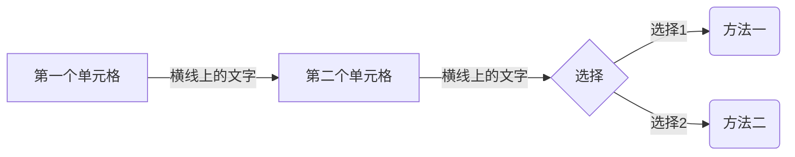

# Markdown第三次

### 标题

# 标题1

## 标题2

### 换行

编译器中：

在每一句的结尾输入两个以上的空格、制表符、回车键引擎自动生成段落

Markdown不支持缩进，如果需要需要使用CSS

### 粗体、斜线和删除线

##### 粗体

**使用两个星号**

__使用两个下划线__

##### 斜体

*使用一个星号*

_使用一个下划线_

##### 粗斜体

**_使用两个星号和一个下划线_**

__*使用两个下划线和一个星号*__

建议写法是粗体使用两个星号，斜体使用一个下划线，粗斜体使用两个星号一个下划线

##### 删除线

~~使用两个波浪号~~

### 有序列表

1. 数字一在段落首行后面一个小数点和空格

2. 按下回车后引擎会自动生成下一个序号

3. 在源码编译器中Markdown会直接忽略前导数字，都是从一开始

4. 可以再有序列表中嵌套使用列表

### 无序列表

+ 使用加号

  - 使用减号

    * 使用星号

### 列表嵌套

* 无序列表中嵌套有序列表

  1. 还可以嵌套前面的**粗体**，_斜体_，~~删除线~~

     - 多级嵌套

### 任务列表

- [ ] 先创建无序列表，然后方括号，方括号中有空格，再在方括号外面再用一个空格

- [ ] 方括号中的空格表示未选中，填入X表示已选中

### 引用

> 使用向右的尖括号+空格表示引用
>
> > 可以在引用中嵌套引用

注意，在编译器界面引用内容有多行内容，需要每一行都需要用尖括号开头

> 第一行引用
>
> 引用的内容中间不能有空行
>
> 在源码编译界面是
>
> .>第一行引用
>
> .>
>
> .>第二行

### 代码块

##### 局部代码

` 使用两个反点号,中间的内容是代码 `

在文本的每一行缩进四个空格(TAb)就能生成代码块

##### 围栏式代码块

使用三个反点号,然后反点号后面标记编程语言，引擎会自动生成该编程与样的高亮，调整排版

```javascript
第一行
第二行
第三行
```

### 列表

使用竖线分割列，行与行之间不用输入分割线，边框的竖线一定要输入

| 表头1             | 表头2   | 表头3   |
| --------------- | ----- | ----- |
| 在这一行一般使用\|---\| | ---\| | ---\| |

### 分割线

使用三个以上减号

---

使用三个以上下划线

___

使用三个以上星号

****

编译器中一般使用三个，在类似Marktext中一般用四个，因为输入四个比三个方便

### 超链接

##### 文字超链接

[使用方括号，括起要显示的文件名] (括号中填要链接到的位置地址)

[使用方括号，括起要显示的文件名](括号中填要链接到的位置地址)

##### 单纯网站链接

<http://www.baidu.com>

使用尖括号括起网站网址

不能直接输入www.baidu.com，前面需要输入网址所遵循的协议

### 图片

##### 普通图片

感叹号开头![图片名称] (图片位置地址)


##### 带标签（title）的图片

![图片名称] (图片地址"双引号中插入标签")


### Emoji表情

:双引号中放入表情代码即可:

流汗黄豆：:sweat_smile:

失望流泪：:disappointed_relieved:

冷汗黄豆：:cold_sweat:

笑哭黄豆：:joy:

Marktext中输入表情的英文意思，就能筛选出表情

### 脚注

首先生成脚注编号：[^1^]

脚注内容遵循的格式：[^名称]:内容

### 公式

##### 行内公式

在一行文本内使用公式

`$ 使用两个美元符号中间包裹住表达式 $ `

$a^2+b^2=c^2$

##### 块公式

在多行公式表达式的前一行和后一行都使用两个美元符号包裹

```markdown
$$
第一行公式
第二行公式
第三行公式
$$
```

### 图表

- 这里只演示流程图

- 首先使用meraid命令起订多行代码

- flowchart LR表示流程图

- 方括号中输入流程单元框

- 圆括号表示圆角矩形流程单元框

- 大括号表示方形单元框（一般是选择单元框）

- 竖线中输入流程箭头上的显示文本

- -->表示箭头

每一个流程单元都用英文字母表示，只根据字母的出现顺序决定流程图的顺序，而不根据ABCD的命名决定

```markdown

```


### 注释

两种注释格式的写法

<!--注释内容-->

<?注释内容>

注释只支持部分Markdown编译器，但是html中支持，所以Markdown文档可以使用html注释已达到Markdown注释的效果

一般标准注释写法是第一种
