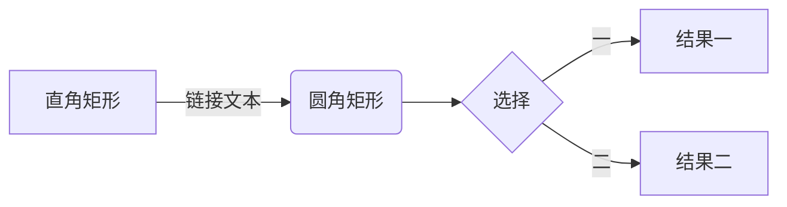
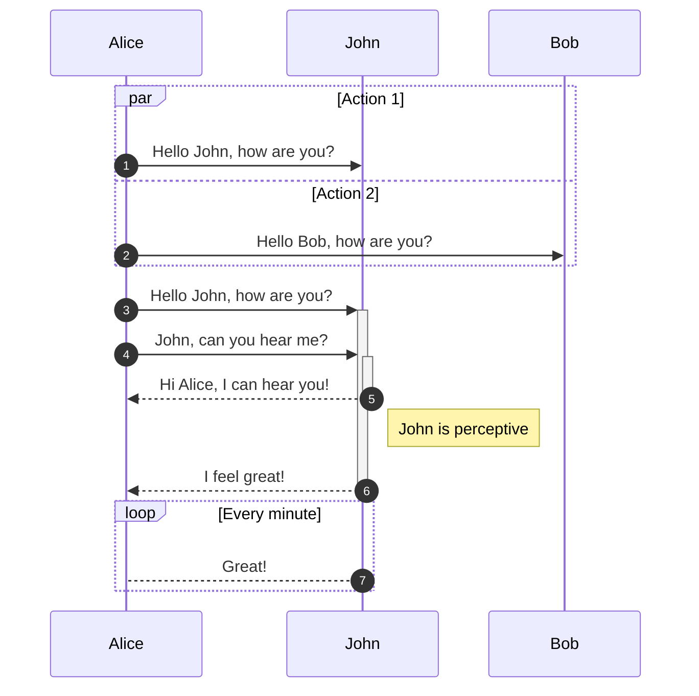
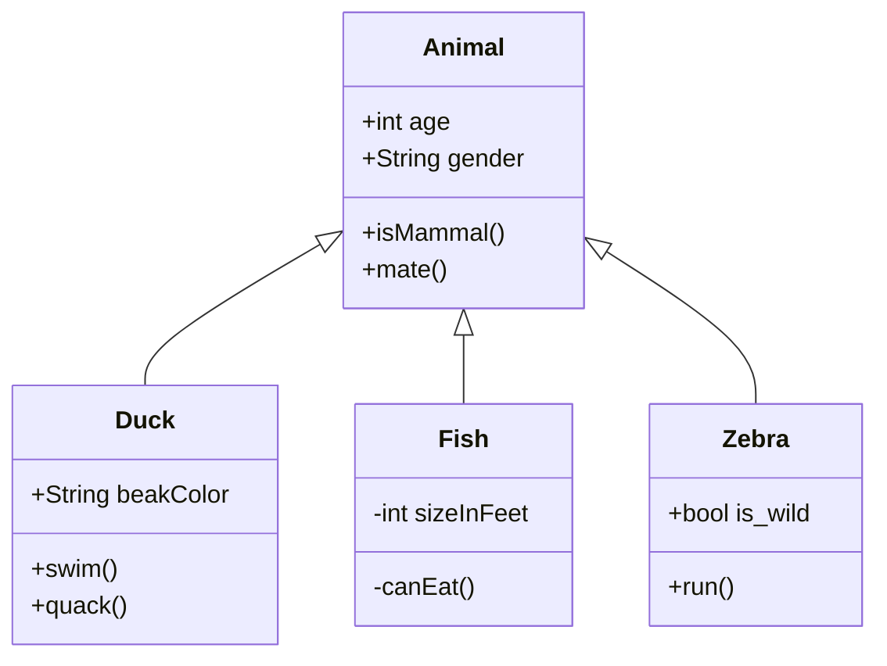
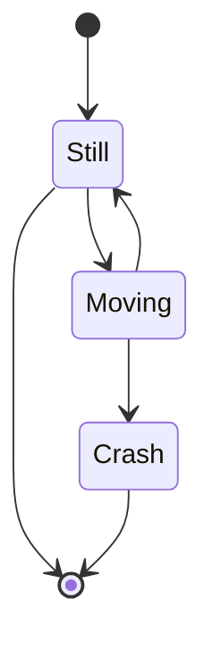
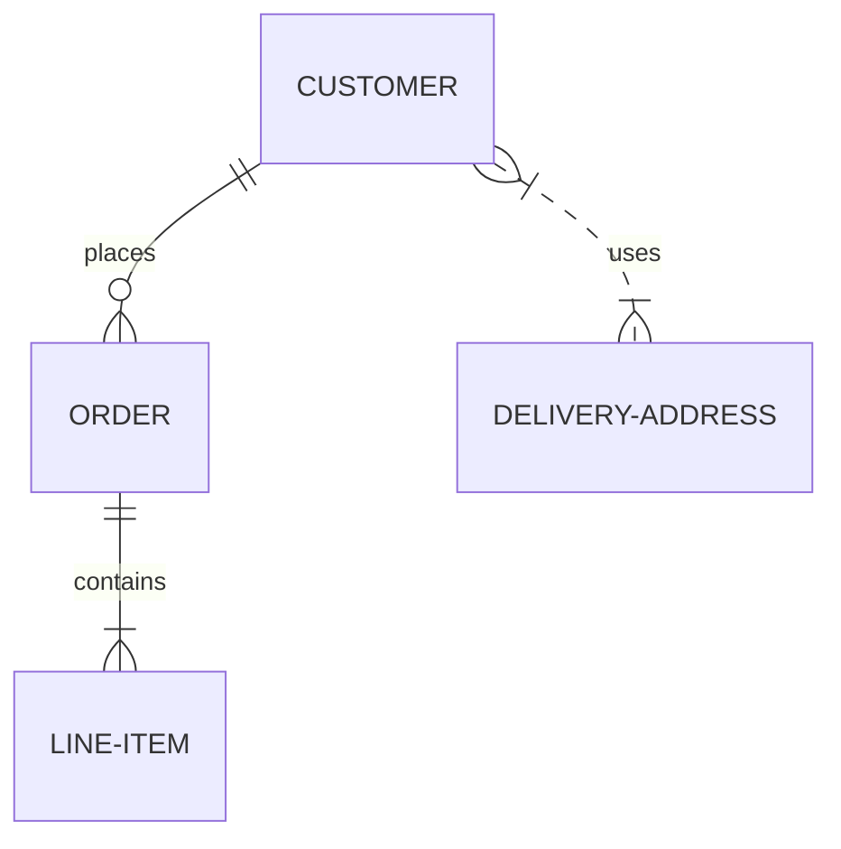
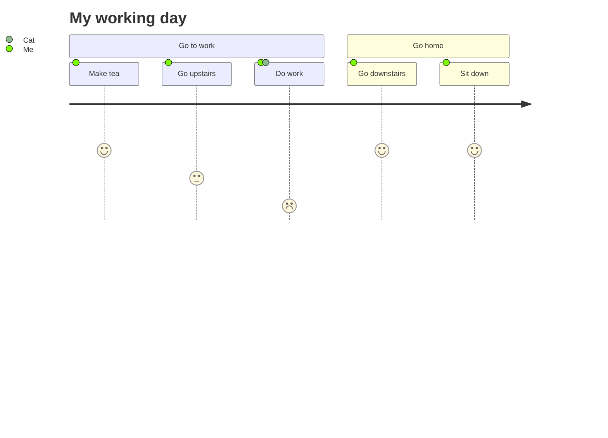
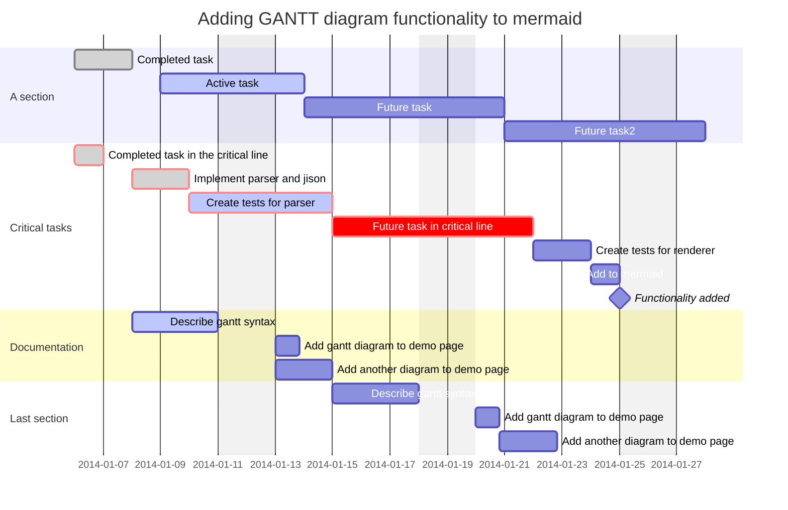
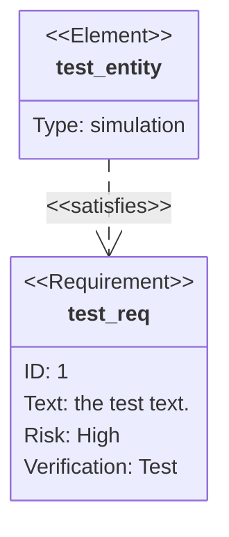
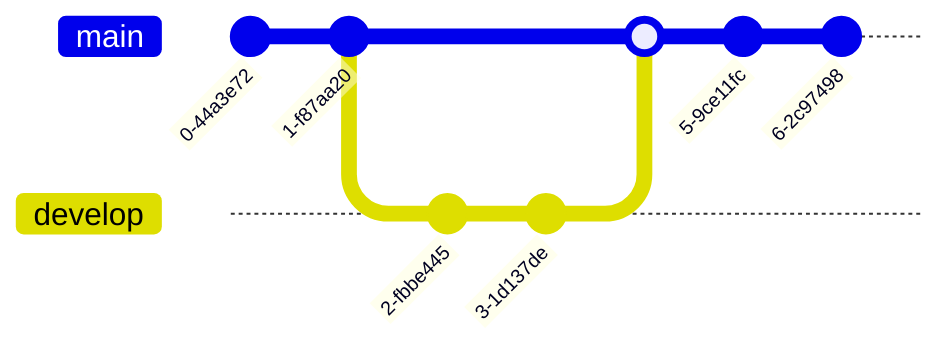
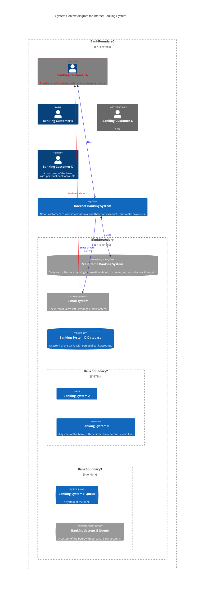

- 标题

## 1.1 常用语法[](https://iamhefang.cn/tutorials/markdown/%E6%A0%87%E9%A2%98#11-%E5%B8%B8%E7%94%A8%E8%AF%AD%E6%B3%95)

Markdown 的标题和 HTML 的标题一致，分为 6 级。分别在一行的开头放 1 到 6 个 `#` 加空格再加标题内容。

|   |   |   |
|---|---|---|
|Markdown|HTML|预览|
|`# 标题 1`|`<h1>标题 1</h1>`|**标题 1**|
|`## 标题 2`|`<h2>标题 2</h2>`|**标题 2**|
|`### 标题 3`|`<h3>标题 3</h3>`|**标题 3**|
|`#### 标题 4`|`<h4>标题 4</h4>`|**标题 4**|
|`##### 标题 5`|`<h5>标题 5</h5>`|**标题 5**|
|`###### 标题 6`|`<h6>标题 6</h6>`|**标题 6**|

[在Markdown编辑器中打开](https://iamhefang.cn/tools/markdown/)

## 1.2 可选语法[](https://iamhefang.cn/tutorials/markdown/%E6%A0%87%E9%A2%98#12-%E5%8F%AF%E9%80%89%E8%AF%AD%E6%B3%95)

标题内容的后面如果也存在空格和 #，也可以构成标题，且标题的级别以前面 # 的数量为准。

|   |   |   |
|---|---|---|
|Markdown|HTML|预览|
|`# 标题 1 ##`|`<h1>标题 1</h1>`|**标题 1**|
|`## 标题 2 ##`|`<h2>标题 2</h2>`|**标题 2**|
|`### 标题 3 ###`|`<h3>标题 3</h3>`|**标题 3**|
|`#### 标题 4 ####`|`<h4>标题 4</h4>`|**标题 4**|
|`##### 标题 5 #####`|`<h5>标题 5</h5>`|**标题 5**|
|`###### 标题 6 ######`|`<h6>标题 6</h6>`|**标题 6**|

除了前面加 # 外，标题 1 和标题 2 也可以用下面加横线的形式。标题下面加等号 `=` 会生成标题 1，加减号 `-` 会生成标题 2。等号和减号的数量一般不限制，可以有一个或多个。

|   |   |   |
|---|---|---|
|Markdown|HTML|预览|
|`标题 1``===`|`<h1>标题 1</h1>`|**标题 1**|
|`标题 2``---`|`<h2>标题 2</h2>`|**标题 2**|

[在Markdown编辑器中打开](https://iamhefang.cn/tools/markdown/)

## 1.3 自定义标题 id[](https://iamhefang.cn/tutorials/markdown/%E6%A0%87%E9%A2%98#13-%E8%87%AA%E5%AE%9A%E4%B9%89%E6%A0%87%E9%A2%98-id)

|   |   |   |
|---|---|---|
|Markdown|HTML|预览|
|`# 标题 1 {\#head1}`|`<h1 id="head1">标题 1</h1>`|**标题 1**|
|`## 标题 2 {\#head2}`|`<h2 id="head2">标题 2</h2>`|**标题 2**|
|`### 标题 3 {#head3}`|`<h3 id="head3">标题 3</h3>`|**标题 3**[**​**](https://iamhefang.cn/tutorials/markdown/%E6%A0%87%E9%A2%98#head3)|
|`#### 标题 4 {#head4}`|`<h4 id="head4">标题 4</h4>`|**标题 4**[**​**](https://iamhefang.cn/tutorials/markdown/%E6%A0%87%E9%A2%98#head4)|
|`##### 标题 5 {#head5}`|`<h5 id="head5">标题 5</h5>`|**标题 5**[**​**](https://iamhefang.cn/tutorials/markdown/%E6%A0%87%E9%A2%98#head5)|
|`###### 标题 6 {#head6}`|`<h6 id="head6">标题 6</h6>`|**标题 6**[**​**](https://iamhefang.cn/tutorials/markdown/%E6%A0%87%E9%A2%98#head6)|

[在Markdown编辑器中打开](https://iamhefang.cn/tools/markdown/)

## 注意[](https://iamhefang.cn/tutorials/markdown/%E6%A0%87%E9%A2%98#%E6%B3%A8%E6%84%8F)

在有些 Markdown 解析器里面，`#` 和内容之间不加空格也可以识别为标题，但大部分解析器都是需要加空格的，为了兼容性更强我们一般在写标题时都加空格。

- 段落

在 Markdown 里面直接顶行写一些文本就会生成段落，各个段落之间以空行分割。

## 语法[](https://iamhefang.cn/tutorials/markdown/%E6%AE%B5%E8%90%BD#%E8%AF%AD%E6%B3%95)

|   |   |   |
|---|---|---|
|Markdown|HTML|预览|
|`这是一段文本 1`|`<p>这是一段文本 1</p>`|这是一段文本 1|
|`这是一段文本 1 这是一段文本 2`|`<p>这是一段文本 1 这是一段文本 2</p>`|这是一段文本 1 这是一段文本 2|

[在Markdown编辑器中打开](https://iamhefang.cn/tools/markdown/)

## 注意[](https://iamhefang.cn/tutorials/markdown/%E6%AE%B5%E8%90%BD#%E6%B3%A8%E6%84%8F)

- Markdown 里面的==段落前面不能有超过一个空白字符==（空格、制表符等）。 前面如果有超过一个空格或制表符，该行文本会被生成[代码块](https://iamhefang.cn/tutorials/markdown/%E4%BB%A3%E7%A0%81%E5%9D%97)（`<pre><code>...</code></pre>`）而不是段落(`<p>...</p>`)
- 段落后面也不能有超过一个空白字符（空格、换行符等）。 如果有超过一个换行符，会生成两个段落。如果有超过一个空格，会生成[换行标签](https://iamhefang.cn/tutorials/markdown/%E6%8D%A2%E8%A1%8C) `<br/>`。


- Markdown不支持首行缩进，如果需要的话只能通过修改CSS
- 换行

## 语法[](https://iamhefang.cn/tutorials/markdown/%E6%8D%A2%E8%A1%8C#%E8%AF%AD%E6%B3%95)

在一行文本后面添加两个以上空格，引擎会生成换行符 `<br/>`，下表中 `这是一段文本 1` 后面有两个空格。

|   |   |   |
|---|---|---|
|Markdown|HTML|预览|
|`这是一段文本 1`  `这是一段文本 2`|`<p>这是一段文本 1<br/>这是一段文本 2</p>`|这是一段文本 1  <br>  <br>这是一段文本 2|

[在Markdown编辑器中打开](https://iamhefang.cn/tools/markdown/)

## 注意 [1](https://iamhefang.cn/tutorials/markdown/%E6%8D%A2%E8%A1%8C#fn-1)[](https://iamhefang.cn/tutorials/markdown/%E6%8D%A2%E8%A1%8C#%E6%B3%A8%E6%84%8F-)

- 几乎每个 Markdown 应用程序都支持两个或多个空格进行换行，称为 `结尾空格（trailing whitespace)` 的方式，但这是有争议的，因为很难在编辑器中直接看到空格，并且很多人在每个句子后面都会有意或无意地添加两个空格。由于这个原因，你可能要使用除结尾空格以外的其它方式来换行。幸运的是，几乎每个 Markdown 应用程序都支持另一种换行方式：HTML 的 `<br/>` 标签。
- 为了兼容性，请在行尾添加“结尾空格”或 HTML 的 `<br/>` 标签来实现换行。
- 还有两种其他方式我并不推荐使用。CommonMark 和其它几种轻量级标记语言支持在行尾添加反斜杠 (\) 的方式实现换行，但是并非所有 Markdown 应用程序都支持此种方式，因此从兼容性的角度来看，不推荐使用。并且至少有两种轻量级标记语言支持无须在行尾添加任何内容，只须键入回车键（return）即可实现换行。
- 粗体斜线和删除线

Markdown 可以进文本进行加粗和倾斜。

## 4.1 粗体[](https://iamhefang.cn/tutorials/markdown/%E7%B2%97%E4%BD%93%E6%96%9C%E4%BD%93%E5%88%A0%E9%99%A4%E7%BA%BF#41-%E7%B2%97%E4%BD%93)

在需要加粗的文本前后添加两个星号(`*`)或下划线(`_`)可以对文本加粗。

|   |   |   |
|---|---|---|
|Markdown|HTML|预览|
|`**这是粗体**`|`<strong>这是粗体</strong>`|**这是粗体**|
|`__这是粗体__`|`<strong>这是粗体</strong>`|**这是粗体**|

[在Markdown编辑器中打开](https://iamhefang.cn/tools/markdown/)

## 4.2 斜体[](https://iamhefang.cn/tutorials/markdown/%E7%B2%97%E4%BD%93%E6%96%9C%E4%BD%93%E5%88%A0%E9%99%A4%E7%BA%BF#42-%E6%96%9C%E4%BD%93)

在需要加粗的文本前后添加两个星号(`*`)或下划线(`_`)可以倾斜文本。

|   |   |   |
|---|---|---|
|Markdown|HTML|预览|
|`*这是斜体*`|`<em>这是斜体</em>`|_这是斜体_|
|`_这是斜体_`|`<em>这是斜体</em>`|_这是斜体_|

[在Markdown编辑器中打开](https://iamhefang.cn/tools/markdown/)

## 4.3 粗斜体[](https://iamhefang.cn/tutorials/markdown/%E7%B2%97%E4%BD%93%E6%96%9C%E4%BD%93%E5%88%A0%E9%99%A4%E7%BA%BF#43-%E7%B2%97%E6%96%9C%E4%BD%93)

在需要加粗的文本前后添加三个星号(`*`)或下划线(`_`)可以倾斜并加粗文本。

|   |   |   |
|---|---|---|
|Markdown|HTML|预览|
|`___这是粗体___`|`<strong><em>这是粗斜体</em></strong>`|_**这是粗斜体**_|
|`***这是粗体***`|`<strong><em>这是粗斜体</em></strong>`|_**这是粗斜体**_|
|`**_这是粗体_**`|`<strong><em>这是粗斜体</em></strong>`|_**这是粗斜体**_|
|`__*这是粗体*__`|`<strong><em>这是粗斜体</em></strong>`|_**这是粗斜体**_|

[在Markdown编辑器中打开](https://iamhefang.cn/tools/markdown/)

## 4.4 删除线[](https://iamhefang.cn/tutorials/markdown/%E7%B2%97%E4%BD%93%E6%96%9C%E4%BD%93%E5%88%A0%E9%99%A4%E7%BA%BF#44-%E5%88%A0%E9%99%A4%E7%BA%BF)

|   |   |   |
|---|---|---|
|Markdown|HTML|预览|
|`~~带删除线的字~~`|`<s>带删除线的字</s>`|~~带删除线的字~~|

[在Markdown编辑器中打开](https://iamhefang.cn/tools/markdown/)

## 推荐用法[](https://iamhefang.cn/tutorials/markdown/%E7%B2%97%E4%BD%93%E6%96%9C%E4%BD%93%E5%88%A0%E9%99%A4%E7%BA%BF#%E6%8E%A8%E8%8D%90%E7%94%A8%E6%B3%95)

虽然粗体、斜体和粗体斜体都有多种方法实现，但一般推荐使用两个星号(`**这是粗体**`)标记粗体，使用一个下划线(`_这是斜体_`)标记斜体，使用两个星号和一个下划线(`**_这是粗斜体_**`)标记粗斜体。同时这也是 VS Code 内置 Markdown 插件格式化的结果。

- 列表

## 5.1 有序列表[](https://iamhefang.cn/tutorials/markdown/%E5%88%97%E8%A1%A8#51-%E6%9C%89%E5%BA%8F%E5%88%97%E8%A1%A8)

在文本前面添加数字加点加空格可以构成有序列表。如下表，最终生成的列表前面的编号和前面的数字没有绝对关系，总是从第一个数字开始依次增加。

> 也有很多 Markdown 解析器完全忽略前导数字，总是从 1 开始。

|   |   |   |
|---|---|---|
|Markdown|HTML|预览|
|`1. 有序列表项 1``2. 有序列表项 2`|`<ol>``<li>有序列表项 1</li>``<li>有序列表项 2</li>``</ol>`|1. 有序列表项 1  <br>2.  <br>有序列表项 2|
|`1. 有序列表项 1``1. 有序列表项 2`|`<ol>``<li>有序列表项 1</li>``<li>有序列表项 2</li>``</ol>`|1. 有序列表项 1  <br>2.  <br>有序列表项 2|
|`5. 有序列表项 1``6. 有序列表项 2`|`<ol start="5">``<li>有序列表项 1</li>``<li>有序列表项 2</li>``</ol>`|1. 有序列表项 1  <br>2.  <br>有序列表项 2|

[在Markdown编辑器中打开](https://iamhefang.cn/tools/markdown/)

## 5.2 无序列表[](https://iamhefang.cn/tutorials/markdown/%E5%88%97%E8%A1%A8#52-%E6%97%A0%E5%BA%8F%E5%88%97%E8%A1%A8)

无序列表可以在文本前面加减号(`-`)、星号(`*`)、加号(`+`)实现。

|   |   |   |
|---|---|---|
|Markdown|HTML|预览|
|`- 无序列表项 1``- 无序列表项 2`|`<ul>``<li>无序列表项 1</li>``<li>无序列表项 2</li>``</ul>`|• 无序列表项 1  <br>•  <br>无序列表项 2|
|`* 无序列表项 1``* 无序列表项 2`|`<ul>``<li>无序列表项 1</li>``<li>无序列表项 2</li>``</ul>`|• 无序列表项 1  <br>•  <br>无序列表项 2|
|`+ 无序列表项 1``+ 无序列表项 2`|`<ul>``<li>无序列表项 1</li>``<li>无序列表项 2</li>``</ul>`|• 无序列表项 1  <br>•  <br>无序列表项 2|

[在Markdown编辑器中打开](https://iamhefang.cn/tools/markdown/)

## 5.3 列表嵌套[](https://iamhefang.cn/tutorials/markdown/%E5%88%97%E8%A1%A8#53-%E5%88%97%E8%A1%A8%E5%B5%8C%E5%A5%97)

有序列表、无序列表都是可以嵌套的。在列表项前面添加**两个以上空格**或制表符可以把该行变成子列表。

|   |   |   |
|---|---|---|
|Markdown|HTML|预览|
|`1. 有序列表项 1`  `1. 有序列表项 2`|`<ol>``<li>`有序列表项 1`<ul>``<li>`无序列表项 2`</li>``</ul>``</li>``</ol>`|1. 有序列表项 1  <br>1.  <br>有序列表项 2|
|`- 无序列表项 1`  `- 无序列表项 2`|`<ul>``<li>`无序列表项 1`<ul>``<li>`无序列表项 2`</li>``</ul>``</li>``</ul>`|• 无序列表项 1  <br>◦  <br>无序列表项 2|

[在Markdown编辑器中打开](https://iamhefang.cn/tools/markdown/)

## 5.4 任务列表[](https://iamhefang.cn/tutorials/markdown/%E5%88%97%E8%A1%A8#54-%E4%BB%BB%E5%8A%A1%E5%88%97%E8%A1%A8)

有序列表和无序列表都可以做为任务列表使用，任务列表会在每项前面添加一个复选框

下面的 Markdown 代码

```Markdown
**有序任务列表**

1. [x] 已选中的项目
2. [ ] 未选中的项目

**无序任务列表**

- [x] 已选中的项目
- [ ] 未选中的项目
```

会生成下面的效果

**有序任务列表**

- [x] 已选中的项目
- [ ] 未选中的项目

**无序任务列表**

- [x] 已选中的项目
- [ ] 未选中的项目

[在Markdown编辑器中打开](https://iamhefang.cn/tools/markdown/)

## 5.5 定义列表[](https://iamhefang.cn/tutorials/markdown/%E5%88%97%E8%A1%A8#55-%E5%AE%9A%E4%B9%89%E5%88%97%E8%A1%A8)

注意

我们的[在线Markdown编辑器不支持](https://iamhefang.cn/tools/markdown/)不支持定义列表特性，且并非所有的 Markdown 解析器都支持，使用时请先测试。

下面的 Markdown 代码

```Markdown
列表头 1
: 列表项 11
: 列表项 12

列表头 2
: 列表项 21
: 列表项 22
```

会生成下面的 HTML 代码

```HTML
<dl>
<dt>列表头1</dt>
<dd>列表项11</dd>
<dd>列表项12</dd>
<dt>列表头2</dt>
<dd>列表项21</dd>
<dd>列表项22</dd>
</dl>
```

渲染效果类似下面这样

列表头1列表项11列表项12列表头2列表项21列表项22

- 引用

## 6.1 语法[](https://iamhefang.cn/tutorials/markdown/%E5%BC%95%E7%94%A8#61-%E8%AF%AD%E6%B3%95)

Markdown 可以使用大于号 `>` 和空格生成引用（`<blockquote>...</blockquote>`）

下面的代码

```Markdown
> 这是一个引用段落
```

会生成下面效果

> 这是一个引用段落

[在Markdown编辑器中打开](https://iamhefang.cn/tools/markdown/)

## 6.2 引用多个段落[](https://iamhefang.cn/tutorials/markdown/%E5%BC%95%E7%94%A8#62-%E5%BC%95%E7%94%A8%E5%A4%9A%E4%B8%AA%E6%AE%B5%E8%90%BD)

引用可以包含多个段落，引用内段落和普通段落一样，不过在空行前面也要加上小于号。

下面的代码

```Markdown
> 这是一个引用段落
>
> 这是另一个引用段落
```

会生成下面效果

> 这是一个引用段落
> 
> 这是另一个引用段落

[在Markdown编辑器中打开](https://iamhefang.cn/tools/markdown/)

## 6.3 引用嵌套[](https://iamhefang.cn/tutorials/markdown/%E5%BC%95%E7%94%A8#63-%E5%BC%95%E7%94%A8%E5%B5%8C%E5%A5%97)

在一个引用块里面还可以再引用其他段落。在段落的前面加多个小于事情可以大致多重嵌套的目的。

下面的代码

```Markdown
> 这是一个引用段落
>
> > 这是另一个引用段落
```

会生成下面效果

> 这是一个引用段落
> 
> > 这是另一个引用段落

[在Markdown编辑器中打开](https://iamhefang.cn/tools/markdown/)

## 6.4 引用其他元素[](https://iamhefang.cn/tutorials/markdown/%E5%BC%95%E7%94%A8#64-%E5%BC%95%E7%94%A8%E5%85%B6%E4%BB%96%E5%85%83%E7%B4%A0)

引用不只可以有段落，还可以存在列表、粗斜体等。

下面的代码

```Markdown
> 这是一个*引用* **段落**
>
> 1. 有序列表项 1
> 2. 有序列表项 2
> 3. 有序列表项 3
>
> - 无序列表项 1
> - 无序列表项 2
> - 无序列表项 3
```

会生成下面效果

> 这是一个引用 段落
> 
> 1. 有序列表项 1
> 2. 有序列表项 2
> 3. 有序列表项 3
> 
> - 无序列表项 1
> - 无序列表项 2
> - 无序列表项 3

[在Markdown编辑器中打开](https://iamhefang.cn/tools/markdown/)

- 代码块

## 7.1 行内代码[](https://iamhefang.cn/tutorials/markdown/%E4%BB%A3%E7%A0%81%E5%9D%97#71-%E8%A1%8C%E5%86%85%E4%BB%A3%E7%A0%81)

使用一对反引号(`` ` ``)来创建行内代码。如果在行内代码中需要包含反引号本身，可以使用两个反引号对加前后空格来创建。

|   |   |   |
|---|---|---|
|Markdown|HTML|预览|
|`` 这是行内`代码` ``|`<p>这是行内<code>代码</code></p>`|这是行内`代码`|
|``` `` ` `` ```|``<code>`</code>``|`` ` ``|

[在Markdown编辑器中打开](https://iamhefang.cn/tools/markdown/)

## 7.2 代码块[](https://iamhefang.cn/tutorials/markdown/%E4%BB%A3%E7%A0%81%E5%9D%97#72-%E4%BB%A3%E7%A0%81%E5%9D%97)

将文本的每一行缩进至少四个空格或一个制表符。这样这些文本会变成代码块。

下面的代码

```Markdown
<html>
<head></head>
</html>
```

会生成下面的效果

```Plain
<html>
<head></head>
</html>
```

[在Markdown编辑器中打开](https://iamhefang.cn/tools/markdown/)

## 7.3 围栏式代码块[](https://iamhefang.cn/tutorials/markdown/%E4%BB%A3%E7%A0%81%E5%9D%97#73-%E5%9B%B4%E6%A0%8F%E5%BC%8F%E4%BB%A3%E7%A0%81%E5%9D%97)

在很多 Markdown 解析器里都支持使用三个反引号(`` ` ``)或三个波浪号(`~`)来定义围栏式代码块。同时这种代码块配合插件还可以做到代码高亮、行号等高级功能。

> **如果在代码块中也存在三个反引号或波浪号，可以在外层使用 4 个。**

注意

下面的代码有高亮显示效果，这并不是 Markdown 本身的功能，而是通过第三方插件 `Prism.js` 做到的。一般在开始的三个反引号或波浪号的后面加代码语言可以指定代码的语言从而可以使用第三方插件做到高亮效果。

下面的代码

````Markdown
```javascript
const a = 1;
const b = 2;
function add(num1, num2) {
return num1 + num2;
}
console.log(add(a, b));
```
````

会生成下面的效果

```JavaScript
const a = 1;
const b = 2;
function add(num1, num2) {
return num1 + num2;
}
console.log(add(a, b));
```

[在Markdown编辑器中打开](https://iamhefang.cn/tools/markdown/)

- 超链接

## 9.1 使用超链接[](https://iamhefang.cn/tutorials/markdown/%E8%B6%85%E9%93%BE%E6%8E%A5#91-%E4%BD%BF%E7%94%A8%E8%B6%85%E9%93%BE%E6%8E%A5)

### 9.1.1 链接到网站[](https://iamhefang.cn/tutorials/markdown/%E8%B6%85%E9%93%BE%E6%8E%A5#911-%E9%93%BE%E6%8E%A5%E5%88%B0%E7%BD%91%E7%AB%99)

```Markdown
[何方的个人小站](https://iamhefang.cn/)
```

[何方的个人小站](https://iamhefang.cn/)

### 9.1.2 链接到其他 Markdown 页面[](https://iamhefang.cn/tutorials/markdown/%E8%B6%85%E9%93%BE%E6%8E%A5#912-%E9%93%BE%E6%8E%A5%E5%88%B0%E5%85%B6%E4%BB%96-markdown-%E9%A1%B5%E9%9D%A2)

```Markdown
[Marakdown 标题](./标题)
```

[Marakdown 标题](https://iamhefang.cn/tutorials/markdown/%E6%A0%87%E9%A2%98)

### 9.1.3 无标签链接[](https://iamhefang.cn/tutorials/markdown/%E8%B6%85%E9%93%BE%E6%8E%A5#913-%E6%97%A0%E6%A0%87%E7%AD%BE%E9%93%BE%E6%8E%A5)

```Markdown
<https://iamhefang.cn/>
```

[https://iamhefang.cn/](https://iamhefang.cn/)

### 9.1.4 无标签邮箱链接[](https://iamhefang.cn/tutorials/markdown/%E8%B6%85%E9%93%BE%E6%8E%A5#914-%E6%97%A0%E6%A0%87%E7%AD%BE%E9%82%AE%E7%AE%B1%E9%93%BE%E6%8E%A5)

```Markdown
<hefang@xxx.xxx>
```

hefang@xxx.xxx

### 9.1.5 添加 title[](https://iamhefang.cn/tutorials/markdown/%E8%B6%85%E9%93%BE%E6%8E%A5#915-%E6%B7%BB%E5%8A%A0-title)

```Markdown
[Marakdown 标题](./标题 "点击跳转到标题页")
```

[Marakdown 标题](https://iamhefang.cn/tutorials/markdown/%E6%A0%87%E9%A2%98)

## 9.2 自动超链接[](https://iamhefang.cn/tutorials/markdown/%E8%B6%85%E9%93%BE%E6%8E%A5#92-%E8%87%AA%E5%8A%A8%E8%B6%85%E9%93%BE%E6%8E%A5)

有些 Markdown 解析器还可以自动解析代码中的链接，并生成无标签链接。

比如 [https://iamhefang.cn/](https://iamhefang.cn/) ，并没有添加任何的超链接语法，但是被自动转换成了 a 标签。

如果不希望自动转换，可以把链接写成行内代码，这样就不会自动转换了。比如: `https://iamhefang.cn/`

[在Markdown编辑器中打开](https://iamhefang.cn/tools/markdown/)

## 9.3 和其他元素配合[](https://iamhefang.cn/tutorials/markdown/%E8%B6%85%E9%93%BE%E6%8E%A5#93-%E5%92%8C%E5%85%B6%E4%BB%96%E5%85%83%E7%B4%A0%E9%85%8D%E5%90%88)

超链接还可以和粗体、斜体、代码等其他元素一块使用

```Markdown
1. 这是一个[**粗体链接**](./粗体斜体删除线)
2. 这是一个[_斜体链接_](./粗体斜体删除线)
3. 这是一个[**_粗斜体链接_**](./粗体斜体删除线)
4. 这是一个[`在代码里面的链接`](./代码块)
```

1. 这是一个[**粗体链接**](https://iamhefang.cn/tutorials/markdown/%E7%B2%97%E4%BD%93%E6%96%9C%E4%BD%93%E5%88%A0%E9%99%A4%E7%BA%BF)
2. 这是一个[_斜体链接_](https://iamhefang.cn/tutorials/markdown/%E7%B2%97%E4%BD%93%E6%96%9C%E4%BD%93%E5%88%A0%E9%99%A4%E7%BA%BF)
3. 这是一个[_**粗斜体链接**_](https://iamhefang.cn/tutorials/markdown/%E7%B2%97%E4%BD%93%E6%96%9C%E4%BD%93%E5%88%A0%E9%99%A4%E7%BA%BF)
4. 这是一个[`在代码里面的链接`](https://iamhefang.cn/tutorials/markdown/%E4%BB%A3%E7%A0%81%E5%9D%97)

> 上面 4 个都是在列表里面的链接，这个是在引用里面的链接

[在Markdown编辑器中打开](https://iamhefang.cn/tools/markdown/)

- 图片

## 10.1 添加图片[](https://iamhefang.cn/tutorials/markdown/%E5%9B%BE%E7%89%87#101-%E6%B7%BB%E5%8A%A0%E5%9B%BE%E7%89%87)

下面的代码，在上一节生成超链接的代码前面添加一个感叹号(`!`)，同时把链接换成图片地址。

```Markdown

```

会生成下面的效果

[](https://iamhefang-1310356775.cos.ap-chengdu.myqcloud.com/images/tutorials/markdown/%E5%B7%A5%E5%85%B7%E9%A1%B5%E6%88%AA%E5%9B%BE-dark.png)

[在Markdown编辑器中打开](https://iamhefang.cn/tools/markdown/)

## 10.2 带链接的图片[](https://iamhefang.cn/tutorials/markdown/%E5%9B%BE%E7%89%87#102-%E5%B8%A6%E9%93%BE%E6%8E%A5%E7%9A%84%E5%9B%BE%E7%89%87)

下面的代码，把生成图片的代码放到了超链接的名称里面，超链接的用法见[上一节](https://iamhefang.cn/tutorials/markdown/%E8%B6%85%E9%93%BE%E6%8E%A5)

```Markdown
[](/tools/)
```

会生成下面的效果，点击下面的图片会跳转到工具页

[](https://iamhefang-1310356775.cos.ap-chengdu.myqcloud.com/images/tutorials/markdown/%E5%B7%A5%E5%85%B7%E9%A1%B5%E6%88%AA%E5%9B%BE-dark.png)

[在Markdown编辑器中打开](https://iamhefang.cn/tools/markdown/)

## 10.3 带title的图片[](https://iamhefang.cn/tutorials/markdown/%E5%9B%BE%E7%89%87#103-%E5%B8%A6title%E7%9A%84%E5%9B%BE%E7%89%87)

图片可以添加title，只需要在图片地址的后面添加title内容即可，下面的代码：

```Markdown

```

会生成下面的效果

[](https://iamhefang-1310356775.cos.ap-chengdu.myqcloud.com/images/tutorials/markdown/%E5%B7%A5%E5%85%B7%E9%A1%B5%E6%88%AA%E5%9B%BE-dark.png)

[在Markdown编辑器中打开](https://iamhefang.cn/tools/markdown/)

- 分割线

## 语法[](https://iamhefang.cn/tutorials/markdown/%E5%88%86%E9%9A%94%E7%BA%BF#%E8%AF%AD%E6%B3%95)

一行只存在连续三个或以上星号(`*`)、减号(`-`)或下划线(`_`)会被生成分隔线(`<hr/>`)

以下代码

```Markdown
___

---

***
```

会生成以下效果

---

---

---

## 注意[](https://iamhefang.cn/tutorials/markdown/%E5%88%86%E9%9A%94%E7%BA%BF#%E6%B3%A8%E6%84%8F)

1. 在使用分隔线时分隔线的上下会各留一行空白行。
2. 虽然星号、减号和下划线都能构成分隔符，但一般使用减号，输入更方便。

[在Markdown编辑器中打开](https://iamhefang.cn/tools/markdown/)

- Emoji表情

在 Markdown 里使用 Emoji 表情有两种方法，一种是直接输入 Emoji 表情，另一种是使用 Emoji 表情短码(`emoji shartcodes`)。

Emoji 表情短码放到两个冒号(`:`)之间，比如： `:joy:`😂，更多 Emoji 表情短码见下表

[在Markdown编辑器中打开](https://iamhefang.cn/tools/markdown/)

## 人物 [1](https://iamhefang.cn/tutorials/markdown/Emoji%E8%A1%A8%E6%83%85#fn-1)[](https://iamhefang.cn/tutorials/markdown/Emoji%E8%A1%A8%E6%83%85#%E4%BA%BA%E7%89%A9-)

|   |   |   |
|---|---|---|
|:bowtie: `:bowtie:`|😄 `:smile:`|😆 `:laughing:`|
|😊 `:blush:`|😃 `:smiley:`|☺️ `:relaxed:`|
|😏 `:smirk:`|😍 `:heart_eyes:`|😘 `:kissing_heart:`|
|😚 `:kissing_closed_eyes:`|😳 `:flushed:`|😌 `:relieved:`|
|😆 `:satisfied:`|😁 `:grin:`|😉 `:wink:`|
|😜 `:stuck_out_tongue_winking_eye:`|😝 `:stuck_out_tongue_closed_eyes:`|😀 `:grinning:`|
|😗 `:kissing:`|😙 `:kissing_smiling_eyes:`|😛 `:stuck_out_tongue:`|
|😴 `:sleeping:`|😟 `:worried:`|😦 `:frowning:`|
|😧 `:anguished:`|😮 `:open_mouth:`|😬 `:grimacing:`|
|😕 `:confused:`|😯 `:hushed:`|😑 `:expressionless:`|
|😒 `:unamused:`|😅 `:sweat_smile:`|😓 `:sweat:`|
|😥 `:disappointed_relieved:`|😩 `:weary:`|😔 `:pensive:`|
|😞 `:disappointed:`|😖 `:confounded:`|😨 `:fearful:`|
|😰 `:cold_sweat:`|😣 `:persevere:`|😢 `:cry:`|
|😭 `:sob:`|😂 `:joy:`|😲 `:astonished:`|
|😱 `:scream:`|:neckbeard: `:neckbeard:`|😫 `:tired_face:`|
|😠 `:angry:`|😡 `:rage:`|😤 `:triumph:`|
|😪 `:sleepy:`|😋 `:yum:`|😷 `:mask:`|
|😎 `:sunglasses:`|😵 `:dizzy_face:`|👿 `:imp:`|
|😈 `:smiling_imp:`|😐 `:neutral_face:`|😶 `:no_mouth:`|
|😇 `:innocent:`|👽 `:alien:`|💛 `:yellow_heart:`|
|💙 `:blue_heart:`|💜 `:purple_heart:`|❤️ `:heart:`|
|💚 `:green_heart:`|💔 `:broken_heart:`|💓 `:heartbeat:`|
|💗 `:heartpulse:`|💕 `:two_hearts:`|💞 `:revolving_hearts:`|
|💘 `:cupid:`|💖 `:sparkling_heart:`|✨ `:sparkles:`|
|⭐ `:star:`|🌟 `:star2:`|💫 `:dizzy:`|
|💥 `:boom:`|💥 `:collision:`|💢 `:anger:`|
|❗ `:exclamation:`|❓ `:question:`|❕ `:grey_exclamation:`|
|❔ `:grey_question:`|💤 `:zzz:`|💨 `:dash:`|
|💦 `:sweat_drops:`|🎶 `:notes:`|🎵 `:musical_note:`|
|🔥 `:fire:`|💩 `:hankey:`|💩 `:poop:`|
|💩 `:shit:`|👍 `:+1:`|👍 `:thumbsup:`|
|👎 `:-1:`|👎 `:thumbsdown:`|👌 `:ok_hand:`|
|👊 `:punch:`|👊 `:facepunch:`|✊ `:fist:`|
|✌️ `:v:`|👋 `:wave:`|✋ `:hand:`|
|✋ `:raised_hand:`|👐 `:open_hands:`|☝️ `:point_up:`|
|👇 `:point_down:`|👈 `:point_left:`|👉 `:point_right:`|
|🙌 `:raised_hands:`|🙏 `:pray:`|👆 `:point_up_2:`|
|👏 `:clap:`|💪 `:muscle:`|:metal: `:metal:`|
|:fu: `:fu:`|🚶‍♂️ `:walking:`|🏃‍♂️ `:runner:`|
|🏃‍♂️ `:running:`|👫 `:couple:`|👨‍👩‍👦 `:family:`|
|👬 `:two_men_holding_hands:`|👭 `:two_women_holding_hands:`|💃 `:dancer:`|
|👯‍♀️ `:dancers:`|🙆‍♀️ `:ok_woman:`|🙅‍♀️ `:no_good:`|
|💁‍♀️ `:information_desk_person:`|🙋‍♀️ `:raising_hand:`|👰 `:bride_with_veil:`|
|🙎‍♀️ `:person_with_pouting_face:`|🙍‍♀️ `:person_frowning:`|🙇‍♂️ `:bow:`|
|💏 `:couplekiss:`|💑 `:couple_with_heart:`|💆‍♀️ `:massage:`|
|💇‍♀️ `:haircut:`|💅 `:nail_care:`|👦 `:boy:`|
|👧 `:girl:`|👩 `:woman:`|👨 `:man:`|
|👶 `:baby:`|👵 `:older_woman:`|👴 `:older_man:`|
|👱‍♂️ `:person_with_blond_hair:`|👲 `:man_with_gua_pi_mao:`|👳‍♂️ `:man_with_turban:`|
|👷‍♂️ `:construction_worker:`|👮‍♂️ `:cop:`|👼 `:angel:`|
|👸 `:princess:`|😺 `:smiley_cat:`|😸 `:smile_cat:`|
|😻 `:heart_eyes_cat:`|😽 `:kissing_cat:`|😼 `:smirk_cat:`|
|🙀 `:scream_cat:`|😿 `:crying_cat_face:`|😹 `:joy_cat:`|
|😾 `:pouting_cat:`|👹 `:japanese_ogre:`|👺 `:japanese_goblin:`|
|🙈 `:see_no_evil:`|🙉 `:hear_no_evil:`|🙊 `:speak_no_evil:`|
|💂‍♂️ `:guardsman:`|💀 `:skull:`|🐾 `:feet:`|
|👄 `:lips:`|💋 `:kiss:`|💧 `:droplet:`|
|👂 `:ear:`|👀 `:eyes:`|👃 `:nose:`|
|👅 `:tongue:`|💌 `:love_letter:`|👤 `:bust_in_silhouette:`|
|👥 `:busts_in_silhouette:`|💬 `:speech_balloon:`|💭 `:thought_balloon:`|
|:feelsgood: `:feelsgood:`|:finnadie: `:finnadie:`|:goberserk: `:goberserk:`|
|:godmode: `:godmode:`|:hurtrealbad: `:hurtrealbad:`|:rage1: `:rage1:`|
|:rage2: `:rage2:`|:rage3: `:rage3:`|:rage4: `:rage4:`|
|:suspect: `:suspect:`|:trollface: `:trollface:`||

## 自然 [1](https://iamhefang.cn/tutorials/markdown/Emoji%E8%A1%A8%E6%83%85#fn-1)[](https://iamhefang.cn/tutorials/markdown/Emoji%E8%A1%A8%E6%83%85#%E8%87%AA%E7%84%B6-)

|   |   |   |
|---|---|---|
|☀️ `:sunny:`|☂️ `:umbrella:`|☁️ `:cloud:`|
|❄️ `:snowflake:`|☃️ `:snowman:`|⚡ `:zap:`|
|🌀 `:cyclone:`|🌁 `:foggy:`|🌊 `:ocean:`|
|🐱 `:cat:`|🐶 `:dog:`|🐭 `:mouse:`|
|🐹 `:hamster:`|🐰 `:rabbit:`|🐺 `:wolf:`|
|🐸 `:frog:`|🐯 `:tiger:`|🐨 `:koala:`|
|🐻 `:bear:`|🐷 `:pig:`|🐽 `:pig_nose:`|
|🐮 `:cow:`|🐗 `:boar:`|🐵 `:monkey_face:`|
|🐒 `:monkey:`|🐴 `:horse:`|🐎 `:racehorse:`|
|🐫 `:camel:`|🐑 `:sheep:`|🐘 `:elephant:`|
|🐼 `:panda_face:`|🐍 `:snake:`|🐦 `:bird:`|
|🐤 `:baby_chick:`|🐥 `:hatched_chick:`|🐣 `:hatching_chick:`|
|🐔 `:chicken:`|🐧 `:penguin:`|🐢 `:turtle:`|
|🐛 `:bug:`|🐝 `:honeybee:`|🐜 `:ant:`|
|🪲 `:beetle:`|🐌 `:snail:`|🐙 `:octopus:`|
|🐠 `:tropical_fish:`|🐟 `:fish:`|🐳 `:whale:`|
|🐋 `:whale2:`|🐬 `:dolphin:`|🐄 `:cow2:`|
|🐏 `:ram:`|🐀 `:rat:`|🐃 `:water_buffalo:`|
|🐅 `:tiger2:`|🐇 `:rabbit2:`|🐉 `:dragon:`|
|🐐 `:goat:`|🐓 `:rooster:`|🐕 `:dog2:`|
|🐖 `:pig2:`|🐁 `:mouse2:`|🐂 `:ox:`|
|🐲 `:dragon_face:`|🐡 `:blowfish:`|🐊 `:crocodile:`|
|🐪 `:dromedary_camel:`|🐆 `:leopard:`|🐈 `:cat2:`|
|🐩 `:poodle:`|🐾 `:paw_prints:`|💐 `:bouquet:`|
|🌸 `:cherry_blossom:`|🌷 `:tulip:`|🍀 `:four_leaf_clover:`|
|🌹 `:rose:`|🌻 `:sunflower:`|🌺 `:hibiscus:`|
|🍁 `:maple_leaf:`|🍃 `:leaves:`|🍂 `:fallen_leaf:`|
|🌿 `:herb:`|🍄 `:mushroom:`|🌵 `:cactus:`|
|🌴 `:palm_tree:`|🌲 `:evergreen_tree:`|🌳 `:deciduous_tree:`|
|🌰 `:chestnut:`|🌱 `:seedling:`|🌼 `:blossom:`|
|🌾 `:ear_of_rice:`|🐚 `:shell:`|🌐 `:globe_with_meridians:`|
|🌞 `:sun_with_face:`|🌝 `:full_moon_with_face:`|🌚 `:new_moon_with_face:`|
|🌑 `:new_moon:`|🌒 `:waxing_crescent_moon:`|🌓 `:first_quarter_moon:`|
|🌔 `:waxing_gibbous_moon:`|🌕 `:full_moon:`|🌖 `:waning_gibbous_moon:`|
|🌗 `:last_quarter_moon:`|🌘 `:waning_crescent_moon:`|🌜 `:last_quarter_moon_with_face:`|
|🌛 `:first_quarter_moon_with_face:`|🌔 `:moon:`|🌍 `:earth_africa:`|
|🌎 `:earth_americas:`|🌏 `:earth_asia:`|🌋 `:volcano:`|
|🌌 `:milky_way:`|⛅ `:partly_sunny:`|:octocat: `:octocat:`|
|:squirrel: `:squirrel:`|||

## 物体 [1](https://iamhefang.cn/tutorials/markdown/Emoji%E8%A1%A8%E6%83%85#fn-1)[](https://iamhefang.cn/tutorials/markdown/Emoji%E8%A1%A8%E6%83%85#%E7%89%A9%E4%BD%93-)

|   |   |   |
|---|---|---|
|🎍 `:bamboo:`|💝 `:gift_heart:`|🎎 `:dolls:`|
|🎒 `:school_satchel:`|🎓 `:mortar_board:`|🎏 `:flags:`|
|🎆 `:fireworks:`|🎇 `:sparkler:`|🎐 `:wind_chime:`|
|🎑 `:rice_scene:`|🎃 `:jack_o_lantern:`|👻 `:ghost:`|
|🎅 `:santa:`|🎄 `:christmas_tree:`|🎁 `:gift:`|
|🔔 `:bell:`|🔕 `:no_bell:`|🎋 `:tanabata_tree:`|
|🎉 `:tada:`|🎊 `:confetti_ball:`|🎈 `:balloon:`|
|🔮 `:crystal_ball:`|💿 `:cd:`|📀 `:dvd:`|
|💾 `:floppy_disk:`|📷 `:camera:`|📹 `:video_camera:`|
|🎥 `:movie_camera:`|💻 `:computer:`|📺 `:tv:`|
|📱 `:iphone:`|☎️ `:phone:`|☎️ `:telephone:`|
|📞 `:telephone_receiver:`|📟 `:pager:`|📠 `:fax:`|
|💽 `:minidisc:`|📼 `:vhs:`|🔉 `:sound:`|
|🔈 `:speaker:`|🔇 `:mute:`|📢 `:loudspeaker:`|
|📣 `:mega:`|⌛ `:hourglass:`|⏳ `:hourglass_flowing_sand:`|
|⏰ `:alarm_clock:`|⌚ `:watch:`|📻 `:radio:`|
|🛰️ `:satellite:`|➿ `:loop:`|🔍 `:mag:`|
|🔎 `:mag_right:`|🔓 `:unlock:`|🔒 `:lock:`|
|🔏 `:lock_with_ink_pen:`|🔐 `:closed_lock_with_key:`|🔑 `:key:`|
|💡 `:bulb:`|🔦 `:flashlight:`|🔆 `:high_brightness:`|
|🔅 `:low_brightness:`|🔌 `:electric_plug:`|🔋 `:battery:`|
|📲 `:calling:`|✉️ `:email:`|📫 `:mailbox:`|
|📮 `:postbox:`|🛀 `:bath:`|🛁 `:bathtub:`|
|🚿 `:shower:`|🚽 `:toilet:`|🔧 `:wrench:`|
|🔩 `:nut_and_bolt:`|🔨 `:hammer:`|💺 `:seat:`|
|💰 `:moneybag:`|💴 `:yen:`|💵 `:dollar:`|
|💷 `:pound:`|💶 `:euro:`|💳 `:credit_card:`|
|💸 `:money_with_wings:`|📧 `:e-mail:`|📥 `:inbox_tray:`|
|📤 `:outbox_tray:`|✉️ `:envelope:`|📨 `:incoming_envelope:`|
|📯 `:postal_horn:`|📪 `:mailbox_closed:`|📬 `:mailbox_with_mail:`|
|📭 `:mailbox_with_no_mail:`|🚪 `:door:`|🚬 `:smoking:`|
|💣 `:bomb:`|🔫 `:gun:`|🔪 `:hocho:`|
|💊 `:pill:`|💉 `:syringe:`|📄 `:page_facing_up:`|
|📃 `:page_with_curl:`|📑 `:bookmark_tabs:`|📊 `:bar_chart:`|
|📈 `:chart_with_upwards_trend:`|📉 `:chart_with_downwards_trend:`|📜 `:scroll:`|
|📋 `:clipboard:`|📆 `:calendar:`|📅 `:date:`|
|📇 `:card_index:`|📁 `:file_folder:`|📂 `:open_file_folder:`|
|✂️ `:scissors:`|📌 `:pushpin:`|📎 `:paperclip:`|
|✒️ `:black_nib:`|✏️ `:pencil2:`|📏 `:straight_ruler:`|
|📐 `:triangular_ruler:`|📕 `:closed_book:`|📗 `:green_book:`|
|📘 `:blue_book:`|📙 `:orange_book:`|📓 `:notebook:`|
|📔 `:notebook_with_decorative_cover:`|📒 `:ledger:`|📚 `:books:`|
|🔖 `:bookmark:`|📛 `:name_badge:`|🔬 `:microscope:`|
|🔭 `:telescope:`|📰 `:newspaper:`|🏈 `:football:`|
|🏀 `:basketball:`|⚽ `:soccer:`|⚾ `:baseball:`|
|🎾 `:tennis:`|🎱 `:8ball:`|🏉 `:rugby_football:`|
|🎳 `:bowling:`|⛳ `:golf:`|🚵‍♂️ `:mountain_bicyclist:`|
|🚴‍♂️ `:bicyclist:`|🏇 `:horse_racing:`|🏂 `:snowboarder:`|
|🏊‍♂️ `:swimmer:`|🏄‍♂️ `:surfer:`|🎿 `:ski:`|
|♠️ `:spades:`|♥️ `:hearts:`|♣️ `:clubs:`|
|♦️ `:diamonds:`|💎 `:gem:`|💍 `:ring:`|
|🏆 `:trophy:`|🎼 `:musical_score:`|🎹 `:musical_keyboard:`|
|🎻 `:violin:`|👾 `:space_invader:`|🎮 `:video_game:`|
|🃏 `:black_joker:`|🎴 `:flower_playing_cards:`|🎲 `:game_die:`|
|🎯 `:dart:`|🀄 `:mahjong:`|🎬 `:clapper:`|
|📝 `:memo:`|📝 `:pencil:`|📖 `:book:`|
|🎨 `:art:`|🎤 `:microphone:`|🎧 `:headphones:`|
|🎺 `:trumpet:`|🎷 `:saxophone:`|🎸 `:guitar:`|
|👞 `:shoe:`|👡 `:sandal:`|👠 `:high_heel:`|
|💄 `:lipstick:`|👢 `:boot:`|👕 `:shirt:`|
|👕 `:tshirt:`|👔 `:necktie:`|👚 `:womans_clothes:`|
|👗 `:dress:`|🎽 `:running_shirt_with_sash:`|👖 `:jeans:`|
|👘 `:kimono:`|👙 `:bikini:`|🎀 `:ribbon:`|
|🎩 `:tophat:`|👑 `:crown:`|👒 `:womans_hat:`|
|👞 `:mans_shoe:`|🌂 `:closed_umbrella:`|💼 `:briefcase:`|
|👜 `:handbag:`|👝 `:pouch:`|👛 `:purse:`|
|👓 `:eyeglasses:`|🎣 `:fishing_pole_and_fish:`|☕ `:coffee:`|
|🍵 `:tea:`|🍶 `:sake:`|🍼 `:baby_bottle:`|
|🍺 `:beer:`|🍻 `:beers:`|🍸 `:cocktail:`|
|🍹 `:tropical_drink:`|🍷 `:wine_glass:`|🍴 `:fork_and_knife:`|
|🍕 `:pizza:`|🍔 `:hamburger:`|🍟 `:fries:`|
|🍗 `:poultry_leg:`|🍖 `:meat_on_bone:`|🍝 `:spaghetti:`|
|🍛 `:curry:`|🍤 `:fried_shrimp:`|🍱 `:bento:`|
|🍣 `:sushi:`|🍥 `:fish_cake:`|🍙 `:rice_ball:`|
|🍘 `:rice_cracker:`|🍚 `:rice:`|🍜 `:ramen:`|
|🍲 `:stew:`|🍢 `:oden:`|🍡 `:dango:`|
|🥚 `:egg:`|🍞 `:bread:`|🍩 `:doughnut:`|
|🍮 `:custard:`|🍦 `:icecream:`|🍨 `:ice_cream:`|
|🍧 `:shaved_ice:`|🎂 `:birthday:`|🍰 `:cake:`|
|🍪 `:cookie:`|🍫 `:chocolate_bar:`|🍬 `:candy:`|
|🍭 `:lollipop:`|🍯 `:honey_pot:`|🍎 `:apple:`|
|🍏 `:green_apple:`|🍊 `:tangerine:`|🍋 `:lemon:`|
|🍒 `:cherries:`|🍇 `:grapes:`|🍉 `:watermelon:`|
|🍓 `:strawberry:`|🍑 `:peach:`|🍈 `:melon:`|
|🍌 `:banana:`|🍐 `:pear:`|🍍 `:pineapple:`|
|🍠 `:sweet_potato:`|🍆 `:eggplant:`|🍅 `:tomato:`|
|🌽 `:corn:`|||

## 地点 [1](https://iamhefang.cn/tutorials/markdown/Emoji%E8%A1%A8%E6%83%85#fn-1)[](https://iamhefang.cn/tutorials/markdown/Emoji%E8%A1%A8%E6%83%85#%E5%9C%B0%E7%82%B9-)

|   |   |   |
|---|---|---|
|🏠 `:house:`|🏡 `:house_with_garden:`|🏫 `:school:`|
|🏢 `:office:`|🏣 `:post_office:`|🏥 `:hospital:`|
|🏦 `:bank:`|🏪 `:convenience_store:`|🏩 `:love_hotel:`|
|🏨 `:hotel:`|💒 `:wedding:`|⛪ `:church:`|
|🏬 `:department_store:`|🏤 `:european_post_office:`|🌇 `:city_sunrise:`|
|🌆 `:city_sunset:`|🏯 `:japanese_castle:`|🏰 `:european_castle:`|
|⛺ `:tent:`|🏭 `:factory:`|🗼 `:tokyo_tower:`|
|🗾 `:japan:`|🗻 `:mount_fuji:`|🌄 `:sunrise_over_mountains:`|
|🌅 `:sunrise:`|🌠 `:stars:`|🗽 `:statue_of_liberty:`|
|🌉 `:bridge_at_night:`|🎠 `:carousel_horse:`|🌈 `:rainbow:`|
|🎡 `:ferris_wheel:`|⛲ `:fountain:`|🎢 `:roller_coaster:`|
|🚢 `:ship:`|🚤 `:speedboat:`|⛵ `:boat:`|
|⛵ `:sailboat:`|🚣‍♂️ `:rowboat:`|⚓ `:anchor:`|
|🚀 `:rocket:`|✈️ `:airplane:`|🚁 `:helicopter:`|
|🚂 `:steam_locomotive:`|🚊 `:tram:`|🚞 `:mountain_railway:`|
|🚲 `:bike:`|🚡 `:aerial_tramway:`|🚟 `:suspension_railway:`|
|🚠 `:mountain_cableway:`|🚜 `:tractor:`|🚙 `:blue_car:`|
|🚘 `:oncoming_automobile:`|🚗 `:car:`|🚗 `:red_car:`|
|🚕 `:taxi:`|🚖 `:oncoming_taxi:`|🚛 `:articulated_lorry:`|
|🚌 `:bus:`|🚍 `:oncoming_bus:`|🚨 `:rotating_light:`|
|🚓 `:police_car:`|🚔 `:oncoming_police_car:`|🚒 `:fire_engine:`|
|🚑 `:ambulance:`|🚐 `:minibus:`|🚚 `:truck:`|
|🚋 `:train:`|🚉 `:station:`|🚆 `:train2:`|
|🚅 `:bullettrain_front:`|🚄 `:bullettrain_side:`|🚈 `:light_rail:`|
|🚝 `:monorail:`|🚃 `:railway_car:`|🚎 `:trolleybus:`|
|🎫 `:ticket:`|⛽ `:fuelpump:`|🚦 `:vertical_traffic_light:`|
|🚥 `:traffic_light:`|⚠️ `:warning:`|🚧 `:construction:`|
|🔰 `:beginner:`|🏧 `:atm:`|🎰 `:slot_machine:`|
|🚏 `:busstop:`|💈 `:barber:`|♨️ `:hotsprings:`|
|🏁 `:checkered_flag:`|🎌 `:crossed_flags:`|🏮 `:izakaya_lantern:`|
|🗿 `:moyai:`|🎪 `:circus_tent:`|🎭 `:performing_arts:`|
|📍 `:round_pushpin:`|🚩 `:triangular_flag_on_post:`|🇯🇵 `:jp:`|
|🇰🇷 `:kr:`|🇨🇳 `:cn:`|🇺🇸 `:us:`|
|🇫🇷 `:fr:`|🇪🇸 `:es:`|🇮🇹 `:it:`|
|🇷🇺 `:ru:`|🇬🇧 `:gb:`|🇬🇧 `:uk:`|
|🇩🇪 `:de:`|||

## 符号 [1](https://iamhefang.cn/tutorials/markdown/Emoji%E8%A1%A8%E6%83%85#fn-1)[](https://iamhefang.cn/tutorials/markdown/Emoji%E8%A1%A8%E6%83%85#%E7%AC%A6%E5%8F%B7-)

|   |   |   |
|---|---|---|
|1️⃣ `:one:`|2️⃣ `:two:`|3️⃣ `:three:`|
|4️⃣ `:four:`|5️⃣ `:five:`|6️⃣ `:six:`|
|7️⃣ `:seven:`|8️⃣ `:eight:`|9️⃣ `:nine:`|
|🔟 `:keycap_ten:`|🔢 `:1234:`|0️⃣ `:zero:`|
|#️⃣ `:hash:`|🔣 `:symbols:`|◀️ `:arrow_backward:`|
|⬇️ `:arrow_down:`|▶️ `:arrow_forward:`|⬅️ `:arrow_left:`|
|🔠 `:capital_abcd:`|🔡 `:abcd:`|🔤 `:abc:`|
|↙️ `:arrow_lower_left:`|↘️ `:arrow_lower_right:`|➡️ `:arrow_right:`|
|⬆️ `:arrow_up:`|↖️ `:arrow_upper_left:`|↗️ `:arrow_upper_right:`|
|⏬ `:arrow_double_down:`|⏫ `:arrow_double_up:`|🔽 `:arrow_down_small:`|
|⤵️ `:arrow_heading_down:`|⤴️ `:arrow_heading_up:`|↩️ `:leftwards_arrow_with_hook:`|
|↪️ `:arrow_right_hook:`|↔️ `:left_right_arrow:`|↕️ `:arrow_up_down:`|
|🔼 `:arrow_up_small:`|🔃 `:arrows_clockwise:`|🔄 `:arrows_counterclockwise:`|
|⏪ `:rewind:`|⏩ `:fast_forward:`|ℹ️ `:information_source:`|
|🆗 `:ok:`|🔀 `:twisted_rightwards_arrows:`|🔁 `:repeat:`|
|🔂 `:repeat_one:`|🆕 `:new:`|🔝 `:top:`|
|🆙 `:up:`|🆒 `:cool:`|🆓 `:free:`|
|🆖 `:ng:`|🎦 `:cinema:`|🈁 `:koko:`|
|📶 `:signal_strength:`|🈹 `:u5272:`|🈴 `:u5408:`|
|🈺 `:u55b6:`|🈯 `:u6307:`|🈷️ `:u6708:`|
|🈶 `:u6709:`|🈵 `:u6e80:`|🈚 `:u7121:`|
|🈸 `:u7533:`|🈳 `:u7a7a:`|🈲 `:u7981:`|
|🈂️ `:sa:`|🚻 `:restroom:`|🚹 `:mens:`|
|🚺 `:womens:`|🚼 `:baby_symbol:`|🚭 `:no_smoking:`|
|🅿️ `:parking:`|♿ `:wheelchair:`|🚇 `:metro:`|
|🛄 `:baggage_claim:`|🉑 `:accept:`|🚾 `:wc:`|
|🚰 `:potable_water:`|🚮 `:put_litter_in_its_place:`|㊙️ `:secret:`|
|㊗️ `:congratulations:`|Ⓜ️ `:m:`|🛂 `:passport_control:`|
|🛅 `:left_luggage:`|🛃 `:customs:`|🉐 `:ideograph_advantage:`|
|🆑 `:cl:`|🆘 `:sos:`|🆔 `:id:`|
|🚫 `:no_entry_sign:`|🔞 `:underage:`|📵 `:no_mobile_phones:`|
|🚯 `:do_not_litter:`|🚱 `:non-potable_water:`|🚳 `:no_bicycles:`|
|🚷 `:no_pedestrians:`|🚸 `:children_crossing:`|⛔ `:no_entry:`|
|✳️ `:eight_spoked_asterisk:`|✴️ `:eight_pointed_black_star:`|💟 `:heart_decoration:`|
|🆚 `:vs:`|📳 `:vibration_mode:`|📴 `:mobile_phone_off:`|
|💹 `:chart:`|💱 `:currency_exchange:`|♈ `:aries:`|
|♉ `:taurus:`|♊ `:gemini:`|♋ `:cancer:`|
|♌ `:leo:`|♍ `:virgo:`|♎ `:libra:`|
|♏ `:scorpius:`|♐ `:sagittarius:`|♑ `:capricorn:`|
|♒ `:aquarius:`|♓ `:pisces:`|⛎ `:ophiuchus:`|
|🔯 `:six_pointed_star:`|❎ `:negative_squared_cross_mark:`|🅰️ `:a:`|
|🅱️ `:b:`|🆎 `:ab:`|🅾️ `:o2:`|
|💠 `:diamond_shape_with_a_dot_inside:`|♻️ `:recycle:`|🔚 `:end:`|
|🔛 `:on:`|🔜 `:soon:`|🕐 `:clock1:`|
|🕜 `:clock130:`|🕙 `:clock10:`|🕥 `:clock1030:`|
|🕚 `:clock11:`|🕦 `:clock1130:`|🕛 `:clock12:`|
|🕧 `:clock1230:`|🕑 `:clock2:`|🕝 `:clock230:`|
|🕒 `:clock3:`|🕞 `:clock330:`|🕓 `:clock4:`|
|🕟 `:clock430:`|🕔 `:clock5:`|🕠 `:clock530:`|
|🕕 `:clock6:`|🕡 `:clock630:`|🕖 `:clock7:`|
|🕢 `:clock730:`|🕗 `:clock8:`|🕣 `:clock830:`|
|🕘 `:clock9:`|🕤 `:clock930:`|💲 `:heavy_dollar_sign:`|
|©️ `:copyright:`|®️ `:registered:`|™️ `:tm:`|
|❌ `:x:`|❗ `:heavy_exclamation_mark:`|‼️ `:bangbang:`|
|⁉️ `:interrobang:`|⭕ `:o:`|✖️ `:heavy_multiplication_x:`|
|➕ `:heavy_plus_sign:`|➖ `:heavy_minus_sign:`|➗ `:heavy_division_sign:`|
|💮 `:white_flower:`|💯 `:100:`|✔️ `:heavy_check_mark:`|
|☑️ `:ballot_box_with_check:`|🔘 `:radio_button:`|🔗 `:link:`|
|➰ `:curly_loop:`|〰️ `:wavy_dash:`|〽️ `:part_alternation_mark:`|
|🔱 `:trident:`|:black_square: `:black_square:`|:white_square: `:white_square:`|
|✅ `:white_check_mark:`|🔲 `:black_square_button:`|🔳 `:white_square_button:`|
|⚫ `:black_circle:`|⚪ `:white_circle:`|🔴 `:red_circle:`|
|🔵 `:large_blue_circle:`|🔷 `:large_blue_diamond:`|🔶 `:large_orange_diamond:`|
|🔹 `:small_blue_diamond:`|🔸 `:small_orange_diamond:`|🔺 `:small_red_triangle:`|
|🔻 `:small_red_triangle_down:`|:shipit: `:shipit:`||

- 内嵌HTML和React

在 Markdown 里面是可以直接内嵌 HTML 语法的。扩展的 MarkdownX 语法中可以使用 React 的 JSX 语法。

## 12.1 在 Markdown 中内嵌 HTML[](https://iamhefang.cn/tutorials/markdown/%E5%86%85%E5%B5%8CHTML%E5%92%8CReact#121-%E5%9C%A8-markdown-%E4%B8%AD%E5%86%85%E5%B5%8C-html)

下面的代码是在 Markdown 里面使用 html 添加了一个有用户名和密码输入框的表单

```Markdown
**请在下面表单中输入您的用户名和密码**

<form>
<div>
<label>用户名</label><input type="text" placeholder="请输入用户名"/>
</div>
<div>
<label>密码</label><input type="password" placeholder="请输入密码"/>
</div>
</form>
```

会生成下面效果

**请在下面表单中输入您的用户名和密码**

用户名密码

[在Markdown编辑器中打开](https://iamhefang.cn/tools/markdown/)

## 12.2 在 MarkdownX 中嵌入 React[](https://iamhefang.cn/tutorials/markdown/%E5%86%85%E5%B5%8CHTML%E5%92%8CReact#122-%E5%9C%A8-markdownx-%E4%B8%AD%E5%B5%8C%E5%85%A5-react)

提示

在 MarkdownX 中嵌入 React 特性为扩展特性，大多数Markdown解析器都不支持。据我所知，只有[Docusaurus](https://docusaurus.io/zh-CN/)，也就是本站所使用的框架支持。

下面的代码是在正则表达式教程里面常用的正则表达式输入框。

提示

下面的第一行`import`代码必须放到整个文档内容的最前面

`import RegexWidget from "../components/RegexWidget";``<RegexWidget />`

- 表格

## 13.1 使用表格[](https://iamhefang.cn/tutorials/markdown/%E8%A1%A8%E6%A0%BC#131-%E4%BD%BF%E7%94%A8%E8%A1%A8%E6%A0%BC)

表格使用竖线(`|`)区分每一列，在表格头和表格体之间第列使用至少三个减号(`-`)来做为分隔。

下面的代码

```Markdown
|第一列|第二列|第三列|
|---|---|---|
|第一行第一列|第一行第二列|第一行第三列|
|第二行第一列|第二行第二列|第二行第三列|
```

会生成下面效果

|   |   |   |
|---|---|---|
|第一列|第二列|第三列|
|第一行第一列|第一行第二列|第一行第三列|
|第二行第一列|第二行第二列|第二行第三列|

[在Markdown编辑器中打开](https://iamhefang.cn/tools/markdown/)

## 13.2 设置表格对齐方式[](https://iamhefang.cn/tutorials/markdown/%E8%A1%A8%E6%A0%BC#132-%E8%AE%BE%E7%BD%AE%E8%A1%A8%E6%A0%BC%E5%AF%B9%E9%BD%90%E6%96%B9%E5%BC%8F)

下列代码，在第二行的每一列都添加了冒号(`:`)，左侧添加一个冒号表示该列左对齐，右侧添加一个冒号表示该列右对齐，左右各添加一个冒号表示该列居中对齐。

```Markdown
|第一列|第二列|第三列|
|:---|:---:|---:|
|这一列是左对齐的|这一列是居中对齐的|这一列是右对齐的|
```

会生成下面效果

|   |   |   |
|---|---|---|
|第一列|第二列|第三列|
|这一列是左对齐的|这一列是居中对齐的|这一列是右对齐的|

[在Markdown编辑器中打开](https://iamhefang.cn/tools/markdown/)

## 13.3 在表格中使用其他元素[](https://iamhefang.cn/tutorials/markdown/%E8%A1%A8%E6%A0%BC#133-%E5%9C%A8%E8%A1%A8%E6%A0%BC%E4%B8%AD%E4%BD%BF%E7%94%A8%E5%85%B6%E4%BB%96%E5%85%83%E7%B4%A0)

在表格中可以使用斜体单行元素，比如粗体斜体、行内代码、超链接、图片、Emoji表情、HTML等。

```Markdown
|第一列|第二列|
|:---:|:---:|
|**粗体**|_斜体_|
|`行内代码`|[超链接](./超链接)|
|:cat:|<span style={{color:"red"}}>带颜色的字</span>|
```

|   |   |
|---|---|
|第一列|第二列|
|**粗体**|_斜体_|
|`行内代码`|[超链接](https://iamhefang.cn/tutorials/markdown/%E8%B6%85%E9%93%BE%E6%8E%A5)|
|🐱|带颜色的字|

[在Markdown编辑器中打开](https://iamhefang.cn/tools/markdown/)

- 脚注

注意

脚注是扩展特性，并非所有 Markdown 解析器都支持。

## 14.1 做为说明/文献[](https://iamhefang.cn/tutorials/markdown/%E8%84%9A%E6%B3%A8#141-%E5%81%9A%E4%B8%BA%E8%AF%B4%E6%98%8E%E6%96%87%E7%8C%AE)

- 脚注类似于参考文献或补充说明，统一出现的文档的最后，可在文中任意位置引用。
- 脚注的定义语法为： `[^名称]: 内容`[注](https://iamhefang.cn/tutorials/markdown/%E8%84%9A%E6%B3%A8#fn-%E6%B3%A8)
- 脚注的引用语法为：`[^名称]`。比如上面的`注`就是引用的脚注，点击可以跳转到下面的脚注内容。

### 14.1.1 行内脚注[](https://iamhefang.cn/tutorials/markdown/%E8%84%9A%E6%B3%A8#1411-%E8%A1%8C%E5%86%85%E8%84%9A%E6%B3%A8)

注意

行内脚注是可选功能，并非所有支持脚注的解析器都支持行内脚注。

行内脚注 `^[行内脚注]` 不需要显式声明，只要在需要脚注的地方直接使用就可以，解析器会把内容提取出来放到文末。

## 14.2 做为常量[](https://iamhefang.cn/tutorials/markdown/%E8%84%9A%E6%B3%A8#142-%E5%81%9A%E4%B8%BA%E5%B8%B8%E9%87%8F)

脚注还可以做为类似编程中常量的用法。比如下面的 Markdown 代码里面有一张图片，这张图片的地址非常长，如果直接放到代码里面会影响可读性。我们可以把图片地址放到脚注里面，再在需要的地方引用。

```Markdown
![LOGO](data:image/png;base64,iVBORw0KGgoAAAANSUhEUgAAACgAAAAoCAYAAACM/rhtAAAAAXNSR0IArs4c6QAAAARnQU1BAACxjwv8YQUAAAAJcEhZcwAADsMAAA7DAcdvqGQAAAUQSURBVFhH7VfrK99tGH/+ATMjEznGTJbzqRbWTGMlbNoL4QWieCfe2JLSSN5IxF7IuWgph0QOWwtNJCK0zXEUmYYhZ9fT56r72/3jZj/2ePI87VOf3Pd1X7/r/nzvw3Xd/qIbjj8Cfxc6Ak9OTm4EZfz/BB4cHFBXVxdtbGwox/8Jyri0wIWFBTI2NiZbW1tKSUmh6upq6uvrU/pelTKutMVTU1NkYmJCBgYGTAju6elR+l6FMq4ksKWlhW7fvq0JBB8/fqyN7+/v86qurq7S8fGxzm/1oYxLC/zy5QuZmppqwp49e0Zv3ryhlZUVmp2dpezsbHJ2duYxfMT9+/d5TBXrPMq4lMC1tTVtcrC8vJzty8vLlJaWprPtoJeXF1VWVtLR0dGZWBdRht4CNzc3yc/Pjye+c+cOdXR0sLCXL1/qiAKtra2ppqZGGefTp0/U29urHBOUoZfAvb09CgwM5MktLS3p8+fPvDLoW1lZUWlpKT1//lwTGBkZeSZGfX09+fr6aj4ZGRnnpioZegmMiorSAre3t9OrV6+4nZ6eTj9//qSEhAS6e/cuubm5UXBwMJ9R8VvkTLHy+Jh79+5psZaWlnTmEZTxS4FxcXEcDAe+qKiIMjMzuV9SUsLjjx49opCQEHrx4gVVVFRQbW0tj/f391Nqaqom5vXr1zQ/P0/29vbcT0pKOjOXoIxzBf748YO3SkwA+vj48N+ysjL2CQsL476joyOZmZnxlg0NDen85smTJzQ6Osr+0dHRbHNxcbmwEslQCsSFwA2UJxJf7uTkxD6tra3cx4VBKkH73bt3lJiYyG0LCwuqq6vTYqLiwI4tRjoSdhVlKAXOzc1xMMGIiAjeMrSxWkgb4sBjS/Pz83X8weTkZC0ecieqDdLQ5OSkZj+PMpQCx8bGdCabmJig4uJibj948IBmZmb4TOJiwN/f35/HbGxsKDc3l9vYTowNDAzwqsPW3NyszXERZSgFjoyMcECwoKCAbbid6GM7h4eHuf3w4UN6//695osthi/aMTExXLNv3brFfZHU9aEMpcDp6WmdoOIFA5udnR1vcVBQEJmbm/OqwQ4iAR8eHnIbqenr168sEOmlqqqK3r59ywn848eP/JFXTjN48yGY6CN9CBE4g7AhH4oHA/IhxGJCCMTHeHt7s5+Dg4P2WxUDAgL48SHmAmUoBZ6myIUgziBs29vbfAYNDQ25RiO94OWys7PDKQcVB/2cnBxeZfRxg/GO9PT05A9ASRRx8Xsxn4xfCsQkrq6uWiB3d3e2yzcdtra2Nu1pBUGoJltbW9yHaFQc7Mzu7q4WGxS5FJdQ2GTotYJZWVmaGFwM2FCfsbUiP4IeHh7U2NjINmwzVvZ0LJmo6eIF1NDQoNll6CUQlwQJGYHw/pPHUBHwAeK2ChoZGfEqy74ysZqiMuGofP/+XRuToZdAEC9mBMOqqcY/fPhw5t+Ab9++KX3B2NhYzTcvL09nTIbeAvE4QDCkCNU42NnZqa00ziBKpsoPr24hDrcYqymPy9BbIA43KopqTCaqBcSFh4crx/EOFOKePn2qPKcy9BZ4GSIfrq+vn7HHx8dr4s47KqCMaxF4msiZoaGhLAw3HeVR5Sco49oFjo+PczVB1cGr5/R5U1HGtQpEOUQKwctmcXFR6aOijGsRiNd4YWEh39Du7m6lz0WUcS0CBwcHqamp6dL/DwvK+FcuyWUp478l8Cbij8DfA9Hf+m22sMV0vbcAAAAASUVORK5CYII=)
```

如果我们把图片地址放到脚注里面，代码就会简洁的多。常量脚注的声明方式和引用脚注相似：`[名称]: 内容` 这样比较简洁

```Markdown
![LOGO][logo]

[logo]: data:image/png;base64,iVBORw0KGgoAAAANSUhEUgAAACgAAAAoCAYAAACM/rhtAAAAAXNSR0IArs4c6QAAAARnQU1BAACxjwv8YQUAAAAJcEhZcwAADsMAAA7DAcdvqGQAAAUQSURBVFhH7VfrK99tGH/+ATMjEznGTJbzqRbWTGMlbNoL4QWieCfe2JLSSN5IxF7IuWgph0QOWwtNJCK0zXEUmYYhZ9fT56r72/3jZj/2ePI87VOf3Pd1X7/r/nzvw3Xd/qIbjj8Cfxc6Ak9OTm4EZfz/BB4cHFBXVxdtbGwox/8Jyri0wIWFBTI2NiZbW1tKSUmh6upq6uvrU/pelTKutMVTU1NkYmJCBgYGTAju6elR+l6FMq4ksKWlhW7fvq0JBB8/fqyN7+/v86qurq7S8fGxzm/1oYxLC/zy5QuZmppqwp49e0Zv3ryhlZUVmp2dpezsbHJ2duYxfMT9+/d5TBXrPMq4lMC1tTVtcrC8vJzty8vLlJaWprPtoJeXF1VWVtLR0dGZWBdRht4CNzc3yc/Pjye+c+cOdXR0sLCXL1/qiAKtra2ppqZGGefTp0/U29urHBOUoZfAvb09CgwM5MktLS3p8+fPvDLoW1lZUWlpKT1//lwTGBkZeSZGfX09+fr6aj4ZGRnnpioZegmMiorSAre3t9OrV6+4nZ6eTj9//qSEhAS6e/cuubm5UXBwMJ9R8VvkTLHy+Jh79+5psZaWlnTmEZTxS4FxcXEcDAe+qKiIMjMzuV9SUsLjjx49opCQEHrx4gVVVFRQbW0tj/f391Nqaqom5vXr1zQ/P0/29vbcT0pKOjOXoIxzBf748YO3SkwA+vj48N+ysjL2CQsL476joyOZmZnxlg0NDen85smTJzQ6Osr+0dHRbHNxcbmwEslQCsSFwA2UJxJf7uTkxD6tra3cx4VBKkH73bt3lJiYyG0LCwuqq6vTYqLiwI4tRjoSdhVlKAXOzc1xMMGIiAjeMrSxWkgb4sBjS/Pz83X8weTkZC0ecieqDdLQ5OSkZj+PMpQCx8bGdCabmJig4uJibj948IBmZmb4TOJiwN/f35/HbGxsKDc3l9vYTowNDAzwqsPW3NyszXERZSgFjoyMcECwoKCAbbid6GM7h4eHuf3w4UN6//695osthi/aMTExXLNv3brFfZHU9aEMpcDp6WmdoOIFA5udnR1vcVBQEJmbm/OqwQ4iAR8eHnIbqenr168sEOmlqqqK3r59ywn848eP/JFXTjN48yGY6CN9CBE4g7AhH4oHA/IhxGJCCMTHeHt7s5+Dg4P2WxUDAgL48SHmAmUoBZ6myIUgziBs29vbfAYNDQ25RiO94OWys7PDKQcVB/2cnBxeZfRxg/GO9PT05A9ASRRx8Xsxn4xfCsQkrq6uWiB3d3e2yzcdtra2Nu1pBUGoJltbW9yHaFQc7Mzu7q4WGxS5FJdQ2GTotYJZWVmaGFwM2FCfsbUiP4IeHh7U2NjINmwzVvZ0LJmo6eIF1NDQoNll6CUQlwQJGYHw/pPHUBHwAeK2ChoZGfEqy74ysZqiMuGofP/+XRuToZdAEC9mBMOqqcY/fPhw5t+Ab9++KX3B2NhYzTcvL09nTIbeAvE4QDCkCNU42NnZqa00ziBKpsoPr24hDrcYqymPy9BbIA43KopqTCaqBcSFh4crx/EOFOKePn2qPKcy9BZ4GSIfrq+vn7HHx8dr4s47KqCMaxF4msiZoaGhLAw3HeVR5Sco49oFjo+PczVB1cGr5/R5U1HGtQpEOUQKwctmcXFR6aOijGsRiNd4YWEh39Du7m6lz0WUcS0CBwcHqamp6dL/DwvK+FcuyWUp478l8Cbij8DfA9Hf+m22sMV0vbcAAAAASUVORK5CYII=
```

[**去练习**](https://iamhefang.cn/tools/markdown/)

---

1. 名称可以是以 `^` 开头的数字或其他文本，内容可以是 Markdown 支持的斜体元素。[↩](https://iamhefang.cn/tutorials/markdown/%E8%84%9A%E6%B3%A8#fnref-%E6%B3%A8)
- 公式

Markdown 本身并不支持公式，但 Markdown 在技术文章、文档、博客领域使用较多，所以非常多的 Markdown 解析器是支持公式扩展的。在支持公式扩展的 Markdown 解析器中，我们可以使用 [Katex](https://katex.org/) 语法在 Markdown 中使用公式。

不同的公式渲染器的语法定义也不同，一般分两种，**行内公式**和**块公式**。行内公式一般前后各使用一个 `$` 包裹，块公式一般前后各使用两个 `$` 包裹。

## 15.1 行内公式[](https://iamhefang.cn/tutorials/markdown/%E5%85%AC%E5%BC%8F#151-%E8%A1%8C%E5%86%85%E5%85%AC%E5%BC%8F)

行内公式前后各使用一个 `$` 包裹，渲染结果和行内代码类似，在行内显示，不换行。

```Markdown
这是一个行内公式: $a^2 = b^2 + c^2$
```

这是一个行内公式: 


## 15.2 块公式[](https://iamhefang.cn/tutorials/markdown/%E5%85%AC%E5%BC%8F#152-%E5%9D%97%E5%85%AC%E5%BC%8F)

块公式前后各使用两个 `$` 包裹，渲染结果和代码块一样，独占一行。

```Markdown
$$
f(x) = \int_{-\infty}^\infty
\hat{f}(\xi)\,e^{2 \pi i \xi x}\,d\xi
$$
```


[在Markdown编辑器中打开](https://iamhefang.cn/tools/markdown/)

---

注意

本文只学习如何在 Markdown 中使用公式，公式语法不在本文范围内。若要学习公式具体语法请移步 [Katex](https://katex.org/)。


- 图表

Markdown 本身并不支持图表，但 Markdown 在技术文章、文档、博客领域使用较多，所以非常多的 Markdown 解析器是支持图表扩展的。在支持图表扩展的 Markdown 解析器中，我们可以使用解析支持的图表语法来渲染图表。

由于图表不是 Markdown 标准，不同的 Markdown 编辑器支持的图表类型也不同。 我们的[在线编辑器](https://iamhefang.cn/tools/markdown/)使用的是 [Mermaid](https://mermaid-js.github.io/)。图表的使用方法和围栏式代码块一样，但代码语言固定为 `mermaid`，Markdown 解析器会把代码为 `mermaid` 的代码块解析并渲染为图表。

## 16.1 流程图[](https://iamhefang.cn/tutorials/markdown/%E5%9B%BE%E8%A1%A8#161-%E6%B5%81%E7%A8%8B%E5%9B%BE)

[在Markdown编辑器中打开](https://iamhefang.cn/tools/markdown/)

````Markdown

````


## 16.2 时序图[](https://iamhefang.cn/tutorials/markdown/%E5%9B%BE%E8%A1%A8#162-%E6%97%B6%E5%BA%8F%E5%9B%BE)

[在Markdown编辑器中打开](https://iamhefang.cn/tools/markdown/)

````Markdown

````


AliceJohnBobpar[Action 1][Action 2]John is perceptiveloop[Every minute]Hello John, how are you?1Hello Bob, how are you?2Hello John, how are you?3John, can you hear me?4Hi Alice, I can hear you!5I feel great!6Great!7AliceJohnBob

## 16.3 类图[](https://iamhefang.cn/tutorials/markdown/%E5%9B%BE%E8%A1%A8#163-%E7%B1%BB%E5%9B%BE)

[在Markdown编辑器中打开](https://iamhefang.cn/tools/markdown/)

````Markdown

````


## 16.4 状态图[](https://iamhefang.cn/tutorials/markdown/%E5%9B%BE%E8%A1%A8#164-%E7%8A%B6%E6%80%81%E5%9B%BE)

[在Markdown编辑器中打开](https://iamhefang.cn/tools/markdown/)

````Markdown

````


## 16.5 实体关系图[](https://iamhefang.cn/tutorials/markdown/%E5%9B%BE%E8%A1%A8#165-%E5%AE%9E%E4%BD%93%E5%85%B3%E7%B3%BB%E5%9B%BE)

[在Markdown编辑器中打开](https://iamhefang.cn/tools/markdown/)

````Markdown

````


CUSTOMERORDERLINE-ITEMDELIVERY-ADDRESSplacescontainsuses

## 16.6 用户旅行图[](https://iamhefang.cn/tutorials/markdown/%E5%9B%BE%E8%A1%A8#166-%E7%94%A8%E6%88%B7%E6%97%85%E8%A1%8C%E5%9B%BE)

[在Markdown编辑器中打开](https://iamhefang.cn/tools/markdown/)

````Markdown

````

CatMeMy working day


## 16.7 甘特图[](https://iamhefang.cn/tutorials/markdown/%E5%9B%BE%E8%A1%A8#167-%E7%94%98%E7%89%B9%E5%9B%BE)

[在Markdown编辑器中打开](https://iamhefang.cn/tools/markdown/)

````Markdown

````


2014-01-072014-01-092014-01-112014-01-132014-01-152014-01-172014-01-192014-01-212014-01-232014-01-252014-01-27Completed taskCompleted task in the critical lineImplement parser and jisonDescribe gantt syntaxActive taskCreate tests for parserAdd gantt diagram to demo pageAdd another diagram to demo pageFuture taskFuture task in critical lineDescribe gantt syntaxAdd gantt diagram to demo pageAdd another diagram to demo pageFuture task2Create tests for rendererAdd to mermaidFunctionality addedA sectionCritical tasksDocumentationLast sectionAdding GANTT diagram functionality to mermaid

## 16.8 需求图[](https://iamhefang.cn/tutorials/markdown/%E5%9B%BE%E8%A1%A8#168-%E9%9C%80%E6%B1%82%E5%9B%BE)

[在Markdown编辑器中打开](https://iamhefang.cn/tools/markdown/)

````Markdown

````


<<Requirement>>test_reqId: 1Text: the test text.Risk: HighVerification: Test<<Element>>test_entityType: simulationDoc Ref: None<<satisfies>>

## 16.9 Git 记录图[](https://iamhefang.cn/tutorials/markdown/%E5%9B%BE%E8%A1%A8#169-git-%E8%AE%B0%E5%BD%95%E5%9B%BE)

[在Markdown编辑器中打开](https://iamhefang.cn/tools/markdown/)

````Markdown

````


maindevelop0-09006191-23407fc2-1fdfd6f3-27812945-9ccc6de6-df1f2a2

## 16.10 C4 模型图[](https://iamhefang.cn/tutorials/markdown/%E5%9B%BE%E8%A1%A8#1610-c4-%E6%A8%A1%E5%9E%8B%E5%9B%BE)

[在Markdown编辑器中打开](https://iamhefang.cn/tools/markdown/)

````Markdown

````

<<person>>Banking Customer AA customer of the bank, with personal bank accounts.<<person>>Banking Customer B<<external_person>>Banking Customer Cdesc<<person>>Banking Customer DA customer of the bank,with personal bank accounts.<<system>>Internet Banking SystemAllows customers to view information about their bank accounts, and make payments.<<external_system_db>>Mainframe Banking SystemStores all of the core banking information about customers, accounts, transactions, etc.<<external_system>>E-mail systemThe internal Microsoft Exchange e-mail system.<<system_db>>Banking System D DatabaseA system of the bank, with personal bank accounts.<<system>>Banking System A<<system>>Banking System BA system of the bank, with personal bank accounts. next line.BankBoundary2[ENTERPRISE]<<system_queue>>Banking System F QueueA system of the bank.<<external_system_queue>>Banking System G QueueA system of the bank, with personal bank accounts.


- 注释

Markdown 本身是不支持注释的，但大部分的 Markdown 编辑器或解析器是支持 HTML 的，我们可以使用 HTML 的注释来做到 Markdown 注释的效果。

```HTML
<!-- 注释内容 -->
<?注释内容>
```

[在Markdown编辑器中打开](https://iamhefang.cn/tools/markdown/)

**实操**


