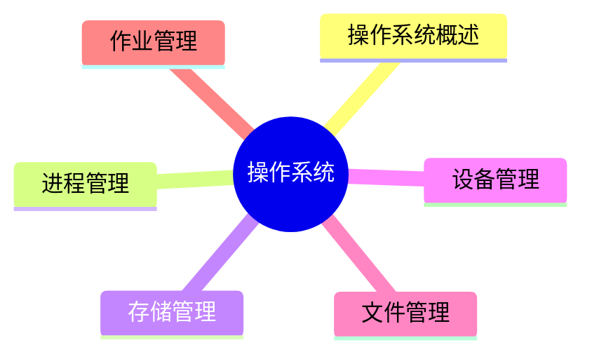

# 软考认识
## 考试科目区分
![[Pasted image 20250924145204.png]]
## 证书价值
![[Pasted image 20250924145258.png]]
## 考试科目和分值
![[Pasted image 20250924145627.png]]
### 上午综合知识选择题
![[Pasted image 20250924145905.png|上午综合知识考试题型]]
### 案例分析
5 选 1+2，90 分钟，75 分
![[Pasted image 20250924150901.png]]
![[Pasted image 20250924151032.png]]
![[Pasted image 20250924151106.png]]
- 软件架构评估/设计这一部分一般是树上的知识点，最好拿满分
- 系统建模也是套题，ER 图，类图等固定知识
- 嵌入式一般比较难，而且我也不会，建议 pass
- Web 系统架构设计每年都有新题，新架构，不会有原题，需要日常积累
### 论文部分
四个试题选一个
![[Pasted image 20250924161330.png]]
从四个问题中选择一个题面：
```md
请围绕“软件维护方法及其应用”论题，依次从以下三个方面进行论述。
1.概要叙述你参与管理和开发的软件项目，以及你在其中所承担的主要工作。
2.详细论述影响软件维护工作的因素有哪些。
3.结合你具体参与管理和开发的实际项目，说明在具体维护过程中，如何度量软件的可维护性，说明具体的软件维护工作类型。
```
本质上是用 2500 字回答这三个问题，加粗即固定套路模板
**摘要**：330 字左右
**信息背景**：500 字
**过渡段**：100~200 字
正文分段论述：理论+时间
**结尾**：300~500 字


### 考试技巧
过于绝对一般是错误的，含有“可能”，“大概”一般是正确的
# 阿诺老师版本
## 系统架构设计师概述
![[Pasted image 20250924164322.png]]
### 架构分类
#### 分层架构
![[Pasted image 20250924164523.png]]
#### 事件驱动&&
![[Pasted image 20250924164831.png]]
类似 [[Qt Official Tutorial#QT 信号槽机制|QT信号槽机制]]，信号触发事件都会进入队列等待处理，由元对象机制作为分发器，然后调用对应的事件处理函数
#### 微核架构（插件架构）
![[Pasted image 20250924165819.png]]
类似 vscode ，文本编辑是最核心的内容，所有拓展功能由插件完成
#### 微服务架构
![[Pasted image 20250924165929.png]]
#### 云服务
![[Pasted image 20250924170304.png]]
#### 考点
系统架构的常用建模方法，根据建模的侧重点的不同，可以将分成 4 种：**结构模型、框架模型、动态模型和过程模型**。
1) 结构模型：这是一个最直观、最普遍的建模方法。此方法以架构的构件、连接件和其他概念来刻画结构。并力图通过结构来反映系统的重要语义内容，包括系统的配置、约束、隐含的假设条件、风格和性质。**研究结构模型的核心是架构描述语言**。
2) 框架模型：框架模型与结构模型类似，但它不太侧重描述结构的细节，而**更侧重整体的结构**。框架模型主要以一些特殊的问题为目标建立**只针对和适应问题的结构**。
3) 动态模型：动态模型是对结构或框架模型的补充，主要**研究系统的“大颗粒”行为的性质**。例如，描述系统的重新配置或演化。这里的动态可以是指系统总体结构的配置、建立或拆除通信或计算的过程，这类系统模型常是激励型的。
4) 过程模型：过程模型是研究**构造系统的步骤和过程**，其结构是遵循某些过程脚本的结果。
这 4  种模型并不是完全独立的，通过有机的结合才可形成一个完整的模型来刻画软件架构，也将能更加准确、全面地反映软件架构。软件架构可从不同角度来描述用户所关心架构的特征。

| 架构风格                    | 适用场景                       |
| ----------------------- | -------------------------- |
| 管道-过滤器风格                | 用于将系统分成若干独立的步骤             |
| 主程序 / 子系统和**面向对象的架构**风格 | 用于对组件内部进行设计                |
| 虚拟机风格                   | 用于构造解释器或专家系统               |
| C/S 和 B/S 风格             | 适合于数据和处理分布在一定范围，通过网络连接构成系统 |
| 平台 / 插件风格               | 用于具有插件扩展功能的应用程序            |
| MVC 风格                  | 用于用户交互程序的设计                |
| SOA 风格                  | 用在企业集成等方面                  |
| C 2 风格                   | 用于 GUI 软件开发，用以构建灵活和可扩展的应用系统等 |
### 计算机系统概述
![[Pasted image 20250924175022.png]]
![[Pasted image 20250924175234.png]]
CPU 中做算术运算和逻辑运算
![[Pasted image 20250924175355.png]]


| 部件       | 要点                                                                                                                                                                                                                                                                                                                                                                                                                                                                                                                      |
| -------- | ----------------------------------------------------------------------------------------------------------------------------------------------------------------------------------------------------------------------------------------------------------------------------------------------------------------------------------------------------------------------------------------------------------------------------------------------------------------------------------------------------------------------- |
| 处理器（CPU） | 为计算机系统运算和控制的核心部件。处理器的指令集按照其复杂程度可分为复杂指令集（CISC）与精简指令集（RISC）两类。CISC 以 Intel、AMD 的 x 86 CPU 为代表，RISC 以 ARM 和 Power 为代表。常见的有图形处理器（GPU）、信号处理器（DSP）以及现场可编程逻辑门阵（FPGA）等。GPU 是一种特殊类型的处理器，具有数百或数千个内核，经过优化可并行运行大量计算，因此近些年在深度学习和机器学习领域得到了广泛应用。DSP 专用于实时的数字信号处理。                                                                                                                                                                                                                                                                       |
| 存储器      | 存储器是利用半导体、磁、光等介质制成用于存储数据的电子设备。根据存储器的硬件结构可分为 SRAM**较贵 static**、DRAM**较便宜 dynamic**、NVRAM、Flash、EPROM、Disk 等。计算机系统中的存储器通常采用分层的体系（Memory Hierarchy）结构，按照与处理器的物理距离可分为 4 个层次。<br><br>（1）**片上缓存**：在处理器核心中直接集成的缓存，SRAM 结构，容量小，速度快。<br>（2）**片外缓存**：在处理器核心外的缓存，需要经过交换互联开关访问，由 SRAM 构成，容量较片上缓存略大，可以为 256 MB–4 MB。按照层级被称为 L 2 Cache 或 L 3 Cache，或者称为平台 Cache（Platform Cache）。<br>（3）**主存（内存）**：用 DRAM 结构，以独立的部件／芯片存在，通过总线与处理器连接。DRAM 依赖不断充电维持其中的数据，容量在数百 MB 至数十 GB。<br>（4）**外存**：可以是磁带、磁盘、光盘和各类 Flash 等介质器件，这类设备访问速度慢，但容量大，且在掉电后能够保持其数据。 |
为什么有 CPU-cache-外存分级结构？
1. **没有一种存储技术能同时做到“速度快、容量大、成本低、掉电不丢数据**，需要在硬件设备的速度和价格之间找到一个平衡点
2. **时间上**，刚访问过的数据，很可能很快再次被访问。**空间上**：访问某地址后，其附近地址很可能也被访问。提前加载“可能用到”的数据块，使 CPU 大部分时间只需访问高速缓存。可以减小内外存设别通信时的性能鸿沟。

# 诸葛老师版本
## 第一章计算机系统知识
### CPU 构成
CPU 主要由运算器、控制器、寄存器组和内部总线等部件组成。
![[PixPin_2025-10-24_18-59-12.png]]
运算器只能完成运算操作，而整个运算过程是由控制器来完成，控制器控制整个 CPU 的工作。
![[PixPin_2025-10-24_19-00-08.png]]
**寄存器组**分为专用寄存器和通用寄存器。运算器和控制器中的寄存器是专用寄存器。通用寄存器的用途由程序员来决定。
**通用寄存器: 当 ALU 执行算术或逻辑运算时，为 ALU 提供一个工作区。**
![[PixPin_2025-10-24_19-00-58.png]]
图形处理器（GraphicsProcessingUnit，GPU）：具有成百数千个内核，经过优化可并行运行大量计算，在人工智能领域得到了广泛应用。
信号处理器（Digital SignalProcessor，DSP）：专用于实时的数字信号处理，在各类高信号采集的设备中得到广泛应用，**常采用哈佛体系结构**。（数据和指令分开存储）
现场可编程逻辑门阵列（FieldProgrammable GateArray，FPGA）。

### 校验码
#### 奇偶校验
奇偶校验：只有检错，没有纠错能力，且检错能力差
#### 海明码
参考链接：[海明码 Hamming code - 知乎](https://zhuanlan.zhihu.com/p/278326197)
是一种多重奇偶校验码，具有**检错和纠错**的功能。数据位 n，校验位 k 的关系应满足：$n+k+1 <= 2^k$，但是**只能实现一个比特数据的纠错**
如接收端收了一串二进制数据101011，经过海明码计算后得到的数字是3，说明数据中的第3位的数据出现了错误，纠正时只需要把**第三位的1取反**
- 码距是编码系统中**两个编码之间不同的二进制的位数**，例如数据1010和数据1111的码距就是2
1. 如果要检测 e 个错误，最小码距应该满足： D>=e+1
2. 如果要纠正 t 个错误，最小码距应满足： D>=2t+1
3. 如果要检测 e 个错误同时纠正 t 个错误，最小码距应该满足： D>=e+t+1 , (e>=t)

##### 编码过程
已知原始数据为1001011,采用Hamming Code编码后，求实际发送的数据？
求解过程如下：

1. 计算需要的校验位数目。从题目中可知数据为的长度为7，即 m=7 ，带入公式 $m+k+1\le2$^k
2. 后得到 k>=4 ，为了减少冗余$k$取最小值4。最后实际发送的数据长度为 7+4=11 位。
3. 重新排列数据。定义4个校验位分别是 a1, a2, a3, a4 。根据海明码原则组合排列7为数据和4位校验码。校验码的位置分别是 1=2^0, 2=2^1, 4= 2^2, 8=2^3 。排列后的顺序如表1.4所示。

$$
\begin{split} a1&=X_3\oplus X_5\oplus X_7\oplus X_9\oplus X_{11} =1\oplus0\oplus1\oplus0\oplus1=1\\ a2&=X_3\oplus X_6\oplus X_7\oplus X_{10}\oplus X_{11} =1\oplus0\oplus1\oplus1\oplus1=0\\ a3&=X_5\oplus X_6\oplus X_7 =0\oplus0\oplus1=1\\ a4&= X_9\oplus X_{10}\oplus X_{11} =0\oplus1\oplus1=0 \end{split} (1.7)
$$
![[Pasted image 20251024211116.jpg]]
##### 解码过程

如果接收端收到的数据10110110011,接收方需要先计算校验位 a1,a2,a3,a4 的值，计算的值再和数据中的校验位进行异或比较,公式（1.8）为接收端的计算公式：

$$
\begin{split} h_1&=X_3\oplus X_5\oplus X_7\oplus X_9\oplus X_{11} \oplus a1\\ h_2&=X_3 \oplus X_6\oplus X_7\oplus X_{10}\oplus X_{11}\oplus a2\\ h_3&= X_5\oplus X_6\oplus X_7\oplus a3\\ h_4&=X_9\oplus X_{10}\oplus X_{11}\oplus a4 \end{split}
$$

公式（1.8）中的监督公式都分为两个部分，前面的使用 $X_i$ 表示的部分是和发送端一模一样的计算公式，后面的 ai 是发送端计算不需要的，是数据中的校验位。这个计算的本意是接收端重新计算一次校验码，然后和数据中校验码进行比较。如果自己计算的校验码和数据中的校验码相同，记为0，不同则记为1。

因为在新的数据串中a1和$X_1$是同一个数据位，a2和$X_2$ 是同一个数据位，a3和 X_4 是同一个数据位，a4和 $X_8$ 是同一个数据位.因此公式（1.8）也可以表示为（1.9）.
$$
\begin{split} h_1&=X_3\oplus X_5\oplus X_7\oplus X_9\oplus X_{11} \oplus X_1\\ h_2&=X_3\oplus X_6\oplus X_7\oplus X_10\oplus X_{11}\oplus X_2\\ h_3&=X_5\oplus X_6\oplus X_7\oplus X_4\\ h_4&=X_9\oplus X_{10}\oplus X_{11}\oplus X_8 \end{split} 
$$

计算结果按照 $h_4h_3 h_2 h_1$ 的顺序进行排列，如果结果等于0说明数据没有出错；如果结果不等于0，说明数据出错。把该数据转 化为10进制数，就是出错数据的位置。因为二进制数中每一位置只有2种状态，0或者1。因此知道错误的位置后，改正错误就非常简单，把对应的数据取反即可。

把接收到的数据 10110110011 代入公式（1.8）中得到：
$$
\begin{split} h_1&=1\oplus0\oplus1\oplus0\oplus1\oplus1=0\\ h_2&=1\oplus0\oplus1\oplus1\oplus1\oplus0=1\\ h_3&=0\oplus1\oplus1\oplus1=1\\ h_4&=0\oplus1\oplus1\oplus0=0 \end{split}
$$
新的数据 h_4h_3h_2h_1=0110 ，转换为十进制数值为6，因此说明接收到的数据中第6位出错，将第六位数据取反就可以得到正确的原始数据，原始数据为 10110010011 。
#### CRC 校验码
循环冗余校验码：**只能检错，不能纠错**，重点在于**双方事先规定生成多项式**，发送方将信息经过 crc 校验之后把余数放在信息末尾，接收方将信息除以多项式二进制表示方法后得到的余数是 0，则无差错，否则进行重传。

> [!note]
> 注意，校验过程中的余数计算应**不进位，不借位**的操作

### 指令系统
![[Pasted image 20250706120331.png]] ![[Pasted image 20250706120518.png]]
![[Pasted image 20250706120805.png]] 
![[Pasted image 20250706142557.png]]
#### 寻址方式
顺序寻址: 下一条指令的地址由程序计数器 PC 给出，PC 每次自增 +1（+的是偏移量，一条指令的长度）
跳跃寻址: 下一条指令的地址由指令本身给出。
#### 操作数的寻址方式
**立即寻址**：指令的地址码字段不是操作数的地址，**而是操作数本身**，速度最快；
**直接寻址**：指令的地址码字段给出操作数在内存的地址（操作数在内存中）；
**间接寻址**：指令的地址码字段给出操作数在内存的地址的地址（操作数在内存中）；
**寄存器寻址**：指令的地址码字段给出操作数在寄存器的编号（操作数在寄存器中）；
**寄存器间接寻址**：指令的地址码字段给出寄存器的编号，寄存器中所存的内容为操作数在内存的地址（操放在内存中）；
**相对寻址**：指令的地址码字段是一个偏移量，这个偏移量加上程序计数器 PC 的值即为操作数在内存的地址；
**基址寻址**：指令的地址码字段是一个偏移量，这个偏移量加上基址寄存器 R，的值即为操作数在内存的地址；
**变址寻址**：指令的地址码字段是一个偏移量，这个偏移量加上变址寄存器 R 的值即为操作数在内存的地址。

> [!note]
> 计算机指令执行过程：**取指令->分析指令->执行指令**三个步骤，首先将程序计数器 PC 中的指令地址取出，送入地址总线，CPU 依据指令地址去内存中取出指令内容存入**指令寄存器**（存储指令内容）；之后由指令译码器进行分析，分析指令操作码；最后取出指令执行所需的源操作数，执行指令。

CPU 如何区分指令和数据：**CPU指令周期的不同阶段**来区分二进制的指令和数据，因为在指令周期的不同阶段，**指令会命令 CPU 分别去取指令或数据**

#### 指令集
| 特性     | CISC        | RISC                        |
| ------ | ----------- | --------------------------- |
| 指令数目   | 多           | 少                           |
| 指令长度   | 可变长指令       | 大部分等长指令                     |
| 控制器复杂性 | 复杂          | 简单                          |
| 寻址方式   | 较丰富，提高编程灵活性 | 较少，以提高效率                    |
| 编程便利性  | 指令多，编程灵活    | 编程量更大，采用**较多通用寄存器**         |
| 实现方式   | 微程序控制技术     | 采用**硬布线逻辑控制优化编译程序**，采用流水线技术 |
#### 指令的流水处理
![[PixPin_2025-10-24_19-18-12.png]]
取指令->指令译码->指令执行->指令结果写回

指令流水处理计算题概念

>[!note]
>指令流水线的计算
>- 非流水执行时间：一条指令执行的时间×指令总数
>- 流水执行时间：第一条指令的执行时间+**最长流水段长度**(n-1)，n 为指令总数
>- 加速比：非流水方式与流水方式所用时间之比
>- 流水线的操作周期：为**最长流水段**时间
>- 流水线的吞吐率：为**最长流水段时间**的倒数
>- 连续 n 条指令的吞吐率：指令总数/总时间

![[PixPin_2025-10-24_19-21-33.png]]
### 存储器
#### 存储器的层次结构
![[PixPin_2025-10-24_19-24-29.png]]
#### 存储器分类
RAM：SRAM&DRAM
ROM

| ROM 分类               | 擦除方式  | 擦除速度 | 可编程次数     |
| -------------------- | ----- | ---- | --------- |
| 固定只读存储器（ROM）         | 无     | 无    | 无         |
| 可编程只读存储器（PROM）       | -     | 较慢   | 一次        |
| 可擦除可编程只读存储器（EPROM）   | 紫外线照射 | 较慢   | 较少        |
| 电擦除可擦除可编程存储器（EEPROM） | 电擦除   | 较快   | 100 w 次左右 |
| 闪速存储器（闪存）**U 盘**     | 电擦除   | 最快   | 较少        |

高速缓存 Cache
Cache 的功能：**解决 CPU 和主存之间的速度不匹配的问题。**
Cache 的理论依据：程序的局部性原理。
CPU 对主存中的指令和数据的访问，在一小段时间内，总是集中在一小块存储空间里。
1. 时间局部性：最近被访问过的指令和数据很可能会被再次访问；
2. 空间局部性：最近访问过的指令和数据往往集中在一小片存储区域中。

在 CPU 工作时，送出的是主存单元的地址，而应从 Cache 存储器中读/写信息。这就需要**将主存地址转换成 Cache 的地址**，这种地址的转换称为地址映像。**由硬件自动完成**
##### 地址转换方式
![[Pasted image 20250705222014.png]]
只会把主存中的**任意一个块**中的数据和起始地址放入 cache（作为标记位）
全相连映射，方便直接，但是速度慢，每次查找复杂度为 $O(n*(n+1) / 2)$
![[Pasted image 20250706115845.png]] 
直接相连映射，内存利用率不高，容易冲突，但是查找快
![[Pasted image 20250706113445.png]]
![[Pasted image 20250706113842.png]]
![[Pasted image 20250706114418.png]] ![[Pasted image 20250706114656.png]]
组相连映射
cache 分组，主存中不分块按照对应位置放在 cache 对应分组（cache 块）中任意位置，由于其综合前两者有点，被广泛使用
![[Pasted image 20250706115154.png]] ![[Pasted image 20250706115647.png]]
![[Pasted image 20250706120131.png]]

##### Cache 替换策略
解决的问题是：所有 cache 中的行都满了，应该替换哪些内容？
Cache 替换算法的目标是**使 Cache 获得尽可能高的命中率**。
- **随机替换算法**：从特定的行位置中随机地选取一行换出即可。特点：硬件易实现，速度快；但命中率和工作效率在小容量 Cache 中不高。
- **先进先出算法**：最先进入 Cache 的行被换出。
- **LFU 算法**：被访问的行计数器增加 1，值最小的行被换出。特点：不能反映近期 cache 的访问情况（老东西一直占着位置）。
- **LRU 算法**：被访问的行计数器置 o，其他的计数器增加 1，换值最大的行。特点：***符合 cache 的工作原理***。

##### Cache 性能指标
当 CPU 所访问的数据在 Cache 中时，直接从 Cache 中读取数据，即命中；否则，需要从主存中读取数据，即未命中。
命中率：在一个程序执行期间，设 Nc 表示 cache 完成存取的次数，Nm 表示主存完成存取的总次数，h 定义为命中率，则有
$$
h=\frac{N_c}{N_c + N_m}
$$
##### 磁盘扇区
概念：
存取时间：寻道时间+旋转等待时间+数据传送时间
寻道时间：将磁头定位至所要求的磁道上所需的时间
旋转等待时间：寻道完成后至磁道上需要访问的信息到达磁头下的时间，平均等待时间为磁盘旋转一周所需时间的一半
数据传送时间：读取数据所需的时间

磁盘调度算法：
（1）先来先服务算法（FCFS）：根据进程请求访问磁盘的先后次序进行调度。
（2）最短寻道时间优先算法（SSTF）：最短移臂调度算法，要求访问的磁道与当前磁头所在的磁道距离最近，使得每次寻道时间最短，但平均寻道时间不一定最短（局部贪心）。
（3）扫描算法（SCAN）：电梯调度算法，每次选择距离最近的同一个方向的磁道访问。
（4）单向扫描调度算法（CSCAN）：每次均从头到尾依次扫描访问。

![[PixPin_2025-10-24_19-53-13.png]]
### 总线
| 总线分类 | 数据线             | 特点                | 应用                     |
| ---- | --------------- | ----------------- | ---------------------- |
| 串行总线 | 一条双向数据线或两条单向数据线 | 速率不高，但适合**长距离**连接 | 通信总线（计算机之间或计算机与其他系统之间） |
| 并行总线 | 多条双向数据线         | 有传输延迟，适合**近距离**连接 | 系统总线（计算机各部件）           |

- **PCI 总线**：  
    PCI 总线是目前微型机上广泛采用的**内总线**，采用**并行传输方式**。
- **SCSI 总线**：  
    小型计算机系统接口（SCSI）是一条**并行外总线**，广泛用于连接软硬盘、光盘、扫描仪等设备。
- **其他常见总线**：
    - **RS-232C** —— 串行外总线
    - **USB** —— 串行外总线
    - **IEEE-1394** —— 串行外总线
    - **IEEE-488** —— 并行外总线

![[PixPin_2025-10-24_19-58-05 1.png]]

### 输入输出技术
CPU 与外围设备之间的信息交换方式
I/O 接口与外设之间的信息交换（比较简单）
CPU 与 IO 接口之间的信息交换：
大致流程：
![[PixPin_2025-10-24_20-11-08.png]]
- 程序查询方式
CPU 执行**程序**（**软件方式**）来轮询查询外设的状态，判断外设是否准备好接收数据或向 CPU 输入数据。
特点 ：
1. CPU 与外设串行工作
2. 硬件结构简单
3. CPU 大量时间都在**查询和等待**，资源浪费较多
4. 需要 CPU 保存现场，由 CPU 将数据放入内存
5. 一次读写单位为字
适用场合：低速外设或 CPU 任务不繁忙的情况
![[PixPin_2025-10-24_20-15-27.png]]

- 程序中断方式（键盘鼠标）
当外设数据准备好之后会触发一个**中断信号**，CPU 接收到这个中断信号后会**停止现行程序来处理中断事件**，处理方式是：响应中断->**关中断**（将这个中断状态的寄存器改为 1，表示这个中断状态正在被处理）-> 开始处理中断（找到中断事件的入口地址和对应的事件程序） -> 软件保存\恢复 CPU 现场 -> **开中断**
1. CPU 与外设可并行工作
2. 但硬件结构相对复杂一些，服务开销时间大
3. 需要 CPU 保存现场，由 CPU 将数据放入内存
4. 一次读写单位为字

- DMA 方式 
直接内存存取（DMA），**DMA（硬件） 控制器接管总线的控制权**，数据交换不经过 CPU，直接在内存和 I/O 设备间进行成**块**传送。
1. CPU 与外设可并行工作
2. 仅在传送数据块的**开始和结束时才需要 CPU 的干预**
3. 不需要 CPU 保护现场
4. 由外设直接将数据放入内存 (或相反)
5. 一次读写单位为**块**（若干个字），传送一个数据占用一个存储周期
适用于微型机中内存与高速外围设备进行**大批量的数据交换**（因为直接和内存通信非常快）
- 通道方式
引用专用的 IO 处理器**专门处理 IO 操作管理所有外围设备**（硬件）
极大提高 CPU 效率，但是需要更多的硬件

## 第二章操作系统
根据考试大纲，本章主要考查系统架构设计师单选题，预计考 **4 分**左右，对应第二版教材 2.3.2 小节，仅有基本概念，需要额外补充知识。根据历年真题考试情况，**五大管理仍是重点**。


![[PixPin_2025-10-24_20-59-49.png]]
### 存储管理
两者都是为了更好的管理计算机上**程序和数据的存储**
#### 分段存储管理
将进程空间划分成若干个段，每段也有段号和段内地址，每段是一组完整的逻辑信息
![[PixPin_2025-10-24_21-36-54.png]]
分页与分段的区别：分页是根据物理空间划分，每页大小相同；分段是根据逻辑空间划分，每段是一个完整的功能，便于共享，但是大小不同。

#### 段页式存储管理
先将整个主存划分成若干个**大小相等的存储块**，将用户程序按程序的逻辑关系分为**若干个段，再将每个段划分成若干个页**。既具有分页系统能有效地提高主存利用率的优点，又具有分段系统能很好地满足用户需要的长处。
![[PixPin_2025-10-24_21-38-26.png]]
优点：空间浪费小、存储共享容易、存储保护容易、能动态连接;
缺点：由于**管理软件的增加，复杂性和开销也随之增加**，需要的硬件以及占用的内容也有所增加,使得执行速度大大下降。

![[PixPin_2025-10-24_21-43-34.png]]
### 前趋图
