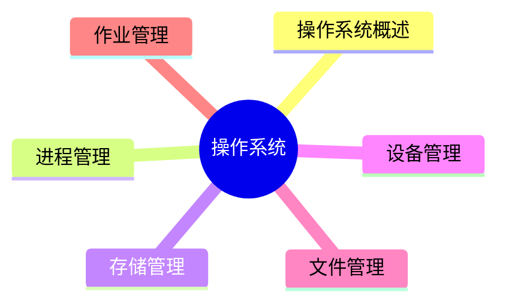

# 软考认识
## 考试科目区分
![[Pasted image 20250924145204.png]]
## 证书价值
![[Pasted image 20250924145258.png]]
## 考试科目和分值
![[Pasted image 20250924145627.png]]
### 上午综合知识选择题
![[Pasted image 20250924145905.png|上午综合知识考试题型]]
### 案例分析
5 选 1+2，90 分钟，75 分
![[Pasted image 20250924150901.png]]
![[Pasted image 20250924151032.png]]
![[Pasted image 20250924151106.png]]
- 软件架构评估/设计这一部分一般是树上的知识点，最好拿满分
- 系统建模也是套题，ER 图，类图等固定知识
- 嵌入式一般比较难，而且我也不会，建议 pass
- Web 系统架构设计每年都有新题，新架构，不会有原题，需要日常积累
### 论文部分
四个试题选一个
![[Pasted image 20250924161330.png]]
从四个问题中选择一个题面：
```md
请围绕“软件维护方法及其应用”论题，依次从以下三个方面进行论述。
1.概要叙述你参与管理和开发的软件项目，以及你在其中所承担的主要工作。
2.详细论述影响软件维护工作的因素有哪些。
3.结合你具体参与管理和开发的实际项目，说明在具体维护过程中，如何度量软件的可维护性，说明具体的软件维护工作类型。
```
本质上是用 2500 字回答这三个问题，加粗即固定套路模板
**摘要**：330 字左右
**信息背景**：500 字
**过渡段**：100~200 字
正文分段论述：理论+时间
**结尾**：300~500 字


### 考试技巧
过于绝对一般是错误的，含有“可能”，“大概”一般是正确的
# 阿诺老师版本
## 系统架构设计师概述
![[Pasted image 20250924164322.png]]
### 架构分类
#### 分层架构
![[Pasted image 20250924164523.png]]
#### 事件驱动&&
![[Pasted image 20250924164831.png]]
类似 [[Qt Official Tutorial#QT 信号槽机制|QT信号槽机制]]，信号触发事件都会进入队列等待处理，由元对象机制作为分发器，然后调用对应的事件处理函数
#### 微核架构（插件架构）
![[Pasted image 20250924165819.png]]
类似 vscode ，文本编辑是最核心的内容，所有拓展功能由插件完成
#### 微服务架构
![[Pasted image 20250924165929.png]]
#### 云服务
![[Pasted image 20250924170304.png]]
#### 考点
系统架构的常用建模方法，根据建模的侧重点的不同，可以将分成 4 种：**结构模型、框架模型、动态模型和过程模型**。
1) 结构模型：这是一个最直观、最普遍的建模方法。此方法以架构的构件、连接件和其他概念来刻画结构。并力图通过结构来反映系统的重要语义内容，包括系统的配置、约束、隐含的假设条件、风格和性质。**研究结构模型的核心是架构描述语言**。
2) 框架模型：框架模型与结构模型类似，但它不太侧重描述结构的细节，而**更侧重整体的结构**。框架模型主要以一些特殊的问题为目标建立**只针对和适应问题的结构**。
3) 动态模型：动态模型是对结构或框架模型的补充，主要**研究系统的“大颗粒”行为的性质**。例如，描述系统的重新配置或演化。这里的动态可以是指系统总体结构的配置、建立或拆除通信或计算的过程，这类系统模型常是激励型的。
4) 过程模型：过程模型是研究**构造系统的步骤和过程**，其结构是遵循某些过程脚本的结果。
这 4  种模型并不是完全独立的，通过有机的结合才可形成一个完整的模型来刻画软件架构，也将能更加准确、全面地反映软件架构。软件架构可从不同角度来描述用户所关心架构的特征。

| 架构风格                    | 适用场景                       |
| ----------------------- | -------------------------- |
| 管道-过滤器风格                | 用于将系统分成若干独立的步骤             |
| 主程序 / 子系统和**面向对象的架构**风格 | 用于对组件内部进行设计                |
| 虚拟机风格                   | 用于构造解释器或专家系统               |
| C/S 和 B/S 风格             | 适合于数据和处理分布在一定范围，通过网络连接构成系统 |
| 平台 / 插件风格               | 用于具有插件扩展功能的应用程序            |
| MVC 风格                  | 用于用户交互程序的设计                |
| SOA 风格                  | 用在企业集成等方面                  |
| C 2 风格                   | 用于 GUI 软件开发，用以构建灵活和可扩展的应用系统等 |
### 计算机系统概述
![[Pasted image 20250924175022.png]]
![[Pasted image 20250924175234.png]]
CPU 中做算术运算和逻辑运算
![[Pasted image 20250924175355.png]]


| 部件       | 要点                                                                                                                                                                                                                                                                                                                                                                                                                                                                                                                      |
| -------- | ----------------------------------------------------------------------------------------------------------------------------------------------------------------------------------------------------------------------------------------------------------------------------------------------------------------------------------------------------------------------------------------------------------------------------------------------------------------------------------------------------------------------- |
| 处理器（CPU） | 为计算机系统运算和控制的核心部件。处理器的指令集按照其复杂程度可分为复杂指令集（CISC）与精简指令集（RISC）两类。CISC 以 Intel、AMD 的 x 86 CPU 为代表，RISC 以 ARM 和 Power 为代表。常见的有图形处理器（GPU）、信号处理器（DSP）以及现场可编程逻辑门阵（FPGA）等。GPU 是一种特殊类型的处理器，具有数百或数千个内核，经过优化可并行运行大量计算，因此近些年在深度学习和机器学习领域得到了广泛应用。DSP 专用于实时的数字信号处理。                                                                                                                                                                                                                                                                       |
| 存储器      | 存储器是利用半导体、磁、光等介质制成用于存储数据的电子设备。根据存储器的硬件结构可分为 SRAM**较贵 static**、DRAM**较便宜 dynamic**、NVRAM、Flash、EPROM、Disk 等。计算机系统中的存储器通常采用分层的体系（Memory Hierarchy）结构，按照与处理器的物理距离可分为 4 个层次。<br><br>（1）**片上缓存**：在处理器核心中直接集成的缓存，SRAM 结构，容量小，速度快。<br>（2）**片外缓存**：在处理器核心外的缓存，需要经过交换互联开关访问，由 SRAM 构成，容量较片上缓存略大，可以为 256 MB–4 MB。按照层级被称为 L 2 Cache 或 L 3 Cache，或者称为平台 Cache（Platform Cache）。<br>（3）**主存（内存）**：用 DRAM 结构，以独立的部件／芯片存在，通过总线与处理器连接。DRAM 依赖不断充电维持其中的数据，容量在数百 MB 至数十 GB。<br>（4）**外存**：可以是磁带、磁盘、光盘和各类 Flash 等介质器件，这类设备访问速度慢，但容量大，且在掉电后能够保持其数据。 |
为什么有 CPU-cache-外存分级结构？
1. **没有一种存储技术能同时做到“速度快、容量大、成本低、掉电不丢数据**，需要在硬件设备的速度和价格之间找到一个平衡点
2. **时间上**，刚访问过的数据，很可能很快再次被访问。**空间上**：访问某地址后，其附近地址很可能也被访问。提前加载“可能用到”的数据块，使 CPU 大部分时间只需访问高速缓存。可以减小内外存设别通信时的性能鸿沟。

# 诸葛老师版本
## 第一章计算机系统知识
### CPU 构成
CPU 主要由运算器、控制器、寄存器组和内部总线等部件组成。
![[PixPin_2025-10-24_18-59-12.png]]
运算器只能完成运算操作，而整个运算过程是由控制器来完成，控制器控制整个 CPU 的工作。
![[PixPin_2025-10-24_19-00-08.png]]
**寄存器组**分为专用寄存器和通用寄存器。运算器和控制器中的寄存器是专用寄存器。通用寄存器的用途由程序员来决定。
**通用寄存器: 当 ALU 执行算术或逻辑运算时，为 ALU 提供一个工作区。**
![[PixPin_2025-10-24_19-00-58.png]]
图形处理器（GraphicsProcessingUnit，GPU）：具有成百数千个内核，经过优化可并行运行大量计算，在人工智能领域得到了广泛应用。
信号处理器（Digital SignalProcessor，DSP）：专用于实时的数字信号处理，在各类高信号采集的设备中得到广泛应用，**常采用哈佛体系结构**。（数据和指令分开存储）
现场可编程逻辑门阵列（FieldProgrammable GateArray，FPGA）。

### 校验码
#### 奇偶校验
奇偶校验：只有检错，没有纠错能力，且检错能力差
#### 海明码
参考链接：[海明码 Hamming code - 知乎](https://zhuanlan.zhihu.com/p/278326197)
是一种多重奇偶校验码，具有**检错和纠错**的功能。数据位 n，校验位 k 的关系应满足：$n+k+1 <= 2^k$，但是**只能实现一个比特数据的纠错**
如接收端收了一串二进制数据101011，经过海明码计算后得到的数字是3，说明数据中的第3位的数据出现了错误，纠正时只需要把**第三位的1取反**
- 码距是编码系统中**两个编码之间不同的二进制的位数**，例如数据1010和数据1111的码距就是2
1. 如果要检测 e 个错误，最小码距应该满足： D>=e+1
2. 如果要纠正 t 个错误，最小码距应满足： D>=2t+1
3. 如果要检测 e 个错误同时纠正 t 个错误，最小码距应该满足： D>=e+t+1 , (e>=t)

##### 编码过程
已知原始数据为1001011,采用Hamming Code编码后，求实际发送的数据？
求解过程如下：

1. 计算需要的校验位数目。从题目中可知数据为的长度为7，即 m=7 ，带入公式 $m+k+1\le2$^k
2. 后得到 k>=4 ，为了减少冗余$k$取最小值4。最后实际发送的数据长度为 7+4=11 位。
3. 重新排列数据。定义4个校验位分别是 a1, a2, a3, a4 。根据海明码原则组合排列7为数据和4位校验码。校验码的位置分别是 1=2^0, 2=2^1, 4= 2^2, 8=2^3 。排列后的顺序如表1.4所示。

$$
\begin{split} a1&=X_3\oplus X_5\oplus X_7\oplus X_9\oplus X_{11} =1\oplus0\oplus1\oplus0\oplus1=1\\ a2&=X_3\oplus X_6\oplus X_7\oplus X_{10}\oplus X_{11} =1\oplus0\oplus1\oplus1\oplus1=0\\ a3&=X_5\oplus X_6\oplus X_7 =0\oplus0\oplus1=1\\ a4&= X_9\oplus X_{10}\oplus X_{11} =0\oplus1\oplus1=0 \end{split} (1.7)
$$
![[Pasted image 20251024211116.jpg]]
##### 解码过程

如果接收端收到的数据10110110011,接收方需要先计算校验位 a1,a2,a3,a4 的值，计算的值再和数据中的校验位进行异或比较,公式（1.8）为接收端的计算公式：

$$
\begin{split} h_1&=X_3\oplus X_5\oplus X_7\oplus X_9\oplus X_{11} \oplus a1\\ h_2&=X_3 \oplus X_6\oplus X_7\oplus X_{10}\oplus X_{11}\oplus a2\\ h_3&= X_5\oplus X_6\oplus X_7\oplus a3\\ h_4&=X_9\oplus X_{10}\oplus X_{11}\oplus a4 \end{split}
$$

公式（1.8）中的监督公式都分为两个部分，前面的使用 $X_i$ 表示的部分是和发送端一模一样的计算公式，后面的 ai 是发送端计算不需要的，是数据中的校验位。这个计算的本意是接收端重新计算一次校验码，然后和数据中校验码进行比较。如果自己计算的校验码和数据中的校验码相同，记为0，不同则记为1。

因为在新的数据串中a1和$X_1$是同一个数据位，a2和$X_2$ 是同一个数据位，a3和 X_4 是同一个数据位，a4和 $X_8$ 是同一个数据位.因此公式（1.8）也可以表示为（1.9）.
$$
\begin{split} h_1&=X_3\oplus X_5\oplus X_7\oplus X_9\oplus X_{11} \oplus X_1\\ h_2&=X_3\oplus X_6\oplus X_7\oplus X_10\oplus X_{11}\oplus X_2\\ h_3&=X_5\oplus X_6\oplus X_7\oplus X_4\\ h_4&=X_9\oplus X_{10}\oplus X_{11}\oplus X_8 \end{split} 
$$

计算结果按照 $h_4h_3 h_2 h_1$ 的顺序进行排列，如果结果等于0说明数据没有出错；如果结果不等于0，说明数据出错。把该数据转 化为10进制数，就是出错数据的位置。因为二进制数中每一位置只有2种状态，0或者1。因此知道错误的位置后，改正错误就非常简单，把对应的数据取反即可。

把接收到的数据 10110110011 代入公式（1.8）中得到：
$$
\begin{split} h_1&=1\oplus0\oplus1\oplus0\oplus1\oplus1=0\\ h_2&=1\oplus0\oplus1\oplus1\oplus1\oplus0=1\\ h_3&=0\oplus1\oplus1\oplus1=1\\ h_4&=0\oplus1\oplus1\oplus0=0 \end{split}
$$
新的数据 h_4h_3h_2h_1=0110 ，转换为十进制数值为6，因此说明接收到的数据中第6位出错，将第六位数据取反就可以得到正确的原始数据，原始数据为 10110010011 。
#### CRC 校验码
循环冗余校验码：**只能检错，不能纠错**，重点在于**双方事先规定生成多项式**，发送方将信息经过 crc 校验之后把余数放在信息末尾，接收方将信息除以多项式二进制表示方法后得到的余数是 0，则无差错，否则进行重传。

> [!note]
> 注意，校验过程中的余数计算应**不进位，不借位**的操作

### 指令系统
![[Pasted image 20250706120331.png]] ![[Pasted image 20250706120518.png]]
![[Pasted image 20250706120805.png]] 
![[Pasted image 20250706142557.png]]
#### 寻址方式
顺序寻址: 下一条指令的地址由程序计数器 PC 给出，PC 每次自增 +1（+的是偏移量，一条指令的长度）
跳跃寻址: 下一条指令的地址由指令本身给出。
#### 操作数的寻址方式
**立即寻址**：指令的地址码字段不是操作数的地址，**而是操作数本身**，速度最快；
**直接寻址**：指令的地址码字段给出操作数在内存的地址（操作数在内存中）；
**间接寻址**：指令的地址码字段给出操作数在内存的地址的地址（操作数在内存中）；
**寄存器寻址**：指令的地址码字段给出操作数在寄存器的编号（操作数在寄存器中）；
**寄存器间接寻址**：指令的地址码字段给出寄存器的编号，寄存器中所存的内容为操作数在内存的地址（操放在内存中）；
**相对寻址**：指令的地址码字段是一个偏移量，这个偏移量加上程序计数器 PC 的值即为操作数在内存的地址；
**基址寻址**：指令的地址码字段是一个偏移量，这个偏移量加上基址寄存器 R，的值即为操作数在内存的地址；
**变址寻址**：指令的地址码字段是一个偏移量，这个偏移量加上变址寄存器 R 的值即为操作数在内存的地址。

> [!note]
> 计算机指令执行过程：**取指令->分析指令->执行指令**三个步骤，首先将程序计数器 PC 中的指令地址取出，送入地址总线，CPU 依据指令地址去内存中取出指令内容存入**指令寄存器**（存储指令内容）；之后由指令译码器进行分析，分析指令操作码；最后取出指令执行所需的源操作数，执行指令。

CPU 如何区分指令和数据：**CPU指令周期的不同阶段**来区分二进制的指令和数据，因为在指令周期的不同阶段，**指令会命令 CPU 分别去取指令或数据**

#### 指令集
| 特性     | CISC        | RISC                        |
| ------ | ----------- | --------------------------- |
| 指令数目   | 多           | 少                           |
| 指令长度   | 可变长指令       | 大部分等长指令                     |
| 控制器复杂性 | 复杂          | 简单                          |
| 寻址方式   | 较丰富，提高编程灵活性 | 较少，以提高效率                    |
| 编程便利性  | 指令多，编程灵活    | 编程量更大，采用**较多通用寄存器**         |
| 实现方式   | 微程序控制技术     | 采用**硬布线逻辑控制优化编译程序**，采用流水线技术 |
#### 指令的流水处理
![[PixPin_2025-10-24_19-18-12.png]]
取指令->指令译码->指令执行->指令结果写回

指令流水处理计算题概念

>[!note]
>指令流水线的计算
>- 非流水执行时间：一条指令执行的时间×指令总数
>- 流水执行时间：第一条指令的执行时间+**最长流水段长度**(n-1)，n 为指令总数
>- 加速比：非流水方式与流水方式所用时间之比
>- 流水线的操作周期：为**最长流水段**时间
>- 流水线的吞吐率：为**最长流水段时间**的倒数
>- 连续 n 条指令的吞吐率：指令总数/总时间

![[PixPin_2025-10-24_19-21-33.png]]
### 存储器
#### 存储器的层次结构
![[PixPin_2025-10-24_19-24-29.png]]
#### 存储器分类
RAM：SRAM&DRAM
ROM

| ROM 分类               | 擦除方式  | 擦除速度 | 可编程次数     |
| -------------------- | ----- | ---- | --------- |
| 固定只读存储器（ROM）         | 无     | 无    | 无         |
| 可编程只读存储器（PROM）       | -     | 较慢   | 一次        |
| 可擦除可编程只读存储器（EPROM）   | 紫外线照射 | 较慢   | 较少        |
| 电擦除可擦除可编程存储器（EEPROM） | 电擦除   | 较快   | 100 w 次左右 |
| 闪速存储器（闪存）**U 盘**     | 电擦除   | 最快   | 较少        |

高速缓存 Cache
Cache 的功能：**解决 CPU 和主存之间的速度不匹配的问题。**
Cache 的理论依据：程序的局部性原理。
CPU 对主存中的指令和数据的访问，在一小段时间内，总是集中在一小块存储空间里。
1. 时间局部性：最近被访问过的指令和数据很可能会被再次访问；
2. 空间局部性：最近访问过的指令和数据往往集中在一小片存储区域中。

在 CPU 工作时，送出的是主存单元的地址，而应从 Cache 存储器中读/写信息。这就需要**将主存地址转换成 Cache 的地址**，这种地址的转换称为地址映像。**由硬件自动完成**
##### 地址转换方式
![[Pasted image 20250705222014.png]]
只会把主存中的**任意一个块**中的数据和起始地址放入 cache（作为标记位）
全相连映射，方便直接，但是速度慢，每次查找复杂度为 $O(n*(n+1) / 2)$
![[Pasted image 20250706115845.png]] 
直接相连映射，内存利用率不高，容易冲突，但是查找快
![[Pasted image 20250706113445.png]]
![[Pasted image 20250706113842.png]]
![[Pasted image 20250706114418.png]] ![[Pasted image 20250706114656.png]]
组相连映射
cache 分组，主存中不分块按照对应位置放在 cache 对应分组（cache 块）中任意位置，由于其综合前两者有点，被广泛使用
![[Pasted image 20250706115154.png]] ![[Pasted image 20250706115647.png]]
![[Pasted image 20250706120131.png]]

##### Cache 替换策略
解决的问题是：所有 cache 中的行都满了，应该替换哪些内容？
Cache 替换算法的目标是**使 Cache 获得尽可能高的命中率**。
- **随机替换算法**：从特定的行位置中随机地选取一行换出即可。特点：硬件易实现，速度快；但命中率和工作效率在小容量 Cache 中不高。
- **先进先出算法**：最先进入 Cache 的行被换出。
- **LFU 算法**：被访问的行计数器增加 1，值最小的行被换出。特点：不能反映近期 cache 的访问情况（老东西一直占着位置）。
- **LRU 算法**：被访问的行计数器置 o，其他的计数器增加 1，换值最大的行。特点：***符合 cache 的工作原理***。

##### Cache 性能指标
当 CPU 所访问的数据在 Cache 中时，直接从 Cache 中读取数据，即命中；否则，需要从主存中读取数据，即未命中。
命中率：在一个程序执行期间，设 Nc 表示 cache 完成存取的次数，Nm 表示主存完成存取的总次数，h 定义为命中率，则有
$$
h=\frac{N_c}{N_c + N_m}
$$
##### 磁盘扇区
概念：
存取时间：寻道时间+旋转等待时间+数据传送时间
寻道时间：将磁头定位至所要求的磁道上所需的时间
旋转等待时间：寻道完成后至磁道上需要访问的信息到达磁头下的时间，平均等待时间为磁盘旋转一周所需时间的一半
数据传送时间：读取数据所需的时间

磁盘调度算法：
（1）先来先服务算法（FCFS）：根据进程请求访问磁盘的先后次序进行调度。
（2）最短寻道时间优先算法（SSTF）：最短移臂调度算法，要求访问的磁道与当前磁头所在的磁道距离最近，使得每次寻道时间最短，但平均寻道时间不一定最短（局部贪心）。
（3）扫描算法（SCAN）：电梯调度算法，每次选择距离最近的同一个方向的磁道访问。
（4）单向扫描调度算法（CSCAN）：每次均从头到尾依次扫描访问。

![[PixPin_2025-10-24_19-53-13.png]]
### 总线
| 总线分类 | 数据线             | 特点                | 应用                     |
| ---- | --------------- | ----------------- | ---------------------- |
| 串行总线 | 一条双向数据线或两条单向数据线 | 速率不高，但适合**长距离**连接 | 通信总线（计算机之间或计算机与其他系统之间） |
| 并行总线 | 多条双向数据线         | 有传输延迟，适合**近距离**连接 | 系统总线（计算机各部件）           |

- **PCI 总线**：  
    PCI 总线是目前微型机上广泛采用的**内总线**，采用**并行传输方式**。
- **SCSI 总线**：  
    小型计算机系统接口（SCSI）是一条**并行外总线**，广泛用于连接软硬盘、光盘、扫描仪等设备。
- **其他常见总线**：
    - **RS-232C** —— 串行外总线
    - **USB** —— 串行外总线
    - **IEEE-1394** —— 串行外总线
    - **IEEE-488** —— 并行外总线

![[PixPin_2025-10-24_19-58-05 1.png]]

### 输入输出技术
CPU 与外围设备之间的信息交换方式
I/O 接口与外设之间的信息交换（比较简单）
CPU 与 IO 接口之间的信息交换：
大致流程：
![[PixPin_2025-10-24_20-11-08.png]]
- 程序查询方式
CPU 执行**程序**（**软件方式**）来轮询查询外设的状态，判断外设是否准备好接收数据或向 CPU 输入数据。
特点 ：
1. CPU 与外设串行工作
2. 硬件结构简单
3. CPU 大量时间都在**查询和等待**，资源浪费较多
4. 需要 CPU 保存现场，由 CPU 将数据放入内存
5. 一次读写单位为字
适用场合：低速外设或 CPU 任务不繁忙的情况
![[PixPin_2025-10-24_20-15-27.png]]

- 程序中断方式（键盘鼠标）
当外设数据准备好之后会触发一个**中断信号**，CPU 接收到这个中断信号后会**停止现行程序来处理中断事件**，处理方式是：响应中断->**关中断**（将这个中断状态的寄存器改为 1，表示这个中断状态正在被处理）-> 开始处理中断（找到中断事件的入口地址和对应的事件程序） -> 软件保存\恢复 CPU 现场 -> **开中断**
1. CPU 与外设可并行工作
2. 但硬件结构相对复杂一些，服务开销时间大
3. 需要 CPU 保存现场，由 CPU 将数据放入内存
4. 一次读写单位为字

- DMA 方式 
直接内存存取（DMA），**DMA（硬件） 控制器接管总线的控制权**，数据交换不经过 CPU，直接在内存和 I/O 设备间进行成**块**传送。
1. CPU 与外设可并行工作
2. 仅在传送数据块的**开始和结束时才需要 CPU 的干预**
3. 不需要 CPU 保护现场
4. 由外设直接将数据放入内存 (或相反)
5. 一次读写单位为**块**（若干个字），传送一个数据占用一个存储周期
适用于微型机中内存与高速外围设备进行**大批量的数据交换**（因为直接和内存通信非常快）
- 通道方式
引用专用的 IO 处理器**专门处理 IO 操作管理所有外围设备**（硬件）
极大提高 CPU 效率，但是需要更多的硬件

## 第二章操作系统
根据考试大纲，本章主要考查系统架构设计师单选题，预计考 **4 分**左右，对应第二版教材 2.3.2 小节，仅有基本概念，需要额外补充知识。根据历年真题考试情况，**五大管理仍是重点**。


![[PixPin_2025-10-24_20-59-49.png]]
### 存储管理
#### 基本概念
- 逻辑地址
**定义**：逻辑地址是由操作系统分配给程序使用的虚拟地址。它是程序在运行时使用的地址，而不是实际存在的地址。逻辑地址也被称为虚拟地址。
两者都是为了更好的管理计算机上**程序和数据的存储**
- 物理地址
**定义**：物理地址是实际存在于计算机系统中的地址。物理地址是存储器的绝对地址，范围从00000H到FFFFFH（在16位系统中），**是CPU访问存储器时由地址总线发出的地址**
在C++中使用 `cout` 打印一个变量的地址时，得到的地址通常是逻辑地址，程序运行时虚拟地址空间中的地址。**操作系统**会将这个虚拟地址映射到实际的物理地址，但这个映射过程对程序员是透明的。

> [!note]
> 逻辑地址映射到物理地址的过程称之为地址重定位
> 程序运行时变量的虚拟内存地址是固定的，然而**映射的物理内存地址是随机**的，每次编译运行同一段代码会得到不一样的虚拟和物理地址，一次编译运行程序过程中的多次分配变量操作会在**同一片物理地址中的不同虚拟地址**
> 
#### 存储分区管理
存储管理的主要目的是解决多个用户使用主存的问题，每一个区域只分配给一个用户作业使用，并且限定这些作业只能在对应区域中运行
（1）固定分区：静态分区方式，将主存划分成若干个固定的分区，将要运行的作业装配进去，由于分区固定，**且与作业大小可能不同，会产生碎片**，***造成空间浪费较大***。
（2）可变分区：动态分区方式，主存空间的分区在作业装入时划分，分区大小与作业大小相同。
重点是可变分区的求与释放算法：

> [!note]
> - 最佳适应算法：假设系统中有 $n$ 个空白分区，当用户申请空间时，从这 $n$ 个空白分区中找到一个最接近用户需求的分区。可能会产生许多无用的小分区，称为外碎片。
> - 最差适应算法：系统总是将用户作业装入最大的空白分区。
> - 首次适应算法：系统从主存的低地址开始选择一个能装入作业的空白分区。
> - 循环首次适应算法：每次分配都是从刚分配的空白分区开始寻找一个能满足用户要求的空白分区。

（3）可重定位分区：可解决碎片问题，移动所有已经分配好的分区，使之成为连续区域。在用户请求空间得不到满足或某个作业执行完毕时进行。

**分区保护的目的是防止未经核准的用户访问分区**
#### 存储管理方案
##### 纯分页存储管理
将进程的地址空间划分成若干个大小相等的区域，称为页。相应地，将主存划分成与页相同的若干个物理块，称为块。在为进程分配主存时，将**进程中若干页分别装入多个不相邻的块中**。
快表指的是：将页表中经常使用的页号等对应关系存放在 Cache 中，称为快表。加快变换速度，快速得到真正的物理地址。

逻辑地址转换为物理地址的方式是通过**页面边换表**做到的
![[PixPin_2025-10-25_13-25-19.png]]
![[PixPin_2025-10-25_13-57-38.png]]
页面置换算法：
有时候，进程空间分为 10 个页面，而系统内存只有 3 个物理块，**无法一次性全部分配**，就需要先分配一部分进程，再根据算法进行淘汰，淘汰的算法称为页面置换算法。

**缺页**：需要执行的页不在物理内存中，需要从外部调入内存。会增加执行时间，因此缺页次数越多，系统效率越低。
（1）最佳置换算法：理想化的算法，选择最长时间不再被访问的页面置换。
（2）先进先出置换算法：淘汰最先进入主存的页面，即选择在主存中驻留时间最久的页面予以淘汰。
（3）最近最少未使用置换算法：选择最近最少未使用的页面予以淘汰，根据局部性原理，这种方式效率较高。
（4）最近未用置换算法：优先淘汰最近未访问的，而后淘汰最近未被修改的页面。
![[PixPin_2025-10-25_14-03-43.png]]
##### 分段存储管理
将进程空间划分成若干个段，每段也有段号和段内地址，每段是一组完整的逻辑信息
![[PixPin_2025-10-24_21-36-54.png]]
分页与分段的区别：分页是根据物理空间划分，每页大小相同；分段是根据逻辑空间划分，每段是一个完整的功能，便于共享，但是大小不同。

##### 段页式存储管理
先将整个主存划分成若干个**大小相等的存储块**，将用户程序按程序的逻辑关系分为**若干个段，再将每个段划分成若干个页**。既具有分页系统能有效地提高主存利用率的优点，又具有分段系统能很好地满足用户需要的长处。
![[PixPin_2025-10-24_21-38-26.png]]
优点：空间浪费小、存储共享容易、存储保护容易、能动态连接;
缺点：由于**管理软件的增加，复杂性和开销也随之增加**，需要的硬件以及占用的内容也有所增加,使得执行速度大大下降。

![[PixPin_2025-10-24_21-43-34.png]]
### 前趋图
![[PixPin_2025-10-25_10-58-01.png]]
确定任务间的并行和执行顺序
![[Pasted image 20251025105854.png]]
出现有**环**的前趋图，原因是：**每个进程都持有下一个进程需要的资源，而又等待下一个进程持有的资源，形成了一个闭环的等待链**

- P代表进程，R代表资源，R方框中有几个圆球就表示有几个这种资源，在图中，R1指向P1，表示R1有一个资源已经分配给了P1，P1指向R2，表示P1还需要P1请求一个R2资源才能执行。
- 阻塞节点：某进程所请求的资源已经全部分配完毕，无法获取所需资源，该进程被阻塞了无法继续。如上图中P2。
- 非阻塞节点：某进程所请求的资源还有剩余，可以分配给该进程继续运行。如上图中P1、P3。当**一个进程资源图中所有进程都是阻塞节**点时，即陷入死锁状态。
![[Pasted image 20251025110438.png]]
![[PixPin_2025-10-25_11-06-25.png]]
### 进程调度
进程调度方式是指当有更高优先级的进程到来时如何分配CPU。调度方式分为可剥夺和不可剥夺两种。
- **可剥夺**：指当有更高优先级的进程到来时，强行将正在运行进程的CPU分配给高优先级的进程;
- **不可剥夺**：指当有更高优先级的进程到来时，必须等待正在运行的进程释放占用的CPU，然后
将CPU分配给高优先级的进程。
**三级调度**
在某些操作系统中，一个作业从提交到完成需要经历高、中、低三级调度。
1. 高级调度：作业调度，决定哪个后备作业可以调入主系统做好运行的准备。
2. 中级调度：对换调度，决定交换区中的哪个就绪进程可以调入内存。
3. 低级调度：进程调度，决定内存中的哪个就绪进程可以占用CPU。低级调度是操作系统中最活跃、最重要的调度程序。
**调度算法**
- **先来先服务**（FCFS）：按先后次序分配 CPU。有利于长作业，不利于短作业；有利于 CPU繁忙型作业，不利于 IQ 繁忙型作业。
- **时间片轮转**：分配给每个进程时间片，轮流占用 CPU。通过时间片轮转提高进程并发性和响应时间特性，从而提高资源利用率。
- **优先级调度**：系统选择优先级大的进程占用 CPU。
- **多级反馈调度**：时间片轮转和优先级调度结合而成。设置多个就绪队列 1、2、3…n，每个队列分别赋予不同的优先级，队列 1 最高，队列 n 最低，分配不同的时间片长度；新进程先进入队列按 FCFS 原则，执行队列 1 的时间片；若未能执行完进程，则转入队列 2 的末尾，依次类推。
### 死锁
所谓死锁，是指两个以上的进程因相互争夺对方占用的资源而陷入无限等待的现象。有 4 个必要条件：
- 互斥（资源互斥）
- 请求保持（进程占有资源并等待其他资源）
- 不可剥夺（系统不能剥夺进程资源）
- 环路（进程资源图是一个环路）
![[PixPin_2025-10-25_11-36-10.png|注意分配优先]]

- **死锁预防**：采用某种策略限制并发进程对资源的请求，破坏死锁产生的 4 个必要条件，使系统在任何时刻都不满足产生死锁的必要条件。  
- **死锁避免**：提前计算出一条不会产生死锁的资源分配方法。著名的死锁避免算法有银行家算法。  
- **死锁检测**：允许死锁产生，但系统定时运行一个死锁检测程序，判断系统是否发生死锁，若检测到有死锁，则设法加以解除。  
- **死锁解除**：即死锁发生后的解除方法，如资源剥夺法、撤销进程法等。  

死锁资源的计算：系统内有 n 个进程，每个进程都需要 R 个资源，那么发生死锁的最大资源数为 $n \times (R - 1)$，死锁的最小资源数为 $n \times (R - 1) + 1**$
![[PixPin_2025-10-25_11-42-53.png]]

### 线程和进程
- **线程是进程中的一个实体**，是可独立分配和调度的基本单位。**线程是调度的最小单位**，进程是拥有资源的最小单位，线程可以共享进程的公共数据、全局变量、代码及一些进程级的资源（如打开文件和信号）等，**但不能共享线程独有的资源，如线程的栈指针等标识数据**。一个进程内的线程在其他进程不可见。

- 引入线程的原因是进程在创建、撤销和切换中，系统必须为之付出较大的时空开销，故在系统中设置的进程数目不宜过多，**进程切换的频率不宜太高**，这就限制了并发程度的提高。引入线程后，将传统进程的两个基本属性分开，线程作为调度和分配的基本单位，进程作为独立分配资源的单位。用户可以通过创建线程来完成任务，以减少程序并发执行时付出的时空开销。
### 设备管理
#### 设备管理技术
1. 通道技术  
  CPU 只需向**通道**发出 I/O 命令，**通道**收到命令后，从主存中取出本次 I/O 要执行的通道程序并执行，**仅当通道完成 I/O 任务后才向 CPU 发出中断信号**。目的：使数据传输独立于 CPU，将 CPU 从烦琐的 I/O 工作中解脱出来。
2. DMA 技术  
  直接内存存取（DMA），是指数据**在主存与 I/O 设备之间直接成块传送**，即在主存与设备间传送一个数据块的过程不需要 CPU 的任何干涉。
3. 缓冲技术  
  包括硬件缓冲（硬件寄存器）和软件缓冲（操作系统）。是为了提高外设利用率，**尽可能使外设处于繁忙状态**。引入缓冲技术的原因：① 缓和 CPU 与 I/O 设备之间速度不匹配的矛盾。② 减少对 CPU 的中断频率，放宽对中断响应时间的限制。③ 提高 CPU 和 I/O 设备之间的并行性。
4. Spooling 技术  
  **假脱机技术**，用一类物理设备模拟另一类物理设备的技术，是使独占使用的设备变成多台虚拟设备的一种技术。  

  系统如何利用 Spooling 技术将打印机模拟为虚拟打印机：当某进程要求打印输出时，操作系统在磁盘上的**输出井**中为其分配一块区域，该进程的输出数据高速存入**输出井**的相关区域中，而**不直接在打印机上输出**。**输出井**上的区域相当于一台**虚拟打印机**，各进程的打印输出数据都暂时存放在**输出井**中，形成一个**输出队列**。最后，由**Spooling**的输出程序依次将**输出队列**中的数据实际打印输出。这样，从用户的角度来看，他似乎独占一台打印机，但从系统的角度来看，同一台打印机又可以分时地为每个用户服务。
  
  **Spooling**技术**缓和了 CPU 与 I/O 设备之间速度不匹配的矛盾**，**提高了 CPU 与 I/O 设备之间的并行程度**。

缓冲技术，流水处理计算题
![[PixPin_2025-10-25_14-26-26.png]]

### 文件系统
#### 文件和文件系统
无结构的流式文件，是由一串二进制流或顺序字符流构成的文件，如二进制文件或字符文件。
有结构的记录式文件，是由一个以上的记录构成的文件，称为记录式文件，如数据库表。
![[PixPin_2025-10-25_14-49-24.png]]
#### 文件目录（文件夹）
文件控制块决（FCB）是用来存放控制文件需要的各种信息的数据结构，以实现“按名存取
FCB的有序集合称为文件目录，，一个FCB就是一个文件目录项。为了创建一个新文件，系统将分配一个 FCB 并存放在文件目录中，成为目录项。
文件控制块（FCB）主要包含以下信息：
- **基本信息**，如文件名、文件的物理地址、文件的长度和文件块数等。
- **存储控制信息**，如文件存取权限等。
- **使用信息**，如文件建立时间、修改时间等。
文件空闲存储空间管理：
1. 空闲区表
用一张表记录磁盘上所有违背分配的控件的属性信息
![[PixPin_2025-10-25_14-58-05.png]]
![[PixPin_2025-10-25_15-12-11.png]]
2. 空闲块链
所有空闲物理块构成一个链表，**头指针放在文件存储器特定位置**，不需要磁盘分配表
![[PixPin_2025-10-25_15-14-35.png]]
3. 成组链接
系统将空闲块分成若干组，，每 100 个空闲块为一组，每组的**第一个空闲块登记了下一组空闲块的物理块号（的地址）和空闲块总数**。UNIX 系统采用该方法。
![[PixPin_2025-10-25_15-16-02.png]]

### 作业管理
#### 作业控制
- **作业**是系统为完成一个用户的计算任务（或一次事务处理）所做的工作总和。例如，对用户编写的源程序，需要经过编译、连接、装入以及执行等步骤得到结果，这其中的每一个步骤称为**作业步**。
1. **作业**：**作业**由**程序**、**数据**和**作业说明书** 3 个部分组成。
2. **作业状态及转换**：**作业**的状态分为 4 种：提交、后备、执行和完成。其中，执行就是作业调入系统中执行，与进程执行状态类似。实际上，作业调度是比进程调度更加高级的调度。
3. 作业控制块（JCB）：是记录与该作业有关的各种信息的登记表。是作业存在的唯一标志，包括用户名、作业名和状态标志等信息。
4. **作业调度算法**
（1）**先来先服务算法**。按作业到达的先后进行调度，即启动等待时间最长的作业。
（2）**短作业优先算法**。优先调度运行时间最短的作业。
（3）**响应比高优先算法**。响应比高的作业优先调度。  
响应比
$$
R_p = \frac{\text{作业响应时间}}{\text{作业执行时间}} = \frac{\text{作业执行时间} + \text{作业等待时间}}{\text{作业执行时间}} = 1 + \frac{\text{作业等待时间}}{\text{作业执行时间}} 
$$
其中，作业响应时间为作业进入系统后的等待时间与作业的执行时间之和。
（4）**优先级调度算法**。优先级高的作业优先调度。
（5）**均衡调度算法**。根据系统的运行情况和作业本身的特性对作业进行分类。作业调度程序从这些不同类别的作业中挑选作业执行。
在一个批量处理为主的系统中，通常用**平均周转时间**或**平均带权周转时间**来衡量调度性能的优劣。
$$作业周转时间 = 作业响应时间 = 作业等待时间 + 作业执行时间$$


$$
作业的带权周转时间 = \frac{\text{作业响应时间}}{\text{作业执行时间}} = 1 + \frac{\text{作业等待时间}}{\text{作业执行时间}}
$$


系统的**平均周转时间或平均带权周转**时间越小，作业调度算法的性能越好。

## 第三章数据库设计
对应第二版教材 2.3.3 小节以及第 6 章，主要考点在第 6 章
### 基本概念
![[PixPin_2025-10-25_16-18-21.png]]

- 数据，是描述事物的符号记录，是数据库中存储的基本对象。
- 数据库，是长期存储在计算机内、有组织的、可共享的大量数据的集合。
- 数据库系统 由数据库、硬件、软件和人员组成。
- 数据库管理系统主要实现对共享数据有效地组织管理和存取。其主要功能数据定义、数据库操纵，数据库运行管理、数据组织、存储和管理、建立和维护
- **数据库管理系统分类**：关系型，面向对象型，对象关系型

### 数据库三级模式和两级映像
1. 内模式，也称存储模式，是数据物理结构和存储方式的描述，是数据在数据库内部的表示方式，**定义所数据库中的数据、索引是如何存储在磁盘上的**。数据库之后会有 frm 文件 myd文件用来存储表的定义和表的数据**
2. 概念模式：一个数据库只能有一个概念模式，**对应数据库中的基本表**（这里的表不是我们看到的二维图），这个模式的存在才允许了数据库中各张数据表中能够有约束，关系和数据类型
3. 外模式：用户模式，对应数据库中的视图。一个数据库有多个外模式。这一点决定了一个数据库可以允许多个用户，不同的用户之间通过**其对应的外模式**看到的视图可以是不一样的

模式/内模式映像): **概念模式和内模式间的相互转换**，是表和数据的物理存储之间的映射：
- 原来使用的是顺序文件存储，后来改为哈希文件存储
- 原来使用机械硬盘，后面使用固态
- 单个数据块大小改变
- 这种**内模式**改变不影响概念模式中约束的作用，**换设备之后表之间的约束仍在**
- 保证了数据的**物理独立性**。
外模式/模式映像：**实现了外模式和概念模式间的相互转换**，是视图和表之间的映射，保证数据的**逻辑独立性**。
- 某个表增删改动字段的名称，属性，数据类型**会改变概念模式**
- 这一变化不需要通过重新撰写 DBMS 管理软件。

上述所有修改操作**只会改变两层映像（虚线框部分）**
![[PixPin_2025-10-25_16-41-21.png]]

### 数据库设计基本步骤
- 一般将数据库设计分为如下**6 个阶段**：  
1. **用户需求分析**。即分析数据存储的要求，产出物有**数据流图**、**数据字典**、**需求说明书**。获得用户对系统的三个要求：信息要求、处理要求、系统要求。  
2. **概念结构设计**。就是设计**E-R 图**，也即**实体-联系图**。工作步骤包括：选择局部应用、逐一设计分 E-R 图、E-R 图合并。**分 E-R 图进行合并时**，它们之间存在的冲突主要有以下 3 类。  
	- **属性冲突**。同一属性可能会存在于不同的分 E-R 图中。  
	- **命名冲突**。相同意义的属性，在不同的分 E-R 图中代表着不同的意义。  
	- **结构冲突**。同一对象在不同 E-R 图中分别作为属性和实体
3. **逻辑结构设计**。将 E-R 图，转换成**关系模式**。工作步骤包括：确定数据模型、将 E-R 图转换成为指定的数据模型、确定完整性约束和确定用户视图。
4. **物理结构设计**。是逻辑模型在计算机中的具体实现方案。步骤包括确定数据分布、存储结构和访问方式。 
5. **数据库实施阶段**。根据逻辑设计和物理设计阶段的结果建立数据库，编制与调试应用程序，组织数据入库，并进行试运行。  
6. **数据库运行和维护阶段**。数据库应用系统经过试运行即可投入运行，但该阶段需要不断地对系统进行评价，修改
联系使用菱形，实体用矩形，实体属性用椭圆，不知道，无意义的属性使用 NULL 值，**候选键（普通字段）也被称为一个实体的关键字**

| 构件       | 说明                       |
| -------- | ------------------------ |
| **矩形**   | 表示**实体集**                |
| **双边矩形** | 表示**弱实体集**               |
| **菱形**   | 表示**联系集**                |
| **双边菱形** | 表示**弱实体集对应的标识性联系**       |
| **椭圆**   | 表示**属性**                 |
| **线段**   | 将属性与相关的实体集连接，或将实体集与联系集相连 |
| **双椭圆**  | 表示**多值属性**               |
| **虚椭圆**  | 表示**派生属性**               |
| **双线**   | 表示一个实体全部参与到联系集中          |
主键属性用下划线表示
![[PixPin_2025-10-25_16-54-49.png]] 

![[PixPin_2025-10-25_16-56-28 1.png]]
### 关系代数
#### 逻辑运算
属性的取值范围，或者说属性字段的所有值的集合称之为**域**
两个集合的**广义笛卡儿积**是两个集合（R，S）的所有非空真子集排列组合，符号是 X，笛卡儿积元素数是 `m*n`，情况是前 m 个来自 R，后 n 个来自 S，共 m+n 个属性
![[PixPin_2025-10-25_17-01-15.png]]
投影表示"在一个关系中选择某些字段"，垂直方向，使用符号 `π`
![[PixPin_2025-10-25_17-31-47.png|选取R关系中的A列，多列用逗号分隔]]
选择表示选择默写记录行，水平方向上**选择元组**
![[PixPin_2025-10-25_17-34-55.png]]
F 可以是属性名，列序号（常量）或者表达式，比如 age>20

候选码->可以成为主键的字段
主属性->包含在任何候选码中的属性，比如：学号，姓名，生日，身份证后四位。假设**学号+姓名**可以成为主键，**姓名+生日+身份证后四位**也可以成为主键，他们共有的是姓名，所以姓名是主属性

关系的描述称为**关系模式**(Relation Schema)，可以形式化地表示为：  
$$
$R(U, D, dom, F) 
$$ 其中，R 表示关系名；U 是组成该关系的**属性名集合**；D 是**属性的域**；dom 是**属性向域的映像集合**；F 为属性间数据的依赖关系集合。  
通常将关系模式简记为：  
$$
$R(U) $ 或 $ R(A_1, A_2, \cdots, A_n) 
$$

![[PixPin_2025-10-25_17-37-40.png]] ![[PixPin_2025-10-25_17-38-44.png]] ![[PixPin_2025-10-25_17-38-54.png]]

连接
连接分为赛塔连接、等值连接和自然连接。
连接运算是从**两个关系 R 和 S 的笛卡尔积中选取满足条件**的元组。
![[PixPin_2025-10-25_17-44-32.png|535]] ![[PixPin_2025-10-25_17-45-46.png]]
等值连接即变为相等的列比较

自然连接比较复杂：
- 是一种特殊的等值连接
- 要求两个关系中进行比较的分量必须是相同的属性组，R 的字段并 S 的字段
- 相同属性组的值要相等 where s.a = r.a
- 在结果集中将重复属性列去掉 unique
![[PixPin_2025-10-25_17-53-59.png]]

除法有点难懂，但本质上是**先进行一次选择，再进行一次投影**
参考链接[数据库-——关系代数的除法运算最白话解析_数据库除法运算-CSDN博客](https://blog.csdn.net/Imomoco/article/details/102727039)
如学生表：  
  
001的象集：{（张三，19，计算机）}  
计算机的象集：{（001，张三，19），（002，李冰，21），（004，王华，21）}

所以，象集的本质是一次选择运算和一次投影运算。

S2:  
  
所以学生表上学号和姓名的分量的象集为：  
（001，张三）象集为（19，计算机）  
（002，李四）象集为（20，管理）  
（003，李冰）象集为（21，计算机）  
（004，王华）象集为（21，计算机）

年龄和系名在S2上的投影为：  
（21，计算机）  
显然只有（003，李冰）和（004，王华）的象集包含投影（21，计算机）
所以学生÷S2：  


广义投影，既允许允许**算术运算**的投影操作
![[PixPin_2025-10-25_18-04-27.png]]

![[PixPin_2025-10-25_19-10-12.png]]
D 选项中的 `‘7’` 加引号表示 7 这个常量的数值大小
#### 连接运算
外连接，可以参考 [[MySQL#外连接]]和[[MySQL#内外连接总结|内外连接图示]]

### 关系数据库语言 SQL
数据库中索引的作用：
- 通过创建唯一性索引，保证数据记录的**唯一性**；
- 大大加快数据的检索速度；
- 加速表与表之间的连接；
- 在使用 **Order By** 和 **Group By** 子句中进行检索数据时，可以显著减少查询中分组和排序的时间；
- 使用索引可以在检索数据的过程中使用**优化隐藏器**，提高系统性能。  

索引分为**聚簇索引**和**非聚簇索引**。**聚簇索引**是指索引表中索引项的顺序与表中记录的**物理顺序一致的索引**。所以，如果改变（创建）了一个表的**聚簇索引**相当于改变了内模式
![[PixPin_2025-10-25_19-16-10.png]]
### 关系模式函数依赖
关系数据库设计的方法之一就是设计满足合适范式的模式。关系数据库规范化理论主要包括数据依赖、范式和模式设计方法。**其中核心基础是数据依赖，数据依赖中最重要、最基本的就是函数依赖。**

#### 函数依赖（Functional Dependency）
**例子**： 假设有一个名为 `学生` 的关系，包含以下属性：

- 学号 (`StudentID`)
- 姓名 (`Name`)
- 系别 (`Department`)
- 教授 (`Professor`)

在这个关系中，可以有以下函数依赖：

- `学号 → 姓名`：每个学生的学号唯一标识一个学生，因此学号可以唯一确定学生的姓名。
- `学号 → 系别`：每个学生的学号唯一标识一个学生，因此学号可以唯一确定学生的系别。
- `学号 → 教授`：每个学生的学号唯一标识一个学生，因此学号可以唯一确定学生的教授。

所以可以说，`姓名` 函数依赖于 `学号`
#### 部分函数依赖（Partial Functional Dependency）
**例子**： 假设有一个名为 `课程安排` 的关系，包含以下属性：

- 课程号 (`CourseID`)
- 学期 (`Semester`)
- 教室 (`Classroom`)
- 教授 (`Professor`)

在这个关系中，假设 `课程号` 和 `学期` 组合起来可以唯一标识每一门课程安排，即 `{课程号, 学期}` 是候选码。但是，教室 (`Classroom`) 可能只依赖于 `课程号`，而不需要 `学期` 来唯一确定。这表示存在部分函数依赖。
所以可以说：`classroom` 部分依赖于 `{课程号，学期}`

### 规范化
关**系数据库设计的方法**之一就是设计满足适当范式的模式，通常可以通过判断分解后的模式达到几范式来评价模式规范化的程度。范式有 5 级，级别越高模式规范化程度也就越高。

当然可以！数据库设计中的范式（Normal Forms）是用于消除数据冗余和保证数据一致性的标准。共有五个主要的范式，分别是第一范式（1 NF）、第二范式（2 NF）、第三范式（3 NF）、BCNF（Boyce-Codd Normal Form）和第四范式（4 NF）。每个范式都旨在解决特定的数据冗余和异常问题。下面我将详细解释每个范式的内容、存在的问题以及如何判断一个数据库是否符合某个范式。

#### 第一范式（1 NF）

**定义**：
每个属性必须是单一的、不可再分的值，而不是列表或数组。

**存在问题**：
- **数据冗余**：如果属性值不是原子值，可能会导致数据冗余。
- **更新异常**：修改数据时可能导致数据不一致。
- **插入异常**：插入新数据时可能会遇到困难。
- **删除异常**：删除数据时可能会丢失有用信息。

**例子**：
假设有一个名为 `学生课程` 的关系，包含以下属性：
- 学号 (`StudentID`)
- 姓名 (`Name`)
- 课程 (`Courses`)  // 课程是一个列表，例如 "数学, 英语"

这个关系不符合第一范式，因为 `课程` 属性包含多个值。

**规范化方法**：
将 `课程` 属性拆分为多个独立的关系。例如：
- `学生` 表：包含 `学号` 和 `姓名`
- `课程` 表：包含 `课程号` 和 `课程名`
- `学生课程` 表：包含 `学号` 和 `课程号`

#### 第二范式（2 NF）

**定义**：
满足第一范式，每个非主属性必须**直接依赖于整个主键（包括依赖部分主键）**

**存在问题**：
- **部分函数依赖**：如果存在部分函数依赖，可能会导致数据冗余和更新异常。

**例子**：
假设有一个名为 `订单详情` 的关系，包含以下属性：
- 订单号 (`OrderID`)
- 产品号 (`ProductID`)
- 数量 (`Quantity`)
- 供应商 (`Supplier`)

假设 `{订单号, 产品号}` 是候选码，但 `供应商` 只依赖于 `产品号`，表示存在部分函数依赖。

**规范化方法**：
将关系分解为两个独立的关系：
- `订单详情` 表：包含 `订单号`、`产品号` 和 `数量`
- `产品` 表：包含 `产品号` 和 `供应商`

#### 第三范式（3 NF）

**定义**：
满足第二范式，每个**非主属性**必须只依赖于主键，而不能依赖于其他非主属性，**即消除传递函数依赖**。

**存在问题**：
- **传递函数依赖**：如果存在传递函数依赖，可能会导致数据冗余和更新异常。

**例子**：
假设有一个名为 `学生` 的关系，包含以下属性：
- 学号 (`StudentID`)
- 姓名 (`Name`)
- 系别 (`Department`)
- 系主任 (`Dean`)

假设 `学号` 是候选码，但 `系主任` 依赖于 `系别`，即 `系别 → 系主任`。这表示存在传递函数依赖。

**规范化方法**：
将关系分解为两个独立的关系：
- `学生` 表：包含 `学号`、`姓名` 和 `系别`
- `系别` 表：包含 `系别` 和 `系主任`

#### BCNF（Boyce-Codd Normal Form）

**定义**：
满足第三范式，而且每个决定因素（即每 `A->B` 公式中个函数依赖的左部）必须是候选码。就是第三范式只限制了非主属性，BCNF 将主属性也纳入进去，所有的主属性之间不能存在传递依赖

**存在问题**：
- **非平凡函数依赖**：如果存在非平凡函数依赖（即左部不是候选码），可能会导致数据冗余和更新异常。

**例子**：
假设有一个名为 `员工` 的关系，包含以下属性：
- 员工号 (`EmployeeID`)
- 部门号 (`DepartmentID`)
- 部门名称 (`DepartmentName`)

假设 `员工号` 是候选码，但 `部门名称` 依赖于 `部门号`，即 `{部门号} → 部门名称`。这里 `{部门号}` 不是候选码，因此不满足 BCNF。

**规范化方法**：
将关系分解为两个独立的关系：
- `员工` 表：包含 `员工号` 和 `部门号`
- `部门` 表：包含 `部门号` 和 `部门名称`

#### 第四范式（4 NF）

**定义**：
满足 BCNF，而且每个非平凡的多值依赖必须被消除。多值依赖是指一个属性集决定另一个属性集，并且这两个属性集之间的关系是多对多的。

**存在问题**：
- **多值依赖**：如果存在多值依赖，可能会导致数据冗余和更新异常。

**例子**：
假设有一个名为 `学生项目` 的关系，包含以下属性：
- 学号 (`StudentID`)
- 项目号 (`ProjectID`)
- 项目名称 (`ProjectName`)

假设 `{学号, 项目号}` 是候选码，但存在多值依赖 `{学号} →→ {项目号, 项目名称}`，一个学号可以对应多个项目号和项目名称的组合，这种就不符合第四范式，但是其中不是一一对应关系

**规范化方法**：
将关系分解为两个独立的关系：
- `学生项目` 表：包含 `学号` 和 `项目号`
- `项目` 表：包含 `项目号` 和 `项目名称`

#### 判断数据库规范化级别的流程

1. **检查第一范式（1 NF）**：
   - 确保每个属性值都是原子值。
   - 如果存在非原子值，将其拆分为多个独立的关系。

1. **检查第二范式（2 NF）**：
   - 确保每个非主属性完全函数依赖于整个候选码。
   - 如果存在部分函数依赖，将关系分解为多个独立的关系。

1. **检查第三范式（3 NF）**：
   - 确保每个非主属性只依赖于主键，消除传递函数依赖。
   - 如果存在传递函数依赖，将关系分解为多个独立的关系。

4. **检查 BCNF**：
   - 确保每个决定因素（即每个函数依赖的左部）是候选码。
   - 如果存在非平凡函数依赖，将关系分解为多个独立的关系。

1. **检查第四范式（4 NF）**：
   - 确保每个非平凡的多值依赖被消除。
   - 如果存在多值依赖，将关系分解为多个独立的关系。

#### 示例流程

假设有一个名为 `员工项目` 的关系，包含以下属性：
- 员工号 (`EmployeeID`)
- 项目号 (`ProjectID`)
- 项目名称 (`ProjectName`)
- 项目预算 (`ProjectBudget`)

假设 `{员工号, 项目号}` 是候选码，但存在多值依赖 `{员工号} →→ {项目号, 项目名称, 项目预算}`。

1. **检查第一范式（1 NF）**：
   - 所有属性值都是原子值，满足 1 NF。

1. **检查第二范式（2 NF）**：
   - 检查非主属性是否完全函数依赖于整个候选码 `{员工号, 项目号}`。
   - `项目名称` 和 `项目预算` 只依赖于 `项目号`，存在部分函数依赖 `{项目号} → 项目名称` 和 `{项目号} → 项目预算`。
   - 将关系分解为两个独立的关系：
     - `员工项目` 表：包含 `员工号` 和 `项目号`
     - `项目` 表：包含 `项目号`、`项目名称` 和 `项目预算`

1. **检查第三范式（3 NF）**：
   - 检查 `项目` 表中的非主属性是否只依赖于主键 `项目号`。
   - `项目名称` 和 `项目预算` 都只依赖于 `项目号`，满足 3 NF。

4. **检查 BCNF**：
   - 检查 `员工项目` 表中的决定因素是否是候选码。
   - `{员工号, 项目号}` 是候选码，满足 BCNF。
   - 检查 `项目` 表中的决定因素是否是候选码。
   - `项目号` 是候选码，满足 BCNF。

1. **检查第四范式（4 NF）**：
   - 检查是否存在非平凡的多值依赖。
   - 不存在非平凡的多值依赖，满足 4 NF。

### 模式分解和判定方法
模式分解：将一个关系模式分解为多个子模式。
模式分解就是模式规范化的工具，模式分解使用**无损连接和保持函数依赖**来衡量模式分解后是否导致原有模式中部分信息丢失。
#### 分解判定
判定定理：关系模式 $R(U,F)$ 的一个分解
$$
\rho=\{R_1(U_1,F_1),R_2(U_2,F_2),\cdots,R_k(U_k,F_k)\}
$$ 
具有无损连接的充分必要条件是 $U_1\cap U_2\rightarrow U_1-U_2\in F^+$ 或 $U_1\cap U_2\rightarrow U_2-U_1\in F^+$。$F^+=F_1 \cup F_2$
#### 保持函数依赖判定
判定依据，分解之后的 $F^+ = F$，则保持（注意，两者等价仅仅是充分条件，必要条件证明非常麻烦，不要求掌握）
![[PixPin_2025-10-25_20-21-57.png]]
### 事务管理
**事务**是 DBMS 的基本工作单位，是由用户定义的一个操作序列。
