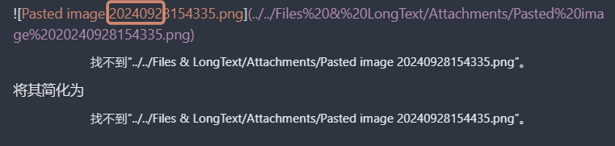
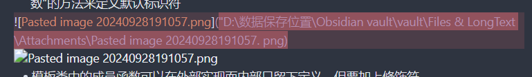

## 常用导航---方便跳转
## 目录
- [邮箱](#邮箱)
- [电话](#电话)
- [域名](#域名)
- [IP](#ip)
- [帐号校验](#帐号校验)
- [字符校验](#字符校验)
    - [汉字](#汉字)
    - [英文和数字](#英文和数字)
    - [长度为3-20的所有字符](#长度为3-20的所有字符)
    - [英文字符](#由英文字符)
        - [由26个英文字母组成的字符串](#由26个英文字母组成的字符串)
        - [由26个大写英文字母组成的字符串](#由26个大写英文字母组成的字符串)
        - [由26个小写英文字母组成的字符串](#由26个小写英文字母组成的字符串)
        - [由数字和26个英文字母组成的字符串](#由数字和26个英文字母组成的字符串)
        - [由数字、26个英文字母或者下划线组成的字符串](#由数字26个英文字母或者下划线组成的字符串)
    - [中文、英文、数字包括下划线](#中文英文数字包括下划线)
    - [中文、英文、数字但不包括下划线等符号](#中文英文数字但不包括下划线等符号)
    - [禁止输入含有^%&',;\=?\$"等字符](#禁止输入含有等字符)
    - [禁止输入含有\~的字符](#禁止输入含有的字符)
- [数字正则](#数字正则)
    - [整数](#整数)
        - [正整数](#正整数)
        - [负整数](#负整数)
        - [非负整数](#非负整数)
        - [非正整数](#非正整数)
    - [浮点数](#浮点数)
        - [正浮点数](#正浮点数)
        - [负浮点数](#负浮点数)
        - [非负浮点数](#非负浮点数)
        - [非正浮点数](#非正浮点数)

## 表达式全集
正则表达式主要依赖于元字符。
元字符不代表他们本身的字面意思，他们都有特殊的含义。一些元字符写在方括号中的时候有一些特殊的意思。以下是一些元字符的介绍：
| 字符   | 描述                                                         |
| ------ | ------------------------------------------------------------ |
| .      | 句号匹配任意单个字符除了换行符。要匹配包括 `\n` 在内的任何字符，请使用像 `(.\|\n)` 的模式。 |
| [ ]    | 字符种类。匹配方括号内的任意字符。                           |
| [^ ]   | 否定的字符种类。匹配除了方括号里的任意字符                   |
| \*     | 匹配 >=0 个重复的在 `*` 号之前的字符。例如，`zo*` 能匹配 `z` 以及 `zoo` 。`*` 等价于 `{0,}`。 |
| \+     | 匹配 >=1 个重复的 `+` 号前的字符。例如， `zo+` 能匹配 `zo` 以及 `zoo` ，但不能匹配 `z` 。`+` 等价于 `{1,}`。 |
| ?      | 标记 ? 之前的字符为可选。例如，`do (es)?` 可以匹配 `does` 或 `does` 中的 `do`。`?` 等价于 `{0,1}`。 |
| & #124 ; | 或运算符，匹配符号前或后的字符。例如，`z |food ` 能匹配 ` z ` 或 ` food `。` (z|f) ood ` 则匹配 ` zood ` 或 ` food `。 |
| & #92 ;  | 转义字符, 用于匹配一些保留的字符 `[ ] ( ) { } . * + ? ^ $ \ & #124 ;` |
| ^      | 从开始行开始匹配。                                           |
| & #36 ;  | 从末端开始匹配。                                             |
| {n}    | `n` 是一个非负整数。匹配确定的 n 次。例如， `o{2}` 不能匹配 `Bob` 中的 `o` ，但是能匹配 `food` 中的两个 `o`。 |
| {n,}   | `n` 是一个非负整数。至少匹配 n 次。例如， `o{2,}` 不能匹配 `Bob` 中的 `o`，但能匹配 `foooood` 中的所有 o。 `o{1,}` 等价于 `o+`。 `o{0,}` 则等价于 `o*`。 |
| {n, m}  | `m` 和 `n` 均为非负整数，其中 `n<=m`。最少匹配 `n` 次且最多匹配 `m` 次。例如，`o{1,3}` 将匹配 `fooooood` 中的前三个 `o`。`o{0,1}` 等价于 `o?`。请注意在逗号和两个数之间不能有空格。 |
| (xyz)  | 字符集，匹配与 `xyz` 完全相等的字符串.                       |
| [xyz]  | 字符集合。匹配所包含的任意一个字符。例如，`[abc]` 可以匹配 `plain` 中的 `a`。 |
| [^xyz] | 负值字符集合。匹配未包含的任意字符。例如， `[^abc]` 可以匹配 `plain` 中的 `p`。 |
| [a-z]  | 字符范围。匹配指定范围内的任意字符。例如，`[a-z]` 可以匹配 `a` 到 `z` 范围内的任意小写字母字符。 |
| [^a-z] | 负值字符范围。匹配任何不在指定范围内的任意字符。例如，`[^a-z]` 可以匹配任何不在 `a` 到 `z` 范围内的任意字符。 |
</details>
<details>
正则表达式提供一些常用的字符集简写。如下:
| 简写 | 描述                                                         |
| ---- | ------------------------------------------------------------ |
| .    | 除换行符外的所有字符                                         |
| \w   | 匹配所有字母数字，等同于 `[a-zA-Z 0-9_]`                      |
| \W   | 匹配所有非字母数字，即符号，等同于： `[^\w]`                 |
| \d   | 匹配数字： `[0-9]`                                           |
| \D   | 匹配非数字： `[^\d]`                                         |
| \s   | 匹配所有空格字符，等同于： `[\t\n\f\r\p{Z}]`                 |
| \S   | 匹配所有非空格字符： `[^\s]`                                 |
| \f   | 匹配一个换页符                                               |
| \n   | 匹配一个换行符                                               |
| \r   | 匹配一个回车符                                               |
| \t   | 匹配一个制表符                                               |
| \v   | 匹配一个垂直制表符                                           |
| \p   | 匹配 CR/LF（等同于 `\r\n`），用来匹配 DOS 行终止符           |
| \b   | 匹配一个单词边界，指单词和空格间的位置。例如，`er\b` 可以匹配 `never` 中的 `er`，但不能匹配 `verb` 中的 `er`。 |
| \B   | 匹配非单词边界。`er\B` 能匹配 `verb` 中的 `er`，但不能匹配 `never` 中的 `er`。 |
</details>
<details>
| 符号 | 描述            |
| ---- | --------------- |
| ?=   | 正先行断言-存在 |
| ?!   | 负先行断言-排除 |
| ?<=  | 正后发断言-存在 |
| ?<!  | 负后发断言-排除 |
</details>
<details>
标志也叫模式修正符，因为它可以用来修改表达式的搜索结果。
这些标志可以任意的组合使用，它也是整个正则表达式的一部分。
| 标志 | 描述                                                  |
| ---- | ----------------------------------------------------- |
| i    | 忽略大小写。                                          |
| g    | 全局搜索。                                            |
| m    | 多行修饰符：锚点元字符 `^` `$` 工作范围在每行的起始。 |
</details>
## 身份证号
```regex
^[1-9]\d{5}(18|19|([23]\d))\d{2}((0[1-9])|(10|11|12))(([0-2][1-9])|10|20|30|31)\d{3}[0-9 Xx]$
```
🚧  E.g: `42112319870115371 X`
## 军官证
```regex
^ [\u4E00-\u9FA5](字第) ([0-9 a-zA-Z]{4,8})(号?)$
```
🚧  E.g: `军字第 2001988 号`，`士字第 P 011816 X 号`。军/兵/士/文/职/广/（其他中文） + "字第" + 4 到 8 位字母或数字 + "号"
## 护照
```regex
^([a-zA-z]|[0-9]){5,17}$
```
🚧  E.g: `141234567`，`G 12345678`，`P 1234567`。14/15 开头 + 7 位数字, G + 8 位数字, P + 7 位数字, S/D + 7 或 8 位数字, 等
## 统一社会信用代码
```regex
^[1-9 ANY][1-59]\d{6}[\dA-Z]{8}[\dX][\dA-HJ-NP-RTUW-Y]$
```
🚧  E.g: `92141127 MA 0 KD 1 Y 64 A`。[GB 32100-2015](https://zh.wikisource.org/wiki/GB_32100-2015_%E6%B3%95%E4%BA%BA%E5%92%8C%E5%85%B6%E4%BB%96%E7%BB%84%E7%BB%87%E7%BB%9F%E4%B8%80%E7%A4%BE%E4%BC%9A%E4%BF%A1%E7%94%A8%E4%BB%A3%E7%A0%81%E7%BC%96%E7%A0%81%E8%A7%84%E5%88%99) / [法人和其他组织统一社会信用代码制度建设总体方案](https://www.gov.cn/zhengce/content/2015-06/17/content_9858.htm)
## 港澳居民来往内地通行证
```regex
^([A-Z]\d{6,10}(\(\w{1}\))?)$
```
🚧  E.g: `H 1234567890`。H/M + 10 位或 6 位数字
## 台湾居民来往大陆通行证
```regex
^\d{8}|^[a-zA-Z 0-9]{10}|^\d{18}$
```
🚧  E.g: `12345678`，`1234567890 B`。新版 8 位或 18 位数字，旧版 10 位数字 + 英文字母
## 用户名
```regex
^[a-zA-Z 0-9_-]{4,16}$
```
🚧  E.g: `jaywcjlove`。验证 **数字**、**字母**、**_**、**-**，不包含特殊字符，长度 `4-16` 之间。
## 微信号
```regex
^[a-zA-Z]([-_a-zA-Z 0-9]{5,19})+$
```
🚧  E.g: `jslite`。微信号正则，6 至 20 位，以字母开头，字母，数字，减号，下划线。
## 密码强度 (宽松)
```regex
^(?=.*\d)(?=.*[a-z])(?=.*[A-Z]).{8,10}$
```
🚧  E.g: `diaoD 123`, `Wgood 123`。必须是包含大小写**字母**和**数字**的组合，长度在 `8-10` 之间。
```regex
^[0-9 a-zA-Z\u 4 E 00-\uFA 29]*$
```
🚧  E.g: `diaoD 123`, `Wgood 123`。数字字母中文。
## 密码强度 (包含特殊字符)
```regex
^.*(?=.{6,})(?=.*\d)(?=.*[A-Z])(?=.*[a-z])(?=.*[!@#$%^&*? ] ).*$
```
🚧  E.g: `diaoD 123#`, `Wgood 123#$`。密码强度正则，最少 `6` 位，包括至少 `1` 个**大写字母**，`1` 个**小写字母**，`1` 个**数字**，`1` 个**特殊字符**。
```regex
(?=.*[a-z])(?=.*[A-Z])(?=.*\d)(?!.*(.)\1{2})^.{8,22}$
```
🚧  相同字符不能出现 3 次，至少 8 个，至多 22 个字符组成，包含一个小写字母，一个大写字母，和一个数字
## 火车车次
```regex
^[GCDZTSPKXLY 1-9]\d{1,4}$
```
E.g: `G 2868`, `D 22`, `D 9`, `Z 5`, `Z 24`, `Z 17`
## 汉字中文
```regex
^[\u 4 e 00-\u 9 fa 5]{0,}$
```
🚧  E.g: `中文`, `湖北`, `黄冈`。不限制文字长度。
```regex
^[\u 4 e 00-\u 9 fa 5]{2,6}$
```
🚧  E.g: `中文`, `湖北黄冈`。2 到 6 位汉字
## 中文名字
```regex
^(?:[\u 4 e 00-\u 9 fa 5·]{2,16})$
```
🚧  E.g: `周杰伦`, `古丽娜扎尔·拜合提亚尔`, `拉希德·本·穆罕默德·本·拉希德`。
## 英文姓名
```regex
(^[a-zA-Z][a-zA-Z\s]{0,20}[a-zA-Z]$)
```
🚧  E.g: `Gene Kelly`, `Fred Astaire`, `Humphrey Bogart`, `GaryCooper`, `Cary Grant`, `Joan Crawford`
## URL
```regex
^[a-zA-Z]+:\/\/
```
🚧  E.g: `http://www.abc.com`, `http://`, `https://`
```regex
^((https?|ftp|file):\/\/)? ([\da-z\.-]+)\. ([a-z\.]{2,6})([\/\w \.-]*)*\/?$
```
🚧  E.g: `https://github.com`, `https://github.com/jaywcjlove`
```regex
^([a-zA-Z 0-9]([a-zA-Z 0-9\-]{0,61}[a-zA-Z 0-9])?\.)+[a-zA-Z]{2,6}$
```
🚧  E.g: `blog. Csdn. Net`
## Mac 地址匹配
```regex
^([0-9 a-fA-F][0-9 a-fA-F]:){5}([0-9 a-fA-F][0-9 a-fA-F])$
```
🚧  E.g: `dc:a9:04:77:37:20`
## 图片后缀
```regex
(. Jpg|. Gif|. Png|. Jpeg)+(\?|\#|$)
```
🚧  E.g: `a/b/c.jpg?`, `a/b/c.png`, `a/b/c.png? Good=1`
## 传真号码
```regex
^(([0\+]\d{2,3}-)? (0\d{2,3})-)(\d{7,8})(-(\d{3,}))?$
```
🚧  E.g: `086-021-5055452`, `021-5055452`。国家代码 (2 到 3 位)，区号 (2 到 3 位)，电话号码 (7 到 8 位)，分机号 (3 位)
## 日期（YYYY-MM-DD 格式）
```regex
^\d{4}-(?: 0[1-9]|1[0-2])-(?: 0[1-9]|[1-2][0-9]|3[01])$
```
🚧  E.g: `1987-04-03`, `2024-04-28`。月份范围为 01 到 12，日范围分别为 01 到 31、01 到 30、01 到 29（对于闰年的二月）或者 01 到 28
## 手机号码
```regex
^1[34578]\d{9}$
```
🚧  E.g: `13611778887`
```regex
^((\+?[0-9]{1,4})|(\(\+86\)))? (13[0-9]|14[57]|15[012356789]|17[03678]|18[0-9])\d{8}$
```
🚧  E.g: `13611779993`, `+8613611779993`
<details>
* 13 段：130、131、132、133、134、135、136、137、138、139
* 14 段：145、147
* 15 段：150、151、152、153、155、156、157、158、159
* 17 段：170、176、177、178
* 18 段：180、181、182、183、184、185、186、187、188、189
* 国际码如：中国 (+86)
</details>
## MD 5 格式 (32 位)
```regex
^[a-f 0-9]{32}$
```
🚧  E.g: `a 31851770 dae 6 ee 96 fc 886 f 261 c 211 e 7`, `99 cd 2175108 d 157588 c 04758296 d 1 cfc`
## IPv 4 地址
```regex
(\b 25[0-5]|\b 2[0-4][0-9]|\b[01]?[0-9][0-9]?)(\. (25[0-5]|2[0-4][0-9]|[01]?[0-9][0-9]?)){3}
```
🚧  E.g: `192.168.1.1`, `127.0.0.1`, `0.0.0.0`, `255.255.255.255`, `1.2.3.4`
```regex
^(?: (?: 25[0-5]|2[0-4][0-9]|[01]?[0-9][0-9]?)\.){3}(?: 25[0-5]|2[0-4][0-9]|[01]?[0-9][0-9]?)$
```
🚧  E.g: `192.168.1.1`, `127.0.0.1`, `0.0.0.0`, `255.255.255.255`, `1.2.3.4`
## IPv 6
```regex
(([0-9 a-fA-F]{1,4}:){7,7}[0-9 a-fA-F]{1,4}|([0-9 a-fA-F]{1,4}:){1,7}:|([0-9 a-fA-F]{1,4}:){1,6}:[0-9 a-fA-F]{1,4}|([0-9 a-fA-F]{1,4}:){1,5}(:[0-9 a-fA-F]{1,4}){1,2}|([0-9 a-fA-F]{1,4}:){1,4}(:[0-9 a-fA-F]{1,4}){1,3}|([0-9 a-fA-F]{1,4}:){1,3}(:[0-9 a-fA-F]{1,4}){1,4}|([0-9 a-fA-F]{1,4}:){1,2}(:[0-9 a-fA-F]{1,4}){1,5}|[0-9 a-fA-F]{1,4}: ((:[0-9 a-fA-F]{1,4}){1,6})|: ((:[0-9 a-fA-F]{1,4}){1,7}|:)|fe 80: (:[0-9 a-fA-F]{0,4}){0,4}%[0-9 a-zA-Z]{1,}|:: (ffff (: 0{1,4}){0,1}:){0,1}((25[0-5]|(2[0-4]|1{0,1}[0-9]){0,1}[0-9])\.){3,3}(25[0-5]|(2[0-4]|1{0,1}[0-9]){0,1}[0-9])|([0-9 a-fA-F]{1,4}:){1,4}: ((25[0-5]|(2[0-4]|1{0,1}[0-9]){0,1}[0-9])\.){3,3}(25[0-5]|(2[0-4]|1{0,1}[0-9]){0,1}[0-9]))
```
🚧  E.g: `2001:0db8:85a3:0000:0000:8a 2 e:0370:7334`, `FE80:0000:0000:0000:0202: B 3 FF: FE 1 E:8329`。
## Email
```regex
^([A-Za-z 0-9_\-\.])+\@([A-Za-z 0-9_\-\.])+\. ([A-Za-z]{2,4})$
```
🚧  E.g: ` wowohoo@qq.com `
```regex
^[a-z 0-9]+([._\\-]*[a-z 0-9])*@([a-z 0-9]+[-a-z 0-9]*[a-z 0-9]+.){1,63}[a-z 0-9]+$
```
🚧  E.g: ` wowohoo@qq.com `
<details>
1. 邮箱以 a-z、A-Z、0-9 开头，最小长度为 1.
2. 如果左侧部分包含-、_、. 则这些特殊符号的前面必须包一位数字或字母。
3. @符号是必填项
4. 右则部分可分为两部分，第一部分为邮件提供商域名地址，第二部分为域名后缀，现已知的最短为 2 位。
    最长的为 6 为。
5. 邮件提供商域可以包含特殊字符-、_、.
</details>
## 十六进制颜色
```regex
^#? ([a-fA-F 0-9]{6}|[a-fA-F 0-9]{3})$
```
🚧  E.g: ` #b8b8b8 `, ` #333 `
```regex
^#? ([0-9 a-fA-F]{3}|[0-9 a-fA-F]{6})$
```
🚧  E.g: ` #b8b8b8 `, ` #333 `
## 日期
```regex
^(?: (?! 0000)[0-9]{4}-(?: (?: 0[1-9]|1[0-2])-(?: 0[1-9]|1[0-9]|2[0-8])|(?: 0[13-9]|1[0-2])-(?:29|30)|(?: 0[13578]|1[02])-31)|(?:[0-9]{2}(?: 0[48]|[2468][048]|[13579][26])|(?: 0[48]|[2468][048]|[13579][26]) 00)-02-29)$
```
🚧  E.g: `2017-02-29`。对**月份**及**日期**验证。
## 版本号
```regex
^\d+(?:\.\d+){2}$
```
🚧  E.g: `0.1.2`。格式必须为 `X.Y.Z`。
## 车牌号
```regex
^[京津沪渝冀豫云辽黑湘皖鲁新苏浙赣鄂桂甘晋蒙陕吉闽贵粤青藏川宁琼使领][A-HJ-NP-Z](?: ((\d{5}[A-HJK])|([A-HJK][A-HJ-NP-Z 0-9][0-9]{4}))|[A-HJ-NP-Z 0-9]{4}[A-HJ-NP-Z 0-9 挂学警港澳])$
```
🚧  E.g: `鄂 A 34324`, `沪 E 13359 F`。包含**新能源**车牌。
```regex
^[京津沪渝冀豫云辽黑湘皖鲁新苏浙赣鄂桂甘晋蒙陕吉闽贵粤青藏川宁琼使领][A-HJ-NP-Z][A-HJ-NP-Z 0-9]{4}[A-HJ-NP-Z 0-9 挂学警港澳]$
```
🚧  E.g: `鄂 A 34324`, `沪 E 13595`。不包含**新能源**车牌。
## 小数点后几位
```regex
^(0|[1-9]\d*)(.[0-9]{2})$
```
🚧  E.g: `1.22`, ~~`0223.23`~~, ~~`0.00`~~。精确到 `2` 位小数
```regex
^(?!^0 (. 0{1,2})?$)\d{0,8}(\.\d{1,2})?$
```
🚧  E.g: `99999999.99`, 非零，俩位小数，最大 99999999.99 [@cuilanxin](https://github.com/jaywcjlove/regexp-example/issues/4#issuecomment-1013578631)
## 小数
```regex
^\d+\.\d+$
```
🚧  E.g: `0.0`, `0.23`, `10.54`。
```regex
^(-?\d+)(\.\d+)?$
```
🚧  E.g: `-0.0`, `0.23`, `-10.54`。
## 正整数
```regex
^\+?\d+$
```
🚧  E.g: `23`
## 负整数
```regex
^-?\d+$
```
🚧  E.g: `-23`, ~~`-2.34`~~
## 整数
```regex
^\+?-?\d+$
```
🚧  E.g: `23`, `12`, `+12`, `-22`, ~~`-12.55`~~
## 非负整数 (正整数或零)
```regex
^\d+$
```
🚧  E.g: `23`, ~~`3.322`~~
## 数字
```regex
^\d{1,}$
```
🚧  E.g: `0120`，`234234`。不包含小数。
```regex
^\d{32}$
```
🚧  E.g: `12232324444757575757575757575759`。**32**位纯数字。
## 数字 (QQ 号码)
```regex
^[1-9][0-9]{4,10}$
```
🚧  E.g: `398188661`。QQ 号正则，5 至 11 位。
```regex
^\d{5,11}$
```
🚧  E.g: `398188661`。更简单的 QQ 号码正则，5~11 位数字组成。
## 中国邮政编码
```regex
^[1-9]\d{5}$
```
🚧  E.g: `200000`。中国邮政编码为 6 位数字。
## 英文字母
```regex
^[A-Z]+$
```
🚧  E.g: `ABC`，`WANG`。大写英文字母。
```regex
^[a-z]+$
```
🚧  E.g: `abc`，`wang`。小写英文字母。
```regex
(^[a-z]|[A-Z 0-9])[a-z]*
```
🚧  E.g: `Tests`，`JavaScript`，`RegEx`。大驼峰。
## 端口号
```regex
^((6553[0-5])|(655[0-2][0-9])|(65[0-4][0-9]{2})|(6[0-4][0-9]{3})|([1-5][0-9]{4})|([0-5]{0,5})|([0-9]{1,4}))$
```
🚧  E.g: `8080`，`3000`，`65535`
## 迅雷链接
```regex
^thunderx?:\/\/[a-zA-Z\d]+=$
```
🚧  E.g: `thunder://QUFodHRwOi 0 vdG 0 vbC 5 sdS 90 ZXN 0 LnppcFpa`。
## Ed 2 k 链接
```regex
^ed 2 k:\/\/\|file\|.+\|\/$
```
🚧  E.g: `ed 2 k://|file|[xxx. Com][%E 8%8 B%B 1%E 9%9 B%84%E 6%9 C%AC%E 8%89%B 23. Mp 4|/`。
## 磁力链接
```regex
^magnet:\? Xt=urn:btih:[0-9 a-fA-F]{40,}.*$
```
🚧  E.g: `magnet:? Xt=urn:btih: 608 FA 22181 A 2614 BAE 9160763 F 04 FCB 7 ED 296 B 9 E`
## 时间
```regex
^(?:[01]\d|2[0-3]):[0-5]\d:[0-5]\d$
```
🚧  E.g: `21:54:55`，`00:23:23`。`24` 小时制时间格式 `HH:mm:ss`，并且验证时间。
```regex
^(?: 1[0-2]|0?[1-9]):[0-5]\d:[0-5]\d$
```
🚧  E.g: `12:54:55`，`01:23:23`。`12` 小时制时间格式 `HH:mm:ss`，并且验证时间。
## HTML 标记
```regex
```
🚧  E.g: ``。
## HTML 注释
```regex
<!--(.*?)-->
```
🚧  E.g: `<!-- hello -->`。
### 调整标题层级
将所有标题的层级降一级，可以根据需要调整
`"^(#+)\s (.*)$"->"#$1 $2"`
将所有标题的层级提升一级，可以根据需要调整, 如需要提升 2 级，则使用 `"^(#+)\s (.*)$"->"##$1 $2"`
如果需要将所有标题降低一级，较为麻烦，需要一层一层替换，**从低到高**
`"^(#{2})\s (.*)$"->"# $2"`，所有二级标题替换为一级标题
`"^(#{3})\s (.*)$"->"## $2"`，所有三级标题替换为二级标题
以此类推
## 工具推荐
- [RegExp](http://github.com/gskinner/regexr) 线上正则表达式学习利器。
- [Regulex](https://jex.im/regulex/#!flags=&re=%5E(a%7 Cb)*%3 F%24) JavaScript 正则表达式可视化工具。 [🇨🇳](https://jaywcjlove.gitee.io/regulex/)
- [Rubular](https://rubular.com/) Ruby 正则表达式编辑器。
- [Regex101](https://regex101.com/) 多语言支持、构建、调试并共享正则。
- [Regexper](https://regexper.com/) 正则表达式可视化工具。
- [RegEx Pal](https://www.regexpal.com/) 正则表达式调试及练习示例。
- [Regular Expression Tester](http://myregexp.com/) 在线正则表达式测试仪。
- [iHateRegex](https://github.com/geongeorge/i-hate-regex) 正则表达式备忘清单。
- [以简单的方式学习正则表达式](https://github.com/ziishaned/learn-regex)
- [Expressions APP](https://www.apptorium.com/expressions) 正则表达式应用 for Mac
- [regexlearn.com](https://github.com/aykutkardas/regexlearn.com) 一步一步地学习正则，从零到高级。
- [Regex-Vis](https://github.com/Bowen7/regex-vis) 一个开源的正则表达式可视化编辑器。

## 邮箱
` gaozihang-001@gmail.com ` 只允许英文字母、数字、下划线、英文句号、以及中划线组成
```regex
^[a-zA-Z 0-9_-]+@[a-zA-Z 0-9_-]+(\.[a-zA-Z 0-9_-]+)+$
```

`高子航 001Abc@bowbee.com.cn ` 名称允许汉字、字母、数字，域名只允许英文域名
```regex
^[A-Za-z 0-9\u 4 e 00-\u 9 fa 5]+@[a-zA-Z 0-9_-]+(\.[a-zA-Z 0-9_-]+)+$
```

## 电话
`13012345678` 手机号
```regex
^1 (3|4|5|6|7|8|9)\d{9}$
```

`XXX-XXXXXXX` `XXXX-XXXXXXXX` 固定电话
```regex
(\(\d{3,4}\)|\d{3,4}-|\s)?\d{8}
```

## 域名
`https://google.com/`
```regex
^((http:\/\/)|(https:\/\/))? ([a-zA-Z 0-9]([a-zA-Z 0-9\-]{0,61}[a-zA-Z 0-9])?\.)+[a-zA-Z]{2,6}(\/)
```

## IP
`127.0.0.1`
```regex
((?: (?: 25[0-5]|2[0-4]\d|[01]?\d?\d)\.){3}(?: 25[0-5]|2[0-4]\d|[01]?\d?\d))
```

## 帐号校验
`gaozihang_001` 字母开头，允许 5-16 字节，允许字母数字下划线
```regex
^[a-zA-Z][a-zA-Z 0-9_]{4,15}$
```

## 字符校验
### 汉字
`高子航`
```regex
^[\u 4 e 00-\u 9 fa 5]{0,}$
```

### 英文和数字
```regex
^[A-Za-z 0-9]+$
```

### 长度为 3-20 的所有字符
```regex
^.{3,20}$
```

### 英文字符
#### 由 26 个英文字母组成的字符串
```regex
^[A-Za-z]+$
```

#### 由 26 个大写英文字母组成的字符串
```regex
^[A-Z]+$
```

#### 由 26 个小写英文字母组成的字符串
```regex
^[a-z]+$
```

#### 由数字和 26 个英文字母组成的字符串
```regex
^[A-Za-z 0-9]+$
```

#### 由数字、26 个英文字母或者下划线组成的字符串 
```regex
^\w+$
```

### 中文、英文、数字包括下划线
```regex
^[\u 4 E 00-\u 9 FA 5 A-Za-z 0-9_]+$
```

### 中文、英文、数字但不包括下划线等符号
```regex
^[\u 4 E 00-\u 9 FA 5 A-Za-z 0-9]+$
```

### 禁止输入含有%&',;=?$\"等字符
```regex
[^%&',;=?$\x 22]+
```

### 禁止输入含有~的字符
```regex
[^~\x 22]+
```

## 数字正则
### 整数
```regex
^-?[1-9]\d*$
```

#### 正整数
```regex
^[1-9]\d*$
```

#### 负整数
```regex
^-[1-9]\d*$
```

#### 非负整数
```regex
^[1-9]\d*|0$
```

#### 非正整数
```regex
^-[1-9]\d*|0$
```

### 浮点数
```regex
^-? ([1-9]\d*\.\d*|0\.\d*[1-9]\d*|0?\. 0+|0)$
```

#### 正浮点数
```regex
^[1-9]\d*\.\d*|0\.\d*[1-9]\d*$
```

#### 负浮点数
```regex
^-([1-9]\d*\.\d*|0\.\d*[1-9]\d*)$
```

#### 非负浮点数
```regex
^[1-9]\d*\.\d*|0\.\d*[1-9]\d*|0?\. 0+|0$
```

#### 非正浮点数
```regex
^(-([1-9]\d*\.\d*|0\.\d*[1-9]\d*))|0?\. 0+|0$
```

### 调整标题层级
将所有标题的层级提高一级（多加一个#），可以根据需要调整
`"^(#+)\s(.*)$"->"#$1 $2"`
将所有标题的层级提升一级，可以根据需要调整, 如需要提升 2 级，则使用 `"^(#+)\s (.*)$"->"##$1 $2"`
如果需要将所有标题降低一级（减少一个#），较为麻烦，需要一层一层替换，**从低到高**
`"^(#{2})\s (.*)$"->"# $2"`，所有二级标题替换为一级标题
`"^(#{3})\s (.*)$"->"## $2"`，所有三级标题替换为二级标题
以此类推
也可以使用这段 C++脚本
```cpp
Class Tools{
Public:
    void adjust_titles_layer (bool addOrSub){// 加上一个 #填true ，减少一个写 false
        String inputPath, outputPath, line;
        InputPath = "D:\\Code Files\\vscode\\Drafts\\inputFile. Md";
        OutputPath = "D:\\Code Files\\vscode\\Drafts\\outputFile. Md";
        // getline (cin, inputPath);
        // getline (cin, outputPath);
        Ifstream inputFile (inputPath, ios::in);
        Ofstream outputFile (outputPath, ios::out);
        Regex titleRegex ("^(#+)( .+)$");
        While (getline (inputFile, line)){
            Smatch match;
            If (regex_match (line, match, titleRegex)){
                String hashes = match[1]. Str ();
                String content = match[2]. Str ();
                If (hashes. Length ()>1){
                    If (addOrSub==true){
                        Hashes. Append ("#");
                    }else{
                        Hashes. Pop_back ();
                    }
                }
                OutputFile << hashes << content << endl;
            }else{
                OutputFile << line << endl;
            }
        }
        InputFile. Close ();
        OutputFile. Close ();
        Cout << "Done";
    }
};
```
### 删除所有代码中注释
- `//` 类型注释

单行注释（`//`)：`//[\s\S]*?\n`
多行注释（`/**/`）：`/\*(.|\r\n|\n)*?\*/`
所有注释：`\/\*[\s\S]*\*\/|\/\/.*`
html 类型注释：`<!--[\s\S]*?-->`
- **解释**：
    - `<!--`：匹配注释的开始符号。
    - `[\s\S]*?`：匹配注释中的任意内容，包括换行符。`[\s\S]` 是一个常用的模式，用来匹配任意字符（包括换行符），`*?` 是非贪婪匹配，确保匹配范围尽可能短。
    - `-->`：匹配注释的结束符号。

- Python `#` 类型注释
单行注释（`#` 开头）：`(?<!["'])(?<!\\)(#.*)`
多行注释（`'''` 和 `"""`）：`("""[\s\S]*?""")|('''[\s\S]*?''')` 后面可能要添加 `\n`
所有注释 `(#.*$)|("""[\s\S]*?""")|('''[\s\S]*?''')\n`
### 删除所有空行
包括所有空白字符，制表位**（不包括换行）**
正则搜索 `^\s*$`，直接替换为空
- `^` 表示行的开头。
- `\s*` 表示匹配任意数量的空白字符（包括空格、制表符等）。
- `$` 表示行的结尾。
- 因此，`^\s*$` 匹配的是完全由空白字符组成的行，或者完全为空的行。

正则表达式搜索 `(\r?\n){2,}` 搜索所有连续的两个或两个以上的换行符，替换框填 `\n` 替换为一个
- `\r?\n` 匹配一个换行符（兼容 Windows 的 `\r\n` 和 Unix/Linux 的 `\n`）。
- `{2,}` 表示匹配两个或多个连续的换行符。

然后可以按下 `Ctrl+s` 利用 vscode 自动格式化代码
### 调整图片显示不出的“找不到文件“问题
有些早期的笔记因我移动了图片文件夹位置而不显示

并且更改成绝对位置之后无法预览

可以通过**查找替换** （不使用正则表达式）
将：`(../../Files%20`
替换为：`(../../../Files%20` 即可

### 删除 markdown 文件中的超链接
选中带有方括号和后括号的表达式`\[([^\[\]]+)\]\(([^\(\)]+)\)`
替换栏为空会导致所有内容包括方括号中内容都删除
正则：`\[(([^\[\]]+))\]\(([^\(\)]+)\)`
替换为`$1`


## 删除所有中文字符

| 基础中文字符删除   | `sed -i 's/[\x{4e00}-\x{9fa5}]//g' file`      |
| ------------------ | --------------------------------------------- |
| 全面中文及标点删除 | `perl -i -pe 's/[\p{Han}\p{P}\p{S}]//g' file` |

如果只需要正则表达式，则只需要将开头的`s/`和结尾的`//g`删去即可

常用 2 万汉字 `[一-龟]`
较为广泛的常用字覆盖 `[\u4e00-\u9fa5]`
包括标点符号则需要在后面加上 `|[，。？！；…：【】（）《》、“”]`