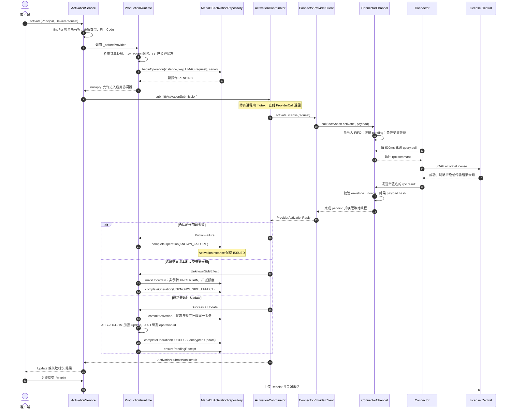
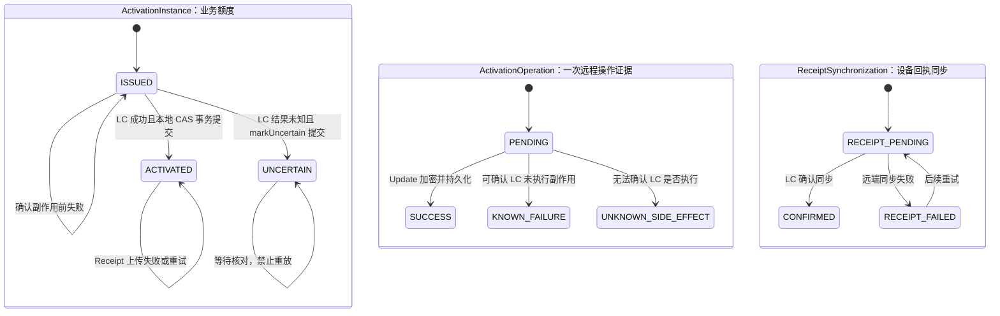
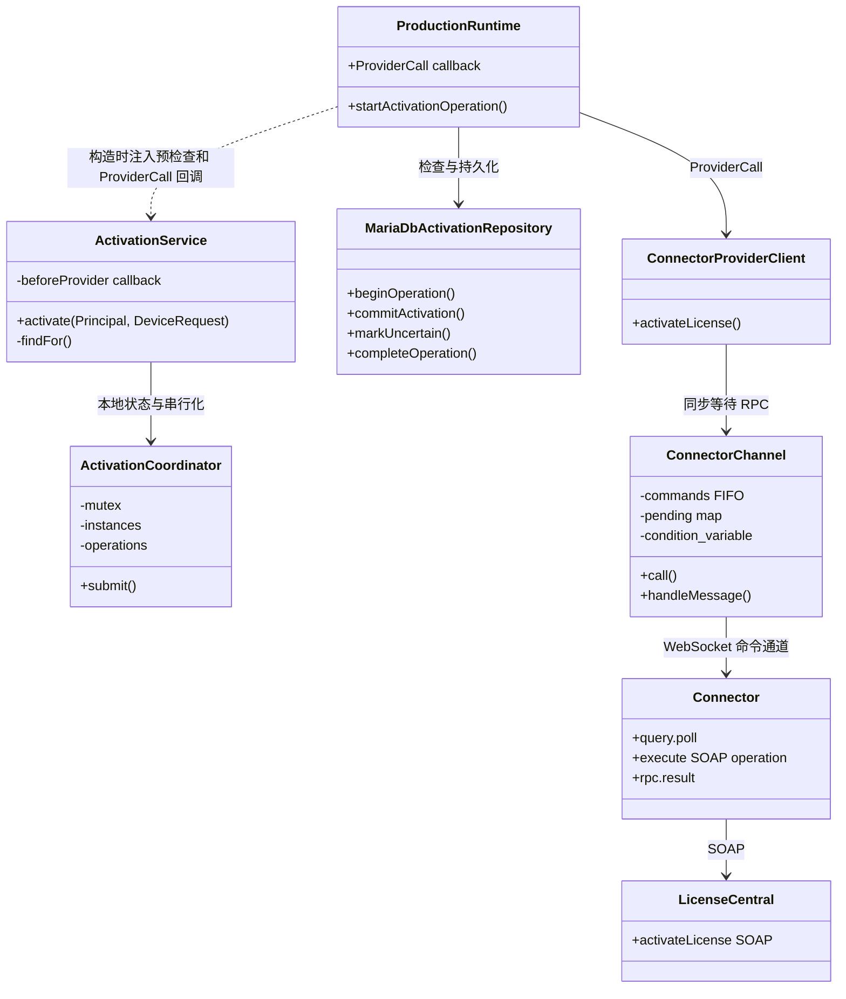

# Pammic LC
> 学习范围：聚焦 C++ 后端机制，按用户选定主题持续追加；本文件记录已经讲解的原理、调用链、边界和待核验点。
> 当前进度：已建立主题路线；第一个主题“激活的跨系统一致性协议”已完成源码调用链、状态图和故障窗口分析。
## 学习路线
1. 激活的跨系统一致性协议
2. Connector 出站命令通道
3. 订单创建 Saga 与幂等恢复
4. 未知结果的核对与补偿订单
5. MariaDB 并发控制与操作日志
6. 作用域授权与 IDOR 防护
7. LC 状态投影与同步
8. C++ 服务边界与可测试性
9. 开发模式、生产组装与 fail closed
## 激活的跨系统一致性协议
### 问题背景
Pammic 的 MariaDB 事务无法覆盖 License Central（LC）的 SOAP 调用。激活由两个独立系统共同完成：LC 接受请求后产生 Update；Pammic 需要消费对应的业务额度并将 Update 交给浏览器。若网络在 LC 完成副作用后断开，后端无法仅凭超时判断“LC 没执行”还是“LC 已执行但响应丢失”。
项目因此采用保守的至多消费一次规则：LC 明确在副作用前拒绝时，激活实例保持可用；成功或结果未知时，Pammic 先把实例占用，再允许交付 Update。它不追求跨系统 exactly-once，而是避免未知结果触发原 TicketLicense 的盲目重放。
### 核心对象

| 对象 | 责任 | 关键区别 |
|---|---|---|
| TicketLicense | LC 订单中可独立激活的一份许可 | 外部许可单元，不能由 Pammic 本地事务锁定 |
| ActivationInstance | Pammic 对 TicketLicense 的业务占用 | 状态表达额度是否还能使用 |
| ActivationOperation | 一次向 LC 发起激活的持久化操作记录 | 保存幂等键、请求指纹、设备序列号、操作结果和 Update 密文 |
| ReceiptSynchronization | 上传 Receipt、关闭 LC 激活的同步记录 | 记录 LC 交付确认进度，不决定 Pammic 额度是否已消费 |
| Update / Receipt | LC 返回的设备更新数据 / 设备导入后的确认数据 | Update 交付在前；Receipt 同步在后 |
业务状态与操作证据分开：`issued / activated / revoked` 描述 Pammic 的额度状态；`PENDING / SUCCESS / KNOWN_FAILURE / UNKNOWN_SIDE_EFFECT` 描述一次远程调用的处理结果。`uncertain` 表示无法确认远程副作用，按已占用处理以阻止复用。
### 调用链

```text
POST /api/v1/me/activations/{id}/attempt
  → ActivationService::activate
  → ProductionRuntime::startActivationOperation（预检查并持久化 PENDING）
  → ActivationCoordinator::submit（进程内串行、幂等检查）
  → ConnectorProviderClient::activateLicense
  → ConnectorChannel::call
  → Connector 调用 LC SOAP
  → MariaDB 提交额度状态与操作证据
  → HTTP 返回 Update
  → 客户之后上传 Receipt
```

浏览器送来的关键参数是 `Idempotency-Key`、激活实例 ID、Context、Firm Code 和 CmDongle 序列号。`ActivationService` 先通过当前 Principal 检查归属，再校验设备输入；生产环境通过 `_beforeProvider` 回调做持久化预检查，然后协调器才调用提供方。
生产预检查 `ProductionRuntime::startActivationOperation` 会核对本地激活投影、订单许可配置及 LC 已消耗的 TicketLicense 状态，然后调用 `MariaDbActivationRepository::beginOperation`。新请求写入 `PENDING` 后才会进入远程调用；已存在的成功操作返回原操作结果及解密后的 Update；同一实例存在未决操作时按未知结果处理，不再发送第二次 LC 激活。

### 端到端时序图

事务边界是这条流程的核心：MariaDB 事务只覆盖本地状态，不能包住 License Central 的 SOAP 调用。先写入 PENDING 是留下“远程调用可能开始”的持久证据；它不是 LC 的事务锁，也不能让两个系统实现 exactly-once。
### 三组状态要分开读

- **ActivationInstance** 回答“这份 TicketLicense 的额度还能不能再用”。
- **ActivationOperation** 回答“某次跨系统调用走到哪、能不能安全重试”。
- **ReceiptSynchronization** 回答“设备导入后的确认信息有没有同步回 LC”。Receipt 失败不会把已消费额度改回 ISSUED。
### 对象关系与依赖方向

ProductionRuntime 是生产组装点：它把应用服务的回调接到 MariaDB 与 Connector。Coordinator 的 map 只在当前进程内；进程重启后的幂等恢复依赖 MariaDB 操作表，不依赖这张内存 map。
### 从代码里需要额外留意的边界
- **密文和请求指纹的保护方式**：activationRequestHash 对实例 ID、Context、设备序列号、Firm Code 计算 HMAC-SHA256。Update 使用 AES-256-GCM；密文、随机 12 字节 nonce、16 字节 tag 和 key version 分开保存，AAD 绑定 `activation-update:<operation-id>`。
- **多进程下存在检查与插入间隙**：beginOperation 先查该实例是否有未决操作，再 INSERT；数据库只有幂等键唯一约束，没有“每个 activation instance 同时只能有一个 PENDING”的约束。Coordinator mutex 只保护当前进程。若多个后端进程共享数据库，不同 key 的并发请求仍需部署约束或数据库级协调。
- **生产预检查的失败分类偏保守**：`_beforeProvider` 先于 Coordinator 的内存幂等检查。若 beginOperation 因请求指纹不匹配或数据库写入失败返回空，startActivationOperation 映射为 UnknownSideEffect；此时 ProviderCall 尚未发生，远端副作用并非未知。Coordinator 自己对同 key 不同请求会返回 KnownFailure，但生产请求未必能走到该分支。
- **RPC timeout 不会取消已排队命令**：ConnectorChannel::call 超时时擦除 pending 项，却没有从 FIFO 删除命令。若 Connector 还没 poll，该命令之后仍可能执行；“调用方超时”不能解释为“LC 没做”。
- **Receipt 队列写入失败不阻止激活成功返回**：ensurePendingReceipt 失败时生产回调只记录日志。如果进程随后重启，启动恢复只从待处理 Receipt 表恢复 attempt 映射，缺失的行可能让后续 Receipt 无法恢复提交。
### 源码阅读锚点
- backend/src/application/activation_service.cpp：归属检查、参数检查、`_beforeProvider` 与 Coordinator 的先后顺序。
- backend/src/application/activation_coordinator.cpp：mutex 覆盖范围、内存幂等表和业务状态迁移。
- backend/src/interfaces/http_server.cpp：startActivationOperation、生产 ProviderCall、ProductionRuntime 组装。
- backend/src/infrastructure/mariadb_activation_repository.cpp：PENDING、CAS 事务、不确定状态和加密载荷持久化。
- backend/src/infrastructure/secret_box.cpp：AES-256-GCM、AAD、HMAC-SHA256。
- backend/src/interfaces/connector_channel.cpp 与 connector/src/main.cpp：FIFO、超时、轮询和 RPC 返回。
- db/mariadb/migrations/001_base_schema.sql 与 010_durable_activation_recovery.sql：唯一约束、状态和恢复字段。

### 结果处理

| LC / 本地结果 | Pammic 的处理 | 激活实例能否重用 |
|---|---|---|
| LC 明确拒绝且确认副作用前失败 | 将操作记录为已知失败；业务实例仍为 `issued` | 可以，需使用新的请求键重新尝试 |
| LC 成功返回 Update | MariaDB 事务把实例改为 `activated` 并扣减激活码剩余额度；Update 加密保存后返回 | 不可以 |
| Connector 超时、响应无效或副作用结果无法确认 | 将实例和操作记录标为不确定；不返回可供继续使用的 Update | 不可以，需管理员核对 |
| Receipt 上传或关闭失败 | 记录同步失败；允许重试 Receipt 同步 | 不可以，激活已经提交 |
“未知”不是普通网络错误文案，而是影响状态迁移的业务结果。它表示调用方不能证明远端没有执行。把它降级为一般失败并自动重试，会有再次消费同一 TicketLicense 的风险。
### 幂等和并发
协调器以幂等键查找既有操作，并比较请求指纹：同一键对应不同请求时拒绝；同一键、同一请求时返回已记录结果。生产环境另有 MariaDB 持久化记录，因此进程重启后仍可识别 `PENDING` 或已完成操作。内存协调器用于进程内串行与快速状态保护，不能替代数据库操作记录。
`ActivationCoordinator::submit` 持有一个协调器级 `std::mutex` 并执行提供方回调，因此锁覆盖了远程调用期间。这会串行化该协调器上的激活，降低并发吞吐；当前系统约束要求一次只进行一个激活，设计以简单的副作用顺序换取较低吞吐。若将来部署多个后端进程，单个进程的 `std::mutex` 本身不构成跨进程全局锁；仍需依赖部署边界、数据库协调和提供方语义共同保证安全，不能只靠进程内锁。
`commitActivation` 使用数据库事务：先以 `id + status='ISSUED' + expected version` 条件更新激活实例，再递减激活码的 `remaining_quantity`、增加 `activated_quantity`，最后提交事务。条件更新是乐观并发控制，事务保证实例状态和激活码计数不会只成功一半。
### 为什么先提交，再交付 Update
客户的设备可能已在本地导入 Update，但浏览器在 Receipt 上传前断网。若 Pammic 等到 Receipt 才扣额度，客户可能再次拿到相同 TicketLicense 的 Update。因此状态提交点放在 LC 返回 Update 之后、HTTP 响应之前。Receipt 只确认 LC 侧的交付同步，不会回滚 Pammic 的激活实例。
成功路径里还有两个持久化阶段：MariaDB 先提交激活状态与计数，随后将 Update 加密保存到操作记录，再确保有待处理 Receipt 记录。若 LC 已成功但后续本地写入失败，系统必须保留未决证据并阻止重复调用；此时可能需要管理员对照 LC 状态恢复，不能假设整个远程与本地流程原子提交。
### 主要源码
- HTTP 激活与 Receipt 路由：`backend/src/interfaces/http_server.cpp` 中 `/api/v1/me/activations/{activation_id}/attempt` 和 `/api/v1/me/activation-attempts/{attempt_id}/receipt`。
- 归属检查、参数校验、预检查回调：`backend/src/application/activation_service.cpp` 的 `activate`。
- 进程内状态与串行协调：`backend/src/application/activation_coordinator.cpp` 的 `submit`。
- 生产预检查与提供方回调：`backend/src/interfaces/http_server.cpp` 的 `startActivationOperation` 和 `ProductionRuntime` 构造函数。
- 持久化操作、版本更新与事务：`backend/src/infrastructure/mariadb_activation_repository.cpp` 的 `beginOperation`、`commitActivation`、`completeOperation` 和 `markUncertain`。
- 外部调用结果分类：`backend/src/infrastructure/connector_provider_client.cpp` 的 `activateLicense`。
### 边界与待核验点
- Connector 通道的命令队列在内存中。后端如果在 `PENDING` 已落库、命令尚未被 Connector 执行时重启，系统可能保守地把该请求当作未决操作并要求人工核对；这保护额度，但增加了运维核对量。
- 浏览器契约要求 Receipt 对应原目标设备。数据库会保存 `target_container_serial`，但当前 `ActivationService::receiptRequestFor` 在应用层只校验序列号非空，没有比较其是否等于激活时保存的目标序列号。这里存在应用层约束未闭合的迹象；还需结合完整生产路径及 LC 校验确认影响。
- `activation_serialization_test.cpp` 验证多个线程竞争同一实例时只调用一次提供方。本文依据源码与测试内容整理，未运行测试。
### 自测问题
1. 为什么 `UnknownSideEffect` 不能直接复用 `KnownFailure` 的重试逻辑？
2. `ActivationInstance` 和 `ActivationOperation` 分别代表什么状态？为什么需要两者？
3. 如果 Receipt 上传失败，为什么 Pammic 不把激活实例改回 `issued`？
4. `std::mutex` 保护的范围是什么？它能否保证多个后端进程之间只发生一次 LC 调用？
5. 如果 LC 成功，但 MariaDB 提交失败，系统为何宁可要求管理员核对，也不直接重试？
