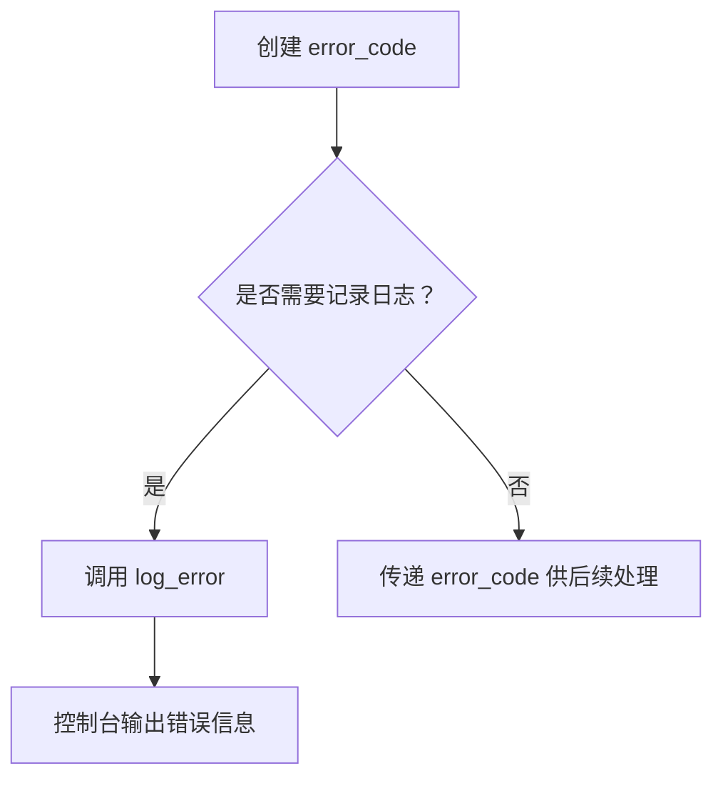

项目地址：(https://github.com/anarthal/servertech-chat.git)
# 完整运行流程
## 环境准备
### 工具安装
- g++版本更新到 11 以上，支持 C++17 标准（ubuntu 使用 `apt install` 即可）
- 安装编译 boost 库必须的开发套件包 `bashsudo apt install build-essential g++ python3-dev libicu-dev libbz2-dev wget`，其中 g++不会是最新的
- 在 [Boost 1.89.0](https://www.boost.org/releases/latest/) 中找到最新 boost 库，使用 `wget` 下载对应的包
	- `tar -xvf` 解压包
	- `cd` 之后 `./bootstrap -prefix=/usr/local/boost_1.89.0` ，prefix 参数决定了之后使用 `./b2 install` 会将 boost 库文件安装在什么位置
	- `./b2 install` 安装 boost 库
	- 检查 `ls -al /usr/local/boost_1.89.0` 中是否有 include 和 lib 文件夹，以及其中是否有大量的 `.hpp` 文件
- 在(https://cmake.org/files/v3.29/cmake-3.29.0.tar.gz) 中下载 cmake 构建工具
	- 解压，进入目录后使用 `./bootstrap -prefix=/usr/local/cmake_3.29.0 && make install` 编译cmake工具
- 将 `/usr/locate/boost_1.89.0` 和 `/usr/locate/cmake-3.29.0` 将两者添加到环境变量中 `export PATH=/usr/local/....:$PATH`
### 代码更新
- 项目使用boost 1.74，最新的 boost 1.89 已经将 `time.expires_from_now()` 舍弃，所以需要替换为 `time.expires_after()`，位置在 servertech-chat/server/src/services/mysql_client. cpp:182:23。
- 根据指引 pdf 中将 mysql 服务的账号密码设置正确
- 在本机的 redis.conf 文件中将 requirepass 设置为 `""` 空，项目只能接受密码为空值的 redis 服务，否则前端无法和后端交互
- 在进入 serve 目录之后使用
```bash
cmake . -DCMAKE_CXX_STANDARD=17 && make
```
出现 main 文件之后继续按照指引即可
# 代码分析（按文件）
## server
### src.util
### src/error. cpp & include/error.hpp
#### 问题
- 为什么 `to_string` 和 `chat_category` 对象 `cat` 要放在匿名命名空间中？
  匿名命名空间（`namespace { ... }`）的作用是**将符号（函数、变量等）限制在当前编译单元（Translation Unit）内**，相当于C语言中的 `static` 修饰符，避免全局命名冲突。
	- `to_string` 是一个辅助函数，仅在 `chat_category::message(int)` 中被调用，不需要暴露给外部代码。
	- `chat_category cat` 是单例对象，用于注册错误类别，外部无需直接访问它。
	- 如果放在匿名命名空间外，可能会造成**符号污染**或与其他模块的同名符号冲突。
- `chat_category` 必须继承 `boost::system::error_category`？
	- Boost.Asio 和 Boost.Redis 等库依赖 Boost.System 的错误处理机制。自定义类别需与之兼容。
	- 自定义的错误类如果继承了 `boost::system::error_category`，他就可以隐式转换为这种类型，前提是 public 继承。参考 [[C++ Basics#继承#不同访问修饰符继承]]
	- 如果使用了自定义类并且继承自 `boost::system::error_category`，就必须要在 boost:: system 命名空间中创建一个特化模板，它的格式为：
```cpp
template <>
struct is_error_code_enum<chat::errc> { 
   static constexpr bool value = true;
};
```
模板类型名称一定要为 `struct is_error_code_enum`，才能够将 `chat::errc` 中的错误类型假入 boost:: system 管理。
#### 整体结构
1. error. hpp 中定义 enum class errc 定义所有可能出现的错误，error. cpp 中使用 `BOOST_DESCIBE_ENUM` 描述 to_string 之后的信息。
2. to_string 创建转换规则，将 `char::ec`；类型对应的 BOOST_DESCIBE_ENUM 类型对应，转换为对应字符串。和 chat_category 将自定义错误注册让 boost:: system 来管理。to_strng 名为了避免冲突，并且他只服务于 chat_category 中，所以放在匿名 namespace 中。
3. 注册还有一个步骤是在 boost:: system 中创建一个特化模板(is_error_code_num)，表示 chat:: errc 已经是其中一员。
4. 两个宏定义让外部**需要返回 error_code 类型的函数**使用他们时，传入错误，即可创建附带位置的 error_code 对象直接中断函数，return 出现的错误。如果
5. 所有的错误**日志输出**都需要通过 log_error 函数处理

可以看到 src/listen. cpp 中，accept_loop 函数中，返回值为 void，代码中就使用：
```cpp
if (ec)
    return chat::log_error(ec, "accept");
```
在 src/api/aip_types. cpp 的 parse_client_event 函数中，大量直接使用宏的场景
```cpp
chat::any_client_event chat::parse_client_event(std::string_view from) {
    error_code ec;

    // Parse the JSON
    auto msg = boost::json::parse(from, ec);
    if (ec)
        CHAT_RETURN_ERROR(ec)
    // 其他代码
}
```
其返回值为：
```cpp
using any_client_event = boost::variant2::variant<
    error_code,  // Invalid, used to report errors
    client_messages_event,
    request_room_history_event>;
```