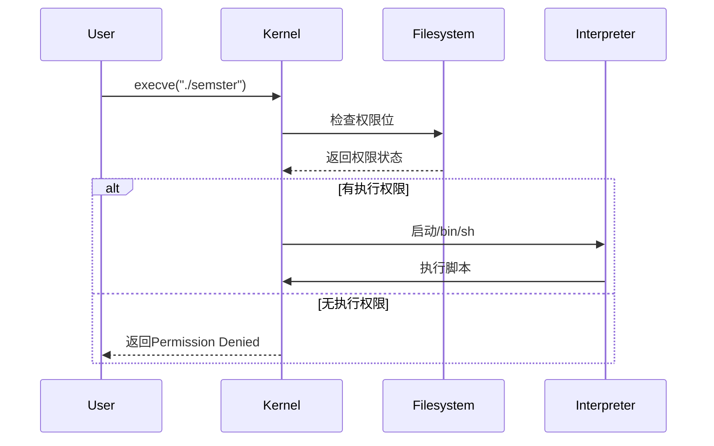

[计算机教育中缺失的一课 · the missing semester of your cs education](https://missing-semester-cn.github.io/)
# 课程概览与 shell
你不能点击一个不存在的按钮或者是用语音输入一个还没有被录入的指令。 为了充分利用计算机的能力，我们不得不回到最根本的方式，使用文字接口：Shell
## 在程序间创建连接
- 当程序尝试读取信息时，它们会从输入流中进行读取，当程序打印信息时，它们会将信息输出到输出流中。
- 当程序打印信息时，它们会将信息输出到输出流中
- 最简单的重定向是 `< file` 和 `> file`。这两个命令可以将程序的输入输出流分别重定向到文件：
`cat` 命令用于查看文本文件的内容。它的名称来源于“concatenate”（连接），因为该命令可以将多个文件的内容连接在一起显示
`touch` 命令用于创建空文件或更新现有文件的访问和修改时间。其名称来源于“touch up”（触动、更新）。该命令通常用于创建新文件或更新已有文件的时间戳。

创建脚本文件之后如果需要执行脚本：
首先修改权限
- 新建文件默认权限为 `644`（`-rw-r--r--`）
- 执行权限位未设置（缺少 `x` 权限）
- 系统要求可执行文件必须具有执行权限
执行方法：
- 使用 sh 命令，执行脚本
- 直接使用文件的路径执行
---
## 执行文件
### Linux 中的文件识别机制

**第一行 `#!/bin/sh` 的作用**：
- 指定解释器路径
- 内核通过此识别文件类型
- 与文件扩展名无关

执行流程
1. 内核检查文件权限
2. 发现可执行权限后读取首行
3. 调用指定解释器执行内容
与直接执行的区别

| 方式           | 执行机制           |
| ------------ | -------------- |
| `./semster`  | 依赖文件权限和shebang |
| `sh semster` | 显式指定解释器，忽略文件权限 |

ELF 文件识别
- 二进制文件：通过魔数识别
- 脚本文件：通过首行 `#!` 识别
内核处理流程
1. 检查文件类型
2. 对脚本文件：
    - 解析 shebang
    - 启动解释器进程
    - 将文件内容传递给解释器

### 与文件识别有关的命令
1. `file` 命令
`file` 命令用于**确定文件类型**，通过分析文件内容来识别文件格式，而不是依赖文件扩展名。
- 检查二进制文件头部"魔数"（magic number）如果是纯文本文件则检查首行指定解释器路径或者脚本标记 `#!`
- 分析文件内容结构
- 识别文本文件的编码格式
2. `head` 命令用于**显示文件开头部分内容**，默认显示前10行。
3. `bash` 是**Bourne Again Shell**，是Linux系统默认的命令行解释器。提供一个标准编程/命令环境

| `-c` | 执行单条命令  |
| ---- | ------- |
| `-x` | 显示执行过程  |
| `-n` | 检查语法不执行 |
| `-i` | 交互模式    |
### 命令又用法查询
| 特性   | `man` | `--help` |
| ---- | ----- | -------- |
| 内容   | 详细手册  | 快速帮助     |
| 来源   | 系统手册页 | 命令内置     |
| 分页   | 支持    | 不支持      |
| 详细程度 | 高     | 低        |
| 适用场景 | 深入学习  | 快速查询     |
可以使用 `command --help | grep -i(ignore-case) "\-options"` 获取对应命令或者参数的帮助
至于为什么需要转义字符，以 `grep --help | grep "-A"`
1. **双引号问题**：

    - 在 Shell 中，双引号会保留大部分特殊字符的字面意义
    - 但 `-` 在命令参数中始终会被解析为参数前缀
    - 因此 `grep "-A"` 仍会被解析为参数
2. **`grep --help | grep '-A'` 失败原因**：
    - `grep --help` 输出的是帮助文本
    - 当用 `grep '-A'` 搜索时，`-A` 被解释为参数
    - 但缺少了该参数需要的数字值

| 方法    | 原理                   |
| ----- | -------------------- |
| `--`  | 强制将后续内容视为非参数         |
| `\-`  | 转义使 `-` 成为普通字符       |
| `[-]` | 字符类中的 `-` 无特殊含义      |
| `-e`  | 明确指定搜索模式(正则表达式)，避免歧义 |

### 深层机制

1. **Shell 参数解析顺序**：
    
    - 参数解析发生在命令执行前
    - 引号内的内容在解析后才会被处理
    - `-` 总是被优先解释为参数前缀
2. **`grep` 参数处理**：
    
    - `-A` 需要跟一个数字参数
    - 当单独出现时会导致语法错误

# # Shell 工具和脚本
[Shell 工具和脚本 · the missing semester of your cs education](https://missing-semester-cn.github.io/2020/shell-tools/)
在 bash 中为变量赋值的语法是 `foo=bar`，访问变量中存储的数值，其语法为 `$foo`。需要注意的是，`foo = bar` （使用空格隔开）是不能正确工作的，因为解释器会调用程序 `foo` 并将 `=` 和 `bar` 作为参数。总的来说，在 shell 脚本中使用空格会起到分割参数的作用，有时候可能会造成混淆，请务必多加检查。
## 使用终端编写脚本
### 编写脚本
对于一个没有后缀的文件 simple_script，向文件中写入：
```bash
#!/bin/sh
mcd () {
    mkdir -p "$1"
    cd "$1"
}
mcd “$1”
```
- `$0` - 脚本名
- `$1` 到 `$9` - 脚本的参数。 `$1` 是第一个参数，依此类推。
- `$@` - 所有参数
- `$#` - 参数个数
- `$?` - 前一个命令的返回值
- `$$` - 当前脚本的进程识别码
- `!!` - 完整的上一条命令，包括参数。常见应用：当你因为权限不足执行命令失败时，可以使用 `sudo !!` 再尝试一次。
- `$_` - 上一条命令的最后一个参数。如果你正在使用的是交互式 shell，你可以通过按下 `Esc` 之后键入 . 来获取这个值。

这样每次调用这个脚本时使用 `./simple_script test_folder` 就会在**当前工作目录**执行脚本中的内容
调用脚本的方法有：

| 概念                                                           | 说明                  |
| ------------------------------------------------------------ | ------------------- |
| `source` 或 `.`                                               | 在当前Shell执行脚本，保留所有定义 |
| `sh script.sh`                                               | 在新子Shell执行，定义不会保留   |
| `$1mcd() { mkdir -p "$1" && cd "$1"; }`<br>`mcd test_folder` | 命令行直接定义             |
`source` 和 `.` 命令（点命令）在功能上是完全相同的，它们都会将指定脚本中的内容加载到**当前 shell 环境中**执行，而不是启动一个新的子 shell。这意味着：

- 所有变量、函数、别名等定义会**保留在当前 shell 中**
- 对当前 shell 的**环境变量**的修改会**立即生效**
- 脚本中的命令会**直接在当前 shell 进程**中执行
---
### 清空终端
1. 关闭终端之后重新打开可以重置 shell 的环境
2. 使用 `exec bash` 会重置 shell，重置细节根据 `~/.bashrc` 文件定义
3. 也可以手动重置具体定义：
```bash
# 取消变量
unset MY_VAR

# 取消函数
unset -f my_function

# 取消别名
unalias my_alias
```
4. 创建虚拟环境
`env -i bash --norc --noprofile`
- `env -i` 启动一个空环境
- `--norc` 不读取 `~/.bashrc`
- `--noprofile` 不读取 `~/.bash_profile` 等
