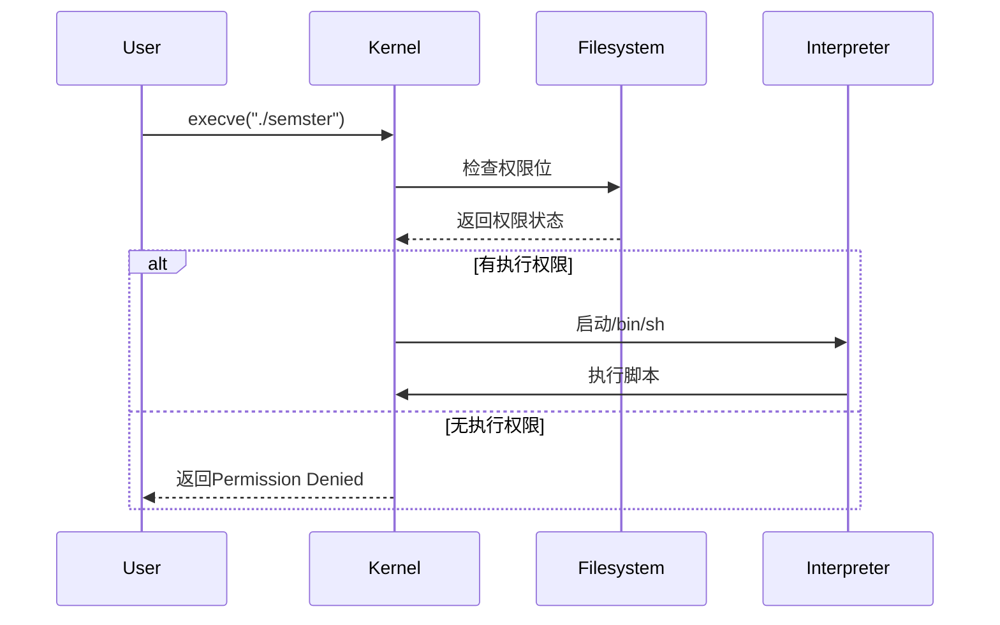

# shell
## 基本介绍
打开终端看到的内容中，
- ~表示现在的工作目录\<home>
- $表示当前身份不是 root 用户
- echo 表示将后面的字符串在屏幕上输出，当然可以使用>表示将内容输入到文件中
如果要求 shell 执行某个不是 shell 所了解的编程关键字，那么它会去咨询 _环境变量_ `$PATH`，它会列出当 shell 接到某条指令时，进行程序搜索的路径：

```shell
missing:~$ echo $PATH
# 这里将会列出环境变量path 中所有的设置
missing:~$ which echo
# 列出echo命令所属的环境变量位置
missing:~$ /bin/echo $PATH
# 在环境变量中 /bin中运行echo $PATH 命令
```

## 在 shell 中导航

### 列表信息

同 linux，ls 表示打印出当前工作目录包含文件
`ls -l /home` 命令用于列出 `/home` 目录下的所有文件和文件夹的详细信息。
- `-l` 是一个选项，表示以长格式列出信息。这通常包括文件权限、所有者、文件大小、最后修改日期等详细信息。

列表信息：`drwxr-xr-x. 2 sickwag sickwag 6 8月 13 10:18 公共`，各个部分含义如下：
1. `drwxr-xr-x.`：这是文件的权限部分。
- `d` 表示这是一个目录（directory）。
- `rwx` 表示文件所有者（owner）有读（read）、写（write）、执行（execute）的权限。
- `r-x` 表示文件所属组（group）有读和执行权限，但没有写权限。
- `r-x` 表示其他用户（others）也有读和执行权限，但没有写权限。
- `.` 表示这个目录有SELinux安全上下文（如果SELinux被启用）。
2. `2`：这是文件或目录的硬链接数（hard link count）。对于目录来说，这个数字通常表示目录中子目录数加一（因每个目录至少有一个硬链接指向它自己）。
3. `sickwag`：这是文件或目录的所有者用户名。
4. `sickwag`：这是文件或目录所属的用户组名。
5. `6`：这是文件或目录的大小，单位是块（block）。在这个上下文中，一个块通常是512字节。
6. `8月 13 10:18`：这是文件或目录的最后修改时间。
7. `公共`：这是文件或目录的名称。

在 shell 中，程序有两个主要的“流”：它们的输入流和输出流。当程序尝试读取信息时，它们会从输入流中进行读取，当程序打印信息时，它们会将信息输出到输出流中。

### 输入输出流

`>` 表示将 `>` 前的内容作为输入流输入到后面的对象，将命令的标准输出重定向到文件中，如果文件不存在，将会创建一个新文件；如果文件已存在，将会覆盖原有内容。
	`ls > filelist.txt` 命令会将 `ls` 命令的输出结果保存到 `filelist.txt` 文件中。
`<` 表示将 `<` 之后的对象的输出输出给前面的操作作为输入，将文件的内容作为命令的标准输入。
	例如，`sort < file.txt` 命令会将 `file.txt` 文件的内容作为 `sort` 命令的输入。

`|` 操作符允许我们将一个程序的输出和另外一个程序的输入连接起来：


### 查找命令
`sudo` 命令表示通过根用户权限执行操作，

1. `sudo`: 这是一个命令，允许用户以超级用户（root）的权限执行后续的命令。这通常需要输入当前用户的密码。
2. `find`: 这是一个强大的命令行工具，用于在文件系统中查找文件和目录。它可以根据文件名、大小、类型、修改时间等多种条件进行搜索。
3. `-L`: 这是一个选项，指示 `find` 命令跟随符号链接。如果找到的是符号链接，`find` 会使用链接指向的实际文件或目录进行搜索。
4. `/sys/class/backlight`: 这是 `find` 命令的搜索起始点，即 `/sys/class/backlight` 目录。这个目录通常包含了与系统背光控制相关的设备信息。
5. `-maxdepth 2`: 这个选项限制 `find` 命令搜索的深度为2层目录。这意味着它只会查找 `/sys/class/backlight` 目录下的直接子目录和文件，不会进入更深层的目录。
6. `-name '*brightness*'`: 这个选项指定 `find` 命令搜索文件名匹配模式 `*brightness*` 的文件。星号 `*` 是通配符，表示任意数量的任意字符。因此，这个命令会找到所有文件名中包含 "brightness" 的文件。

## shell 工具和脚本
```shell
foo=bar
echo "$foo"  # 其中""表示一个整体，$表示引用变量，引用内容没有空格可以不使用双引号
# 打印 bar
echo '$foo'
# 打印 $foo
```
[计算机教育中缺失的一课 · the missing semester of your cs education](https://missing-semester-cn.github.io/)
# 课程概览与 shell
你不能点击一个不存在的按钮或者是用语音输入一个还没有被录入的指令。为了充分利用计算机的能力，我们不得不回到最根本的方式，使用文字接口：Shell
## 在程序间创建连接
- 当程序尝试读取信息时，它们会从输入流中进行读取，当程序打印信息时，它们会将信息输出到输出流中。
- 当程序打印信息时，它们会将信息输出到输出流中
- 最简单的重定向是 `< file` 和 `> file`。这两个命令可以将程序的输入输出流分别重定向到文件：
`cat` 命令用于查看文本文件的内容。它的名称来源于“concatenate”（连接），因该命令可以将多个文件的内容连接在一起显示
`touch` 命令用于创建空文件或更新现有文件的访问和修改时间。其名称来源于“touch up”（触动、更新）。该命令通常用于创建新文件或更新已有文件的时间戳。

创建脚本文件之后如果需要执行脚本：
首先修改权限
- 新建文件默认权限为 `644`（`-rw-r--r--`）
- 执行权限位未设置（缺少 `x` 权限）
- 系统要求可执行文件必须具有执行权限
执行方法：
- 使用 sh 命令，执行脚本
- 直接使用文件的路径执行
---
## 执行文件
### Linux 中文件识别机制

**第一行 `#!/bin/sh` 的作用**：
- 指定解释器路径
- 内核通过此识别文件类型
- 与文件扩展名无关

执行流程
1. 内核检查文件权限
2. 发现可执行权限后读取首行
3. 调用指定解释器执行内容
与直接执行的区别

| 方式           | 执行机制           |
| ------------ | -------------- |
| `./semster`  | 依赖文件权限和 shebang |
| `sh semster` | 显式指定解释器，忽略文件权限 |

ELF 文件识别
- 二进制文件：通过魔数识别
- 脚本文件：通过首行 `#!` 识别
内核处理流程
1. 检查文件类型
2. 对脚本文件：
    - 解析 shebang
    - 启动解释器进程
    - 将文件内容传递给解释器

### 与文件识别有关的命令
1. `file` 命令
`file` 命令用于**确定文件类型**，通过分析文件内容来识别文件格式，而不是依赖文件扩展名。
- 检查二进制文件头部"魔数"（magic number）如果是纯文本文件则检查首行指定解释器路径或者脚本标记 `#!`
- 分析文件内容结构
- 识别文本文件的编码格式
2. `head` 命令用于**显示文件开头部分内容**，默认显示前 10 行。
3. `bash` 是**Bourne Again Shell**，是 Linux 系统默认的命令行解释器。提供一个标准编程/命令环境

| `-c` | 执行单条命令  |
| ---- | ------- |
| `-x` | 显示执行过程  |
| `-n` | 检查语法不执行 |
| `-i` | 交互模式    |
### 命令又用法查询
| 特性   | `man` | `--help` |
| ---- | ----- | -------- |
| 内容   | 详细手册  | 快速帮助     |
| 来源   | 系统手册页 | 命令内置     |
| 分页   | 支持    | 不支持      |
| 详细程度 | 高     | 低        |
| 适用场景 | 深入学习  | 快速查询     |
可以使用 `command --help | grep -i(ignore-case) "\-options"` 获取对应命令或者参数的帮助
至于为什么需要转义字符，以 `grep --help | grep "-A"`
1. **双引号问题**：

    - 在 Shell 中，双引号会保留大部分特殊字符的字面意义
    - 但 `-` 在命令参数中始终会被解析为参数前缀
    - 因此 `grep "-A"` 仍会被解析为参数
2. **`grep --help | grep '-A'` 失败原因**：
    - `grep --help` 输出的是帮助文本
    - 当用 `grep '-A'` 搜索时，`-A` 被解释为参数
    - 但缺少了该参数需要的数字值

| 方法    | 原理                   |
| ----- | -------------------- |
| `--`  | 强制将后续内容视为非参数         |
| `\-`  | 转义使 `-` 成为普通字符       |
| `[-]` | 字符类中 `-` 无特殊含义      |
| `-e`  | 明确指定搜索模式 (正则表达式)，避免歧义 |

### 深层机制

1. **Shell 参数解析顺序**：

    - 参数解析发生在命令执行前
    - 引号内的内容在解析后才会被处理
    - `-` 总是被优先解释为参数前缀
2. **`grep` 参数处理**：

    - `-A` 需要跟一个数字参数
    - 当单独出现时会导致语法错误

# # Shell 工具和脚本
[Shell 工具和脚本 · the missing semester of your cs education](https://missing-semester-cn.github.io/2020/shell-tools/)
在 bash 中为变量赋值的语法是 `foo=bar`，访问变量中存储的数值，其语法为 `$foo`。需要注意的是，`foo = bar` （使用空格隔开）是不能正确工作的，因解释器会调用程序 `foo` 并将 `=` 和 `bar` 作为参数。总的来说，在 shell 脚本中使用空格会起到分割参数的作用，有时候可能会造成混淆，请务必多加检查。
## 使用终端编写脚本
### 编写脚本
对于一个没有后缀的文件 simple_script，向文件中写入：
```bash
#!/bin/sh
mcd () {
    mkdir -p "$1"
    cd "$1"
}
mcd “$1”
```
- `$0` - 脚本名
- `$1` 到 `$9` - 脚本的参数。 `$1` 是第一个参数，依此类推。
- `$@` - 所有参数
- `$#` - 参数个数
- `$?` - 前一个命令的返回值
- `$$` - 当前脚本的进程识别码
- `!!` - 完整的上一条命令，包括参数。常见应用：当你因权限不足执行命令失败时，可以使用 `sudo !!` 再尝试一次。
- `$_` - 上一条命令的最后一个参数。如果你正在使用的是交互式 shell，你可以通过按下 `Esc` 之后键入 . 来获取这个值。

这样每次调用这个脚本时使用 `./simple_script test_folder` 就会在**当前工作目录**执行脚本中内容
调用脚本的方法有：

| 概念                                                           | 说明                  |
| ------------------------------------------------------------ | ------------------- |
| `source` 或 `.`                                               | 在当前 Shell 执行脚本，保留所有定义 |
| `sh script.sh`                                               | 在新子 Shell 执行，定义不会保留   |
| `$1mcd() { mkdir -p "$1" && cd "$1"; }`<br>`mcd test_folder` | 命令行直接定义             |
`source` 和 `.` 命令（点命令）在功能上是完全相同的，它们都会将指定脚本中内容加载到**当前 shell 环境中**执行，而不是启动一个新的子 shell。这意味着：

- 所有变量、函数、别名等定义会**保留在当前 shell 中**
- 对当前 shell 的**环境变量**的修改会**立即生效**
- 脚本中命令会**直接在当前 shell 进程**中执行
---
### 清空终端
1. 关闭终端之后重新打开可以重置 shell 的环境
2. 使用 `exec bash` 会重置 shell，重置细节根据 `~/.bashrc` 文件定义
3. 也可以手动重置具体定义：
```bash
# 取消变量
unset MY_VAR

# 取消函数
unset -f my_function

# 取消别名
unalias my_alias
```
4. 创建虚拟环境
`env -i bash --norc --noprofile`
- `env -i` 启动一个空环境
- `--norc` 不读取 `~/.bashrc`
- `--noprofile` 不读取 `~/.bash_profile` 等
