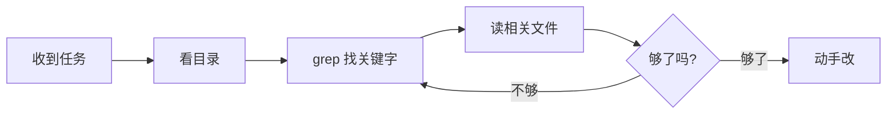

# 小林 Claude Code Note 基础知识
## CLAUDE.md
### 通用知识
![[02-claude-md-load-timeline-749f46ae.webp]]
一份好的 CLAUDE.md 应该包含这几部分：
1. 项目简介：一句话说清楚项目是做什么的
2. 技术栈：用了哪些框架和工具，让 Claude 不会乱选技术
3. 代码规范规则：你的编码偏好，让 Claude 产出的代码风格统一
4. 项目结构（可选）：目录的组织方式，一般来说说明每个**目录是做什么的就可以**
5. 目标完成情况
有三层 CLAUDE.md 存放位置
- **项目级**：放在项目根目录的 `CLAUDE.md`（或者 `.claude/CLAUDE.md`），只在这个项目里生效。适合写项目相关的信息，比如技术栈、目录结构。这个文件可以提交到 Git 里，团队成员共享。
- **个人项目级**：`CLAUDE.local.md`，也放在项目根目录，但通常加到 `.gitignore` 里不提交。适合写你自己的临时调试偏好、sandbox 地址这种「只有我用」的内容，不会干扰到队友。
- **用户级**：放在你 home 目录下的 `~/.claude/CLAUDE.md`，在所有项目里都生效。适合写你个人的通用偏好，比如「请用中文回复」「代码注释用英文」。
### 设计逻辑
- 「README 是写给人看的，[CLAUDE.md](http://claude.md/) 是写给 agent 看的，两个读者群体不一样，密度也不一样。」
- 读取 CLAUDE.md 的逻辑是从当前所在的目录一路往上爬到文件系统根目录，每爬一层就把目录名记下来。爬完之后再反向遍历，从根目录往下读每一层的 CLAUDE.md和 `.claude/CLAUDE.md`，全部合并喂给模型。**离当前路径越近的内容优先级越高**
- 项目变动频繁的*描述部分*需要通过外链让 claude 读取，保证切换 session 之间都获取最新数据
- 避免以下反例:
	- 复述项目内容，整个项目架构文档，tree 命令返回的文件树文本
	- 许愿，「我们希望测试覆盖率达到 90%」、「我们的目标是 0 bug」
	- 常见术语，「Repo 指 repository、PR 指 pull request……」，应该说一些由于网上找不到的，可能引起误解让 claude 犯错的黑话是什么意思
### Rules
对于代码规范等其他*规则*，需要保持规则**短、具体到可以被验证、告诉为什么、持续更新**。但如果不同的子模块有不同的规则，比较多且复杂就**不宜放在 CLAUDE.md 中**，而在 `.claude/rules/`。
每个 rules 文件可以加一段 YAML frontmatter（写在文件最顶部、用 `---` 包起来的一段元信息），标注「这规则只在改某类文件的时候加载」。
```yaml
---
paths: ["**/*.test.ts", "**/*.spec.ts"]
---
# 测试规则
- 用 describe / it，不用 test()
- mock 外部依赖必须用 vi.mock
- 每个测试只写一个断言
- 别用 expect.anything()，断言要精确
```
「如果两条规则互相矛盾，Claude 可能会随便挑一条。」同样需要定期维护
### 参考模板
```md
# CLAUDE.md

## 1. Project Overview
（2-3 行讲清这是个啥项目，技术栈 + 定位）
- 这是一个面向 B 端的订单管理系统
- 技术栈：TypeScript + Next.js 14 + PostgreSQL
- 部署：Vercel + Supabase

## 2. Commands
（最常用的几个命令，Claude 会直接执行）
- 安装依赖：`pnpm install`
- 启动开发：`pnpm dev`
- 跑测试：`pnpm test`
- 类型检查：`pnpm typecheck`
- Lint：`pnpm lint`

## 3. Architecture
（三句话讲完架构，不要展开）
- 前端页面在 app/（App Router）
- API 路由在 app/api/
- 数据库 schema 在 prisma/schema.prisma
- 详细架构见 docs/architecture.md

## 4. Conventions
（团队真实在用的约定）
- 组件文件用 PascalCase（UserCard.tsx）
- 工具函数用 kebab-case（format-date.ts）
- API 返回统一用 { data, error } 格式
- 错误处理用 Result type，不要 throw

## 5. Hard Constraints
（这部分要严，Claude 越界一次就要补）
- 不要写入 production 数据库（去年事故）
- 不要修改 prisma/migrations/ 下已经合入的 migration
- 不要把 .env 文件加入 git
- 所有 API 路由必须过 requireAuth() middleware

## 6. Gotchas
（每个新人都踩过的坑）
- 跑 dev 之前要先 pnpm db:push 同步 schema
- macOS 上 Prisma 偶发崩溃，重启 dev server 就好
- Vercel 部署日志在 dashboard 里看，不在终端
```
### 总结: CLAUDE.md 编写原则
- CLAUDE.md 有一个很重要的原则：**每条信息都要问自己「如果删掉这条，会不会让 Claude 犯错？」 如果不会，就不写**。
- 随着项目开发，应该定期更新里面的内容，比如新功能完成了就加到「已完成功能」列表里，技术栈换了就修改对应的部分。
- 项目主 CLAUDE.md 在 200 行以内，如果需要细化 rules 到具体模块的规则，则在 `.claude/rules/` 中写，每个约 30 行
- Claude 在哪儿犯错了，就加一条防御规则。但不需要手动打开 CLAUDE.md编辑，Claude Code 提供了 `/memory` 命令。**每 3-6 个月做一次完整审查更新**
## Hooks
Hooks 的应用场景非常多，举几个例子：
自动格式化，自动测试，安全检查，自动提交
一句话总结：Skills 给 Claude 装技能包，让它在特定领域更强；Hooks 给操作加钩子，实现自动化工作流。
Hooks 的配置写在项目的 `.claude/settings.json` 或全局的 `~/.claude/settings.json` 里。
```json
{
  "hooks": {
    "PostToolUse": [
      {
        "matcher": "Edit|Write",
        "hooks": [
          {
            "type": "command",
            "command": "jq -r '.tool_input.file_path' | xargs -I {} npx prettier --write {}"
          }
        ]
      }
    ]
  }
}
```
`jq` 负责从 stdin 的 JSON 里把 `tool_input.file_path` 字段读出来，然后 `xargs` 把它交给 Prettier 去格式化。这样每次 Claude 用 Edit 或 Write 工具改完文件，就会自动跑一次 Prettier。

## 思考强度
/effort 调整，注意其 max 档位是模型能力上限，token 完全不设限。听起来最猛，但容易「过度思考」，钻牛角尖
在**一次对话中添加 `ultrathink` 代表让这一轮临时把思考等级放到极限**，下一轮对话恢复到/effot 设置
## 标准 Vibe Coding 项目结构
![[image-20260519220747776.webp]]
## 大项目代码库如何维护
### 索引逻辑
核心原因是: **如何「精准找到要改的那几行代码」？**
业内主要通过 RAG，但存在问题:
- 数据库索引会过期
- 冷启动建立数据库&索引时间较长
- 向量数据库**不适合精确匹配**
Claude Code 依赖 agentic search:

### Harness
Anthropic 的 harness 一共七层，每层都建立在前一层基础上：**CLAUDE.md → Hooks → Skills → Plugins → MCP**，再加两个增强 **LSP 和子 agent**。
大项目规范/约束/概述/确实很多，解决的方法是**分层**:
- 「根目录的 [CLAUDE.md](http://claude.md/) 应该只放指针和关键的坑，其他细节都会变成噪音。」
- 单文件不超过 200 行
- 每个子目录的 [CLAUDE.md](http://claude.md/) 应该明确写「这块用什么命令测，怎么 lint」，让 Claude 只跑该跑的那一部分
- 跨大量文件的改动，正确解法是把任务拆成多个会话 + 用 subagent，不是写更长的 prompt。

> [!Tips] 迁移项目正确做法
> 用 `/batch` 工具，**通过对话敲定迁移细节**，派出几十个并行 subagent，每个在独立 git worktree 里跑、自测、开 PR
### 团队协作
Skill 跟 [CLAUDE.md](http://claude.md/) 最大的区别在一个词：**按需加载**。
[CLAUDE.md](http://claude.md/) 每次会话都全文加载，跟你这次任务有没有关系都加载；skill 不是，它只在 Claude 判断「当前任务需要」的时候才加载，术语叫做 progressive disclosure（渐进式披露）。
- Plugin 用于解决团队成员间 claude 配置差异。它本质上是一个安装包，把 skill、hook、MCP、LSP 配置打包在一起，install plugin 就能继承其他人的能力，并且包含版本信息，能够更新其中的配置版本。
- mcp 在 Vibe 环境的搭建的**末端配置**，应严格按照 [[#Harness]] 中的限制按顺序做好
## Skill 本质理解
### 围绕问题索引
Q1：「skill 不就是一份 markdown 吗？」这可能是最大的误解
Q2：Anthropic 内部几百个 skill，最后只归成了 9 类
Q3：为什么你写的 skill Claude 从来不触发？
Q4：一个 skill 里含金量最高的部分，是「坑点清单」
Q5：skill 还能有记忆、带脚本、挂临时 hook？
Q6：skill 怎么从你的本地走向全团队？
Q7：怎么知道一个 skill 到底有没有人用？
### skill 是一份 markdown 吗？
官方的定义是：**一个文件夹**。里面除了那份 [SKILL.md](http://skill.md/)，还可以放脚本、参考资料、数据文件、输出模板，Claude 能自己发现、探索和使用这些东西。标准结构是:
```bash
deploy-service/
├── SKILL.md               # 唯一必需：何时用我 + 操作指引 + 坑点清单
├── references/            # 参考资料，正文放不下的细节放这里
│   ├── api.md             # 部署平台 API 的详细参数和示例
│   └── troubleshooting.md # 部署失败时的排查手册
├── scripts/               # 现成的可执行脚本
│   ├── smoke_test.sh      # 冒烟测试
│   └── rollback.sh        # 一键回滚
└── assets/                # 输出模板
    └── release_note.md    # 发布报告的固定格式
```
同样，渐进式披露原则保证只要有 SKILL.md 会被加载，其他内容在其中被索引，工作时按需加载
### Skill 触发机制
session 启动的时候，Claude Code 会把所有可用 skill 收集起来，但**只取每个 skill 的名字和 description**，拼成一张清单注入 context。**决定用不用你的 skill，唯一的依据就是那一行 description**。并内置一套维护机制: 
- 整张 skill 清单只允许占用 context 窗口的 1%
- 单个 skill 在清单里的描述最多 250 个字符。
- 超过 1%限制会先按比例压缩所有 description；要是还装不下，就直接降级成**只显示名字、一个字描述都不留**的模式。
### Gotchas 坑点清单
Skill.md 中的 Gotchas 应该填入**靠读代码永远推断不出来，只有踩过坑的人才知道**的内容
### Skill 配合工具使用
#### Skill Memory
如果 skill 执行的是一个有**进度记录的任务**，比如写日报，如何让 skill 知道已经写了哪天的，哪天没写？
解决方法是: skill 维护一个日志文件，每发一次日报就追加一条记录。下次执行时，Claude 先读自己的历史，历史文件可以是 json，也可以是 SQLite，**在 skill 里通过环境变量 CLAUDE_PLUGIN_DATA 拿到存储位置**
对 Skill 中用到的配置一般放在 skill 目录下的一个 config.json
> [!Tips]
> 通过 plugin 安装的 skill 在更新时智慧更新 SKILL.md，不会影响其数据保存的文件
#### Script Orchest
skill 目录中放下几个 skill 会用到的脚本，通过脚本+参数就能执行某个功能，减少 Skill 为了完成功能而重复造轮子
#### Skill Hooks
skill 可以自带 hook，而且这种 hook 只在 skill 被调用时注册，会话结束就失效。hook 内容一般 hook 在 skill 的 frontmatter 里声明就行，如果在去碰全局的 hook 配置可能会被设置为全局规范，比如某个 skill 操作涉及删除文件，那么不再 frontmatter 中设置 hook : "调用 `rm` 命令时执行一段验证数据库中是否有备份的脚本，没有则拒绝执行"。可能会导致**即使没有加载 skill 每次 rm 都拒绝**
### 团队共享 Skill
第一条路：**把 skill 直接提交进代码仓库**，放在 .claude/skills 目录下，但会占用所有人的 context
第二条路：**做成 plugin，搭一个团队内部的 plugin marketplace**。skill 打包上架，谁需要谁安装，context 成本回归到「谁用谁付」。发布 plugin 只需一个 github 仓库，而合并到官方仓库需要在社区有声望后提交 PR
### 配置模板
```md
# Skill: [技能名称，如：Production Deployment]

## Trigger
- [触发条件 1]
- [触发条件 2]

## Objective
[一句话描述最终目标]

## Prerequisites
- [前置条件 1]
- [前置条件 2]

## Execution Steps
1. [具体步骤 1，包含确切命令]
2. [具体步骤 2，包含确切命令]
3. [具体步骤 3，包含确切命令]

## Validation
- [验证方法 1，包含预期结果]
- [验证方法 2，包含预期结果]

## Error Handling
- 如果 [某步骤] 失败：[兜底策略]
- 如果连续失败超过 [N] 次：立即停止并报告。

## Strict Constraints
- **绝对不要** [禁忌操作 1]
- **绝对不要** [禁忌操作 2]
```
## 规约驱动开发（Spec-Driven Development）
### 简要说明
把一件事从头到尾拆成几个台阶，然后逼着你和 AI 在每个台阶上都、核对一次。
可用的工具有: https://github.com/github/spec-kit
使用参考: [配置流程](https://xiaolinnote.com/claudecode/playbook/spec_driven_dev.html#spec-kit-%E4%B8%80%E5%A5%97%E5%91%BD%E4%BB%A4%E8%B7%91%E4%B8%8B%E6%9D%A5%E6%98%AF%E4%BB%80%E4%B9%88%E4%BD%93%E9%AA%8C)
```bash
# 定几条这个项目从头到尾都要守的铁律。比如「所有接口都要写测试」「代码风格统一用某个规范」。定好之后
/speckit-constitution 

# 告诉它你要做什么、为什么做。只说需求，别提技术。
/speckit-specify

# 技术栈、架构选型告诉它，比如「前端用什么、后端用什么、数据库用什么、要不要实时更新」。它会基于前面那份需求文档
/speckit-plan

# 拆分任务
/speckit-tasks

# 执行编译，生成Vibe Coding项目结构
/speckit-implement
```
上面这几条命令本质在**创建几个 skills**，最终创建出的文件不会有任何项目有关内容，只会包含真正使用 CLI 工具开始编程时会使用到的，有利于项目推进的 skill
### 使用
参考[配置流程](https://xiaolinnote.com/claudecode/playbook/spec_driven_dev.html#spec-kit-%E4%B8%80%E5%A5%97%E5%91%BD%E4%BB%A4%E8%B7%91%E4%B8%8B%E6%9D%A5%E6%98%AF%E4%BB%80%E4%B9%88%E4%BD%93%E9%AA%8C)和 https://github.com/github/spec-kit README
```bash
uv tool install specify-cli --from git+https://github.com/github/spec-kit.git
cd /path/to/project
specify init <project-name> --integration claude # 配置为claude
```
它会在当前位置建一个叫 `<project-name>` 的**文件夹**，spec-kit 配置的内容存放在此，本质上还是一些 skills，所以需要进入其中 claude 才能读取到配置内容
```bash
cd <project>
claude
```
在 claude 中具体描述项目是做什么，同样先说需求，没有任何技术名词
![[image-20260702225333944.webp]]
![[image-20260702225815628.webp]]
会生成  `specs/001-team-kanban/spec.md` 这份文档，你会发现这是非常详细的需求文档了，所以一定要读一遍，这是整个流程里性价比最高的一次检查
![[image-20260702235432107.webp]]
然后说明技术要求
![[image-20260702235747708.webp]]
![[image-20260703000129843.webp]] claude 会根据 spec-kit 生成的 skill 要求生成几个文件
![[image-20260703000153790.webp]]
然后拆分任务，直接执行 `/speckit-tasks` 即可，最后 `/speckit-implement` 执行
### 特殊情况
对于需求模糊，大项目的兜底实现
```bash
/speckit-clarify  # 类似 brain-storm/grill-me 的反问，不过基于之前speckit的配置
/speckit-analyze  # 一般在拆完任务、正式写代码之前用。它会把你前面那几份东西，需求、方案、任务清单交叉比对，看看有没有矛盾
```