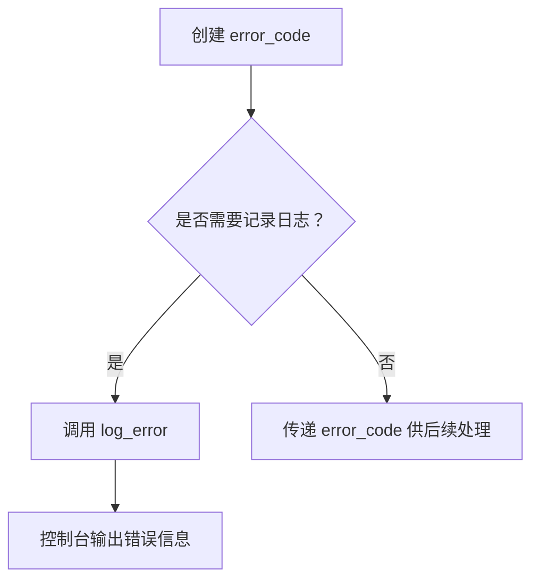

项目地址：(https://github.com/anarthal/servertech-chat.git)
# 完整运行流程
## 环境准备
### 工具安装
- g++版本更新到 11 以上，支持 C++17 标准（ubuntu 使用 `apt install` 即可）
- 安装编译 boost 库必须的开发套件包 `bashsudo apt install build-essential g++ python3-dev libicu-dev libbz2-dev wget`，其中 g++不会是最新的
- 在 [Boost 1.89.0](https://www.boost.org/releases/latest/) 中找到最新 boost 库，使用 `wget` 下载对应的包
	- `tar -xvf` 解压包
	- `cd` 之后 `./bootstrap -prefix=/usr/local/boost_1.89.0` ，prefix 参数决定了之后使用 `./b2 install` 会将 boost 库文件安装在什么位置
	- `./b2 install` 安装 boost 库
	- 检查 `ls -al /usr/local/boost_1.89.0` 中是否有 include 和 lib 文件夹，以及其中是否有大量的 `.hpp` 文件
- 在(https://cmake.org/files/v3.29/cmake-3.29.0.tar.gz) 中下载 cmake 构建工具
	- 解压，进入目录后使用 `./bootstrap -prefix=/usr/local/cmake_3.29.0 && make install` 编译cmake工具
- 将 `/usr/locate/boost_1.89.0` 和 `/usr/locate/cmake-3.29.0` 将两者添加到环境变量中 `export PATH=/usr/local/....:$PATH`
### 代码更新
- 项目使用boost 1.74，最新的 boost 1.89 已经将 `time.expires_from_now()` 舍弃，所以需要替换为 `time.expires_after()`，位置在 servertech-chat/server/src/services/mysql_client. cpp:182:23。
- 根据指引 pdf 中将 mysql 服务的账号密码设置正确
- 在本机的 redis.conf 文件中将 requirepass 设置为 `""` 空，项目只能接受密码为空值的 redis 服务，否则前端无法和后端交互
- 在进入 serve 目录之后使用
```bash
cmake . -DCMAKE_CXX_STANDARD=17 && make
```
出现 main 文件之后继续按照指引即可
# 前置要求
## 协程
参考：[一篇文章搞懂c++ 20 协程 Coroutine - 知乎](https://zhuanlan.zhihu.com/p/615828280)
[ c++20的协程该怎么使用? - 知乎](https://www.zhihu.com/question/405668774/answer/2438678999)
[C++20 协程，99% 的程序员都没完全搞懂！你要做那 1% 吗？ 这可能是全网C++协程讲的最好的视频_哔哩哔哩_bilibili](https://www.bilibili.com/video/BV1Cz9NYFE8E/?spm_id_from=333.337.search-card.all.click&vd_source=876be08bc9c030f4a9ea1fb97e0d0342)
### 在本项目中所需知道的最少知识
我大概明白了，就是假设服务端需要**根据客户端向服务器发送的消息返回对应的内容**，那么发送过程有几个步骤；
```md
通过服务器端的socket监听对应发送内容的客户端的socket(accept函数)
读取客户端的发送数据(read函数)
服务器端生成需要返回给客户端的数据(process函数)
写回数据到客户端(response函数)
```
那么由于这四个过程必须顺序执行，
### 协程基本概念和原理
协程是**可以重入的特殊函数**。就是这个函数在执行的过程，可以（通过 `co_await` ,或者 `co_yield`）挂起，然后在外部（通过 `coroutine_handle`）恢复运行。主要目的是用于**异步编程**。
> [!应用场景] 
> 每次一次协程的挂起都可以视为协程进入一个等待状态，比如请求一个网络，需要HTTP get一个文件，然后对文件进行分析。那么就可以用协程来包装整个处理，在发起HTTP请求后，挂起协程（处理其他事情），等待应答或者超时后，再恢复协程的运行。

- 协程分为无栈协程和有栈协程两种，**无栈指可挂起/恢复的函数**，有栈协程则相当于用户态线程。有栈协程切换的成本是用户态线程切换的成本，而无栈协程切换的成本则相当于**函数调用的成本**。
- 无栈协程只能被线程调用，**本身并不抢占内核调度**，**而线程则可抢占内核调度**。
- 由于 C++设计哲学是***零成本抽象***，并且致力于***使用同步语法写异步代码***，所以协程采用的是无栈协程而不是有栈协程。

> [!有栈协程]
> 有栈（stackful）协程通常的实现手段是在堆上提前分配一块较大的内存空间（比如 64K），也就是协程所谓的“栈”，**参数、return address 等**都可以存放在这个“栈”空间上。如果需要协程切换，那么通过 swapcontext 一类的形式来让系统认为这个堆上空间就是普通的栈，这就实现了上下文的切换。
> 
> “栈”空间普遍是比较小的，在使用中有栈溢出的风险；而如果让“栈”空间变得很大，对内存空间又是很大的浪费。无栈协程则没有这些限制，既没有溢出的风险，也无需担心内存利用率的问题。
> 
> 有栈协程在切换时确实比系统线程要轻量，但是和无栈协程相比仍然是偏重的，无栈协程可以做到**纳秒级**切换

普通的函数函数体顺序执行，无法暂停挂起，跟别说恢复，协程函数可以
![[v2-7a2e0860eecee953296458dc06cb2b40_720w.webp]]
C++的协程（协程函数）内部可以用**co_await** , **co_yield**. 两个关键字挂起协程，**co_return**, 关键字进行返回。**如果一个函数中存在这三个关键字之一，那么它就是一个协程**。
### 协程函数和普通函数的区别
普通函数是**线程相关的**，协程不依赖于特定线程（“依赖”体现在一个函数能否在**同一线程或者不同线程中挂起，恢复**）
- **普通函数**：状态存储在调用线程的栈上
![[PixPin_2025-11-05_16-43-14.png]]
普通函数的执行与销毁完全通过在栈上分配内存记录函数状态来达到。一旦脱离线程的管控（不使用栈），则函数调用无法实现
- **协程**：状态存储在堆分配的"协程帧(coroutine frame)"中
func_1 是普通函数，func_2 是协程函数，则 func_2 会存储在**堆**中，运行 func_2 的过程中对他的挂起是将**栈里的 func_2 状态复制到堆中**然后栈销毁 func_2 的内存，恢复是栈中分配一夸内存，将**堆中 func_2 复制回栈中**的位置


 
### 协程关键字
`co_await` 调用一个awaiter对象（可以认为是一个接口），根据其内部定义决定其操作是挂起，还是继续，以及挂起，恢复时的行为。其呈现形式为
```cpp
// cw_ret 记录调用的返回值，其是awaiter的await_resume 接口返回值。
cw_ret = co_await  awaiter;
```
`co_yield`挂起协程。其出现形式是
```cpp
co_yield  cy_ret;
```
cy_ret会保存在promise承诺对象中（通过 `yield_value` 函数）。在协程外部可以通过promise得到。

`co_return` 协程返回。其出现形式是
```cpp
co_return cr_ret;
```
cr_ret会保存在promise承诺对象中（通过`return_value`函数）。在协程外部可以通过promise得到。要注意，cr_ret并不是协程的返回值。这个是有区别的。

### 协程相关对象
#### 协程帧(coroutine frame)
当 caller 调用一个协程的时候会先创建一个协程帧，协程帧会构建 promise 对象，再通过 promise 对象产生 return object。
协程帧中主要有这些内容：
- 协程参数
- 局部变量
- promise 对象

这些内容在协程恢复运行的时候需要用到，caller 通过协程帧的句柄 std::coroutine_handle 来访问协程帧。
#### promise_type
promise_type 是 promise 对象的类型。promise_type 用于定义一类协程的行为，包括
- 协程创建方式
- 协程初始化完成和结束时的行为
- 发生异常时的行为
- 如何生成 awaiter 的行为
- co_return 的行为
promise 对象可以用于记录/存储一个协程实例的状态。每个协程帧与每个 promise 对象以及每个协程实例是一一对应的。
#### coroutine return object
它是`promise.get_return_object()`方法创建的，一种常见的实现手法会将 coroutine_handle 存储到 coroutine object 内，使得该 return object 获得访问协程的能力
#### std::coroutine_handle
协程帧的句柄，主要用于访问底层的协程帧、恢复协程和释放协程帧。
程序员可通过调用 `std::coroutine_handle::resume()` 唤醒协程。
#### co_await、awaiter、awaitable
- co_await：一元操作符；
- awaitable：支持 co_await 操作符的类型；
- awaiter：定义了 await_ready、await_suspend 和 await_resume 方法的类型。

co_await expr 通常用于表示等待一个任务(可能是 lazy 的，也可能不是)完成。co_await expr 时，expr 的类型需要是一个 awaitable，而该 co_await表达式的具体语义取决于根据该 awaitable 生成的 awaiter。
## 设计方法
### 低内聚，高耦合--精简头文件内容
除非是编写纯头文件库，否则建议将一个文件中函数/变量定义和实现分开。
但是也不是源文件中的所有函数/变量都需要在头文件中对应，如果头文件的某些函数实现需要很多工具函数辅助，但是他们只会帮助头文件中函数的实现，而对外部没有帮助，这时候就可以**不必将他们在头文件中声明，而在 cpp 文件中写入定义+声明**。
- 减少头文件 include 的成本，代码复制也是时间
- 他们不在其他文件使用，**如果考虑可能有命名污染还可以用匿名命名空间包裹**
- 如果他们被频繁使用但是作用于局限于当前文件，考虑使用 `static const` 修饰
## http 响应格式
1. 什么是 HTTP
 HTTP (HyperText Transfer  Protocol)。它是互联网上应用最广泛的一种网络协议，用于从 Web  服务器传输超文本到本地浏览器。
HTTP 有一个非常重要的特性：**它是无状态的 (Stateless)**
想象一下你去银行办业务：
* 无状态：你每次去柜台，柜员都把你当成一个全新的客户。你第一次去取钱，第二次去存钱，每次柜员都会问你“你是谁？你要办什么业务？”。他们不记得你上次来过。
* HTTP 也是如此：你的浏览器（客户端）向服务器发送一个请求（比如“给我首页”），服务器返回一个响应（首页的 HTML）。然后你点击一个链接（比如“查看我的订单”），浏览器又发送一个新请求。对于服务器来说，这两个请求是完全独立的，它**不知道这两个请求来自同一个用户**，**也不知道你刚刚才访问过首页**。

2. **什么是 HTTP 响应头？**
HTTP 通信由请求 (Request) 和响应 (Response) 组成。
* HTTP 请求：你的浏览器发送给服务器的信息。
* HTTP 响应：服务器返回给你的浏览器信息。

无论是请求还是响应，都包含两大部分：
* 头部 (Header)：包含关于请求或响应的元数据（即“关于数据的数据”）。就像你寄信的信封上写着寄件人、收件人、邮票、以及“请勿折叠”等说明。
* 主体 (Body)：包含实际的数据内容。就像信封里的信纸内容。

HTTP 响应头就是服务器在返回数据给浏览器时，在实际数据（Body）之前发送的一些额外信息。这些信息告诉浏览器如何处理响应、响应的类型、服务器的信息等等。

例子：
当你访问一个网页时，服务器可能会返回这样的响应：

```
HTTP/1.1 200 OK
Content-Type: text/html; charset=UTF-8
Server: Nginx/1.18.0
Date: Wed, 27 Aug 2025 10:00:00 GMT
Content-Length: 12345

<!DOCTYPE html>
<html>
<head>...</head>
<body>...</body>
</html>
```
  其中 Content-Type: text/html; charset=UTF-8、Server: Nginx/1.18.0 等就是响应头。
3. **为什么需要 Set-Cookie？**

  由于 HTTP 的无状态性，服务器无法记住用户。但现代 Web 应用需要记住用户，比如：
   * 登录状态：用户登录一次后，不需要每次点击链接都重新输入账号密码。
   * 购物车：商品加入购物车后，即使刷新页面或访问其他页面，购物车内容也还在。
   * 个性化设置：记住用户的语言偏好、主题设置等。

  为了解决这个问题，引入了 Cookie。而 Set-Cookie
  就是服务器告诉浏览器“请你保存这些信息”的方式。

4. Set-Cookie 的工作原理是什么？
  Set-Cookie 是一个特殊的 HTTP 响应头。它的工作原理是：
   - 服务器发送 `Set-Cookie`：当服务器希望浏览器保存一些信息时（例如用户登录成功后），它会在 HTTP 响应中添加一个 Set-Cookie 头。
   - 浏览器保存 Cookie：浏览器收到 Set-Cookie 头后，会根据其中的指示，将这些信息（Cookie）存储在本地。
   - 浏览器自动发送 `Cookie`：在后续的每次请求中，只要请求的 URL 符合 Cookie 的域和路径等条件，浏览器都会自动将之前保存的 Cookie 信息放在 Cookie 请求头中发送给服务器。
   - 服务器识别用户：服务器收到 Cookie 请求头后，就能从中读取信息，从而识别出是哪个用户发来的请求，并根据这些信息来维护用户的状态。
4. 什么是 HTTP 规范的 Set-Cookie 字符串，为什么需要它？

  Set-Cookie 字符串不是随便写的，它必须遵循 HTTP 规范（RFC 6265）。这个规范定义了 Cookie  的格式和各种属性，以确保 Cookie  能够被所有浏览器和服务器正确地理解和处理，并且具有一定的安全性。

  一个规范的 Set-Cookie 字符串看起来像这样：
```
  Set-Cookie: name=value; Expires=Wed, 27 Aug 2025 10:00:00 GMT; HttpOnly; Secure; SameSite=Lax; Path=/
```

* `name=value`：这是 Cookie 最核心的部分，一个键值对。例如 sid=随机字符串，sid 是会话 ID 的名称，随机字符串是它的值。
* `Expires` 或 `Max-Age`：定义 Cookie 的过期时间。过期后浏览器会自动删除它。
* `Domain`：指定哪些域名可以接收这个 Cookie。
* `Path`：指定哪些路径下的请求会发送这个 Cookie。
* `HttpOnly`：重要安全属性。如果设置了这个属性，客户端的 JavaScript 就无法通过 document. cookie 等方式访问这个 Cookie。这可以有效防止跨站脚本攻击 (XSS) 窃取 Cookie。
* `Secure`：重要安全属性。如果设置了这个属性，Cookie 只会在 HTTPS 连接中发送。
* `SameSite`：重要安全属性。用于防止跨站请求伪造 (CSRF) 攻击。它有 Strict、Lax 和 None 几个值，控制浏览器在跨站请求时是否发送 Cookie。
为什么需要它？
* 互操作性：确保所有符合标准的浏览器和服务器都能正确地发送、接收和处理 Cookie。
* 安全性：通过 HttpOnly、Secure、SameSite 等属性，可以大大降低 Cookie 被窃取或滥用的风险。
6. 网络通信为什么需要它？
     Set-Cookie 和 Cookie 机制是 Web 应用中实现用户状态管理的基石。没有它，每次用户点页面，服务器都不知道你是谁，你就无法保持登录状态，无法使用购物车，无法享受个性化服务。它弥补了  HTTP 无状态的缺陷，使得复杂的 Web 应用成为可能。

# 代码分析（按文件）
## server
### src/util/cookie. cpp & include/util/cookie. hpp
#### 检查字符是否合法--查找表方法
```cpp
// 判断字符是否为 HTTP token 的有效字符 (RFC2616/RFC7230)。Cookie 名必须是有效的 token。
static bool is_token_char(char c) noexcept {
    static char constexpr tab[] = {
        0, 0, 0, 0, 0, 0, 0, 0, 0, 0, 0, 0, 0, 0, 0, 0, 0, 0, 0, 0, 0, 0, 0, 0, 0, 0, 0, 0, 0, 0, 0, 0,
        0, 1, 0, 1, 1, 1, 1, 1, 0, 0, 1, 1, 0, 1, 1, 0, 1, 1, 1, 1, 1, 1, 1, 1, 1, 1, 0, 0, 0, 0, 0, 0,
        0, 1, 1, 1, 1, 1, 1, 1, 1, 1, 1, 1, 1, 1, 1, 1, 1, 1, 1, 1, 1, 1, 1, 1, 1, 1, 1, 0, 0, 0, 1, 1,
        1, 1, 1, 1, 1, 1, 1, 1, 1, 1, 1, 1, 1, 1, 1, 1, 1, 1, 1, 1, 1, 1, 1, 0, 1, 0, 1, 0, 0, 0, 0, 0,
        0, 0, 0, 0, 0, 0, 0, 0, 0, 0, 0, 0, 0, 0, 0, 0, 0, 0, 0, 0, 0, 0, 0, 0, 0, 0, 0, 0, 0, 0, 0, 0,
        0, 0, 0, 0, 0, 0, 0, 0, 0, 0, 0, 0, 0, 0, 0, 0, 0, 0, 0, 0, 0, 0, 0, 0, 0, 0, 0, 0, 0, 0, 0, 0,
        0, 0, 0, 0, 0, 0, 0, 0, 0, 0, 0, 0, 0, 0, 0, 0, 0, 0, 0, 0, 0, 0, 0, 0, 0, 0, 0, 0, 0, 0, 0, 0};
    return tab[static_cast<unsigned char>(c)];
}

// 判断字符是否为 cookie 值的有效字符 (RFC6265)。
static bool is_cookie_value_char(char c) noexcept {
    static char constexpr tab[] = {
        0, 0, 0, 0, 0, 0, 0, 0, 0, 0, 0, 0, 0, 0, 0, 0, 0, 0, 0, 0, 0, 0, 0, 0, 0, 0, 0, 0, 0, 0, 0, 0,
        0, 1, 0, 1, 1, 1, 1, 1, 1, 1, 1, 1, 0, 1, 1, 1, 1, 1, 1, 1, 1, 1, 1, 1, 1, 1, 1, 0, 1, 1, 1, 1,
        1, 1, 1, 1, 1, 1, 1, 1, 1, 1, 1, 1, 1, 1, 1, 1, 1, 1, 1, 1, 1, 1, 1, 1, 1, 1, 1, 1, 0, 1, 1, 1,
        1, 1, 1, 1, 1, 1, 1, 1, 1, 1, 1, 1, 1, 1, 1, 1, 1, 1, 1, 1, 1, 1, 1, 1, 1, 1, 1, 1, 1, 1, 1, 0,
        0, 0, 0, 0, 0, 0, 0, 0, 0, 0, 0, 0, 0, 0, 0, 0, 0, 0, 0, 0, 0, 0, 0, 0, 0, 0, 0, 0, 0, 0, 0, 0,
        0, 0, 0, 0, 0, 0, 0, 0, 0, 0, 0, 0, 0, 0, 0, 0, 0, 0, 0, 0, 0, 0, 0, 0, 0, 0, 0, 0, 0, 0, 0, 0,
        0, 0, 0, 0, 0, 0, 0, 0, 0, 0, 0, 0, 0, 0, 0, 0, 0, 0, 0, 0, 0, 0, 0, 0, 0, 0, 0, 0, 0, 0, 0, 0};
    return tab[static_cast<unsigned char>(c)];
}
```
这两个函数中使用了 `static char constexpr tab[]` 查找表，这是一种**提高性能的做法**，由于合法的 HTTP token 和 cookie-value 字段只能是 **ASCII 字符中的英文字母**。
tab 表是一个 256 字节的表，其中中为 1 的位置表示 ascii 表中这个位置的字符是可用的。
CPU 缓存友好，程序需要判断一个字符时，它只需要将字符的 ASCII值作为索引去访问 tab 数组相应位置，即可得到他是否是合法的。
常规写法 `if(c >= 'a' && c <= 'z' || c >='A' && c <= 'Z'))` 中 if 分支会因为 CPU 分支预测，缓存未命中带来性能损失。
查找表在**未出现溢出错误**的情况下没有分支，速度极快。
#### 零拷贝 cookie 解析器
cookie_list 类是一个零拷贝（Zero-Copy）的解析器，用于解析客户端发送的 `Cookie`   请求头字符串。它的主要目的是高效地从一个长字符串中提取出所有的 Cookie 名称-值对，而无需进行额外的内存分配和字符串复制。
其中的响应头解析使用的字符串是 `const char*` 类型了，所有的工具函数都是用了指针运算加快速度，可能会有点晕。本质上是：
将 http 响应头放入构造函数中，就够造了一个可迭代对象，每次迭代返回头中的一个键值对
```cpp
chat::cookie_list cookies(raw_cookie_header);
// 2. 遍历 cookie_list 来查找特定的 Cookie
std::string_view sessionId;
for (const auto& cookie_pair : cookies) { // 范围 for 循环，每次迭代得到一个
cookie_pair
 // 第一次迭代：cookie_pair.name = "sid", cookie_pair.value = "abc123xyz"
 // 第二次迭代：cookie_pair.name = "theme", cookie_pair.value = "dark"
 // 第三次迭代：cookie_pair.name = "lang", cookie_pair.value = "en"
 if (cookie_pair.name == "sid") {
	 sessionId = cookie_pair.value; // 提取 sid 的值
	 break; // 找到后就可以停止迭代了
 }
}
```
### src/util/email. cpp & include/util/email. hpp
email. cpp 及其头文件的功能是否是我理解诶的那样：
1. is_email 函数用来判断一个电子邮件地址字符串是否符合合法的电子邮件格式，由于电子邮件地址中可能包含 Unicode 字符
2. 而标准库中的 regex 不支持，所以这里使用了 `boost:: make_u32regex` 函数来构建一个能够匹配含有 Unicode 字符的电子邮件地址正则表达式对象
### src/util/scrypt. cpp & include/util/scrypt. hpp
#### 加密函数工作原理
- `scrypt_generate_hash` 的工作原理：
  `scrypt_generate_hash` 函数接收用户输入的明文密码字符串 (passwd)、一个随机生成的盐值 (salt) 和 scrypt 算法的参数 (params)。它通过调用底层的 OpenSSL 库，执行 scrypt算法，计算出一个固定大小的哈希值。这个哈希值是一个**二进制数据块(blob)**，存储在 `std::array<unsigned char, hash_size>` 中
-  `scrypt_phc_parse` 的作用:
	- **函数的作用绝不是将哈希值“解码”回原始密码。密码哈希是不可逆的。**
	-  1. 它接收一个 PHC 格式的字符串（例如`$scrypt$ ln=14, r=8, p=1 $somesalt$ somehash`）。这个字符串是服务器在用户注册时，将 scrypt算法的参数、随机盐值和计算出的哈希值序列化后存储在数据库中的。
       2. 它的任务是解析这个 PHC 字符串，从中提取出 scrypt 算法的参数          (scrypt_params)、原始的盐值 (salt) 和原始的哈希值 (hash)。
       3. 它将这些提取出来的信息封装到 scrypt_data 结构体中返回。
#### 密码加密&匹配原理
 由于密码哈希是单向的，我们无法从哈希值还原出原始密码。那么，当用户尝试登录时，我们如何验证他们输入的密码是否正确？
1. 用户输入密码：用户在登录界面输入一个候选密码。
2. 服务器获取存储的哈希信息：服务器从数据库中获取该用户注册时存储的 PHC 格式的哈希字符串。
3. 解析存储的哈希信息：调用 `scrypt_phc_parse` 函数，将数据库中存储的 PHC 字符串解析，提取出原始的 scrypt 参数、盐值和存储的哈希值。
4. 重新计算哈希：调用 `scrypt_generate_hash` 函数，使用用户本次输入的候选密码、从数据库中提取出的盐值和提取出的参数，重新计算一个新的哈希值。
5. 比较哈希值：使用 time_safe_equals 函数（一个防止时序攻击的安全比较函数），将新计算出的哈希值与从数据库中提取出的存储哈希值进行比较。
6. 判断密码是否正确：
   * 如果两个哈希值完全匹配，则说明用户输入的候选密码是正确的。
   * 如果两个哈希值不匹配，则说明用户输入的密码是错误的。
### src/error. cpp & include/error.hpp
#### 问题
- 为什么 `to_string` 和 `chat_category` 对象 `cat` 要放在匿名命名空间中？
  匿名命名空间（`namespace { ... }`）的作用是**将符号（函数、变量等）限制在当前编译单元（Translation Unit）内**，相当于C语言中的 `static` 修饰符，避免全局命名冲突。
	- `to_string` 是一个辅助函数，仅在 `chat_category::message(int)` 中被调用，不需要暴露给外部代码。
	- `chat_category cat` 是单例对象，用于注册错误类别，外部无需直接访问它。
	- 如果放在匿名命名空间外，可能会造成**符号污染**或与其他模块的同名符号冲突。
- `chat_category` 必须继承 `boost::system::error_category`？
	- Boost.Asio 和 Boost.Redis 等库依赖 Boost.System 的错误处理机制。自定义类别需与之兼容。
	- 自定义的错误类如果继承了 `boost::system::error_category`，他就可以隐式转换为这种类型，前提是 public 继承。参考 [[C++ Basics#继承#不同访问修饰符继承]]
	- 如果使用了自定义类并且继承自 `boost::system::error_category`，就必须要在 boost:: system 命名空间中创建一个特化模板，它的格式为：
```cpp
template <>
struct is_error_code_enum<chat::errc> { 
   static constexpr bool value = true;
};
```
模板类型名称一定要为 `struct is_error_code_enum`，才能够将 `chat::errc` 中的错误类型假入 boost:: system 管理。
#### 整体结构
1. error. hpp 中定义 enum class errc 定义所有可能出现的错误，error. cpp 中使用 `BOOST_DESCIBE_ENUM` 描述 to_string 之后的信息。
2. to_string 创建转换规则，将 `char::ec`；类型对应的 BOOST_DESCIBE_ENUM 类型对应，转换为对应字符串。和 chat_category 将自定义错误注册让 boost:: system 来管理。to_strng 名为了避免冲突，并且他只服务于 chat_category 中，所以放在匿名 namespace 中。
3. 注册还有一个步骤是在 boost:: system 中创建一个特化模板(is_error_code_num)，表示 chat:: errc 已经是其中一员。
4. 两个宏定义让外部**需要返回 error_code 类型的函数**使用他们时，传入错误，即可创建附带位置的 error_code 对象直接中断函数，return 出现的错误。如果
5. 所有的错误**日志输出**都需要通过 log_error 函数处理

可以看到 src/listen. cpp 中，accept_loop 函数中，返回值为 void，代码中就使用：
```cpp
if (ec)
    return chat::log_error(ec, "accept");
```
在 src/api/aip_types. cpp 的 parse_client_event 函数中，大量直接使用宏的场景
```cpp
chat::any_client_event chat::parse_client_event(std::string_view from) {
    error_code ec;

    // Parse the JSON
    auto msg = boost::json::parse(from, ec);
    if (ec)
        CHAT_RETURN_ERROR(ec)
    // 其他代码
}
```
其返回值为：
```cpp
using any_client_event = boost::variant2::variant<
    error_code,  // Invalid, used to report errors
    client_messages_event,
    request_room_history_event>;
```

### src/main. cpp
#### 整体工作流程
`main_impl` 函数中先创建事件管理器 ctx
shared_state 是所有会话，服务中都需要的数据，通用接口函数都被放在其中。使用一个 `shared_ptr` 通过引用计数的方法保证只要还有一个服务在使用 shared_state 中的内容，就不会释放其内存，避免悬空引用。
`listening_endpoint` 记录下当前监听的端口号（默认使用输入参数中的 `0.0.0.0:8888`），这里只是一个封装作用
`signal_set` 是一个**异步信号管理器**，它在 `Boost.Asio` 的事件驱动框架中提供了安全、异步的信号处理机制，用于异步监听和处理系统信号（signals）。**在不阻塞主事件循环**的情况下处理进程信号。**允许程序在收到信号时执行清理操作**，可以接受的信号有：
```md
┌─────────┬──────┬────────────────────┬──────────────────────────────────┐
│ 信号名   │ 数值  │ 触发场景             │ 用途                             │
├─────────┼──────┼────────────────────┼──────────────────────────────────┤
│ SIGINT  │ 2    │ Ctrl+C             │ 中断程序（通常是用户请求）           │
│ SIGTERM │ 15   │ kill 命令           │ 终止程序（优雅关闭）                │
│ SIGKILL │ 9    │ kill -9            │ 强制终止（不能被捕捉或忽略）          │
│ SIGHUP  │ 1    │ 终端断开            │ 终端挂起，常用于守护进程重载配置       │
│ SIGUSR1 │ 10   │ 用户自定义           │ 用户自定义用途，如重载日志文件        │
│ SIGUSR2 │ 12   │ 用户自定义           │ 用户自定义用途                     │
│ SIGPIPE │ 13   │ 向已关闭的管道写入    │ 管道破裂，通常忽略                  │
│ SIGCHLD │ 17   │ 子进程退出           │ 子进程状态改变                     │
└─────────┴──────┴────────────────────┴──────────────────────────────────┘
```
构造函数中第一个参数表明这个信号接收器会接受那个上下文中的信号，对其中发出的信号进行管理。
可以通过无参构造后使用 `add()` 函数添加多个信号。
后续代码中：
```cpp
signals.async_wait([st, &ctx](boost::system::error_code, int) {
    // 在收到 SIGINT 或 SIGTERM 时执行清理操作
    st->redis().cancel();
    st->mysql().cancel();
    ctx.stop();
});
```
- 告知 `signal_set` 对象在它的生命周期内，如果在 `ctx.get_executor()` 的上下文中**收到管理器中任何一个信号**时，执行 lambda 函数逻辑
- 停止逻辑是先停止 Redis 和 MySQL 的连接循环，这一操作会在收到信号被发送到 ctx 的事件管理器中异步进行，并在 `ctx.run()` 代码所在的线程中进行
接下来使用 `asio::co_spawn` 函数将 `run_server` 函数的运行作为一个写成交给 ctx 管理，如果协程运行过程中出现异常，就使用这个异常处理函数来处理
```cpp
[](std::exception_ptr exc) {
	if (exc)
		std::rethrow_exception(exc);
}
```
同理，由于协程运行过程中有可能被终止，所以使用 `signals.async_wait` 同样作为协程添加给 ctx 管理，一旦出现 signals 中有的信号，就执行其中 lambda 函数的逻辑，停止 redis 和 mysql 的服务，实现优雅退出。
### src/server. cpp 和 src/include/server. hpp
`log_exception` 用来重新抛出异常（因为需要将这个异常信息记录到日志中）
`run_server` 是一个协程，用来启动所有服务
使用 `asio::ip::tcp::acceptor` 接受所有的**入站请求**，所有由外部发送到**其监听端口**的 tcp 都由 acceptor 统一接受管理，并转交给内核。
关于 `SO_REUSEADDR`：
当你关闭一个 TCP 服务器时，操作系统内核会将该端口保持在 `TIME_WAIT` 状态（通常为 2-4 分钟）。这是 **TCP协议的正常行为**，确保所有延迟的数据包能被正确处理。
但是开发过程中需要频繁运行项目，不使用 reuseaddr 会导致下次传入同样的端口**绑定失败**，需要几分钟之后才可以（这是由系统内核管控的）

在原生 C 代码中，连接到 tcp 服务需要：
```cpp
#include <iostream>
#include <string.h>
#include <sys/socket.h>
#include <netinet/in.h>
#include <unistd.h>
#include <arpa/inet.h>

const int PORT = 8080;

int main() {
    int server_fd, new_socket;
    struct sockaddr_in address;
    int opt = 1; // 用于 setsockopt 的参数值
    int addrlen = sizeof(address);
    char buffer[1024] = { 0 };

    // 1. 创建 socket 文件描述符
    if ((server_fd = socket(AF_INET, SOCK_STREAM, 0)) == 0) {
        perror("socket failed");
        exit(EXIT_FAILURE);
    }
    // 2. 设置 SO_REUSEADDR 选项
    // SOL_SOCKET: 表示选项级别是套接字层
    // SO_REUSEADDR: 要设置的选项名
    // &opt: 指向选项值的指针
    // sizeof(opt): 选项值的长度
    if (setsockopt(server_fd, SOL_SOCKET, SO_REUSEADDR, &opt, sizeof(opt))) {
        perror("setsockopt");
        exit(EXIT_FAILURE);
    }
    std::cout << "SO_REUSEADDR 设置成功。" << std::endl;

    // 3. 绑定 socket 到地址和端口
    address.sin_family = AF_INET;
    address.sin_addr.s_addr = INADDR_ANY; // 监听所有可用接口
    address.sin_port = htons(PORT); // 将端口号从主机字节序转成网络字节序

    // 如果不设置 SO_REUSEADDR，这里在快速重启时可能会失败
    if (bind(server_fd, (struct sockaddr *)&address, sizeof(address)) < 0) {
        perror("bind failed");
        exit(EXIT_FAILURE);
    }
    std::cout << "Socket 绑定到端口 " << PORT << " 成功。" << std::endl;

    // 4. 开始监听
    if (listen(server_fd, 3) < 0) {
        perror("listen");
        exit(EXIT_FAILURE);
    }
    std::cout << "正在监听连接..." << std::endl;

    // 5. 接受一个新连接
    if ((new_socket = accept(server_fd, (struct sockaddr *)&address, (socklen_t*)&addrlen)) < 0) {
        perror("accept");
        exit(EXIT_FAILURE);
    }
    
    // 读取客户端数据
    int valread = read(new_socket, buffer, 1024);
    std::cout << "收到消息: " << buffer << std::endl
    // 发送响应
    char* response = "Hello from server";
    send(new_socket, response, strlen(response), 0);
    std::cout << "响应已发送。" << std::endl;
    // 关闭 socket
    close(new_socket);
    close(server_fd);

    return 0;
}
```
acceptor 封装了这些操作，简化了设置方式
```cpp
acceptor.open(listening_endpoint.protocol());
acceptor.set_option(asio::socket_base::reuse_address(true));
acceptor.bind(listening_endpoint);
acceptor.listen();
```
常用的设置配置有：
```cpp
// 在open之后，bind之前使用， 可以多次调用设置添加配置
acceptor.set_option(asio::socket_base::reuse_address(true));
acceptor.set_option(asio::ip::tcp::no_delay(true)); // 禁用 Nagle's algorithm
acceptor.set_option(asio::socket_base::keep_alive(true));
```
servers 中，使用一个死循环，一直监听**已经设置好的 ip 和端口号的**acceptor，监听是否有新的 tcp 连接传入，
```cpp
asio::awaitable<void> chat::run_server(...) {
    // ... 初始化 acceptor ...
    while (true)  // 无限循环
    {
        // 协程在这里挂起，等待连接
        asio::ip::tcp::socket sock = co_await acceptor.async_accept();
        // 有连接到达后，协程恢复执行
        // 启动新会话处理，主线程继续等待下一个连接
        asio::co_spawn(...);
    }
    // 这个 while(true) 只有在 io_context 被停止时才会退出
}
```
根据 [[#src/main. cpp]] 中的代码：
```cpp
auto st = std::make_shared<shared_state>(doc_root, ctx.get_executor());
// ....
signals.async_wait([st, &ctx](boost::system::error_code, int) {
    st->redis().cancel();
    st->mysql().cancel();
    ctx.stop();
});
```
st 使用的是当前的协程，所以一旦出现中断信号，ctx 被终止，io_context 会让协程终止，run_server 的协程也就会被关闭，监听自动关闭

### src/http_serssion. cpp & include/http_session. hpp
使用错误码，即 `boost::system::error_code` 作为错误的识别标志，比抛出异常并处理的方式开销更小，网络错误中错误很常见，如果都使用抛出错误方式解决会有性能问题。
#### 请求发起和请求路径
##### 请求路径
```md
完整 URL: https://example.com:8080/api/login?user=john#section1
协议:     https:
主机名:   example.com
端口:     :8080
路径:     /api/login
查询参数: ?user=john
片段:     #section1
```

`using handler_fn = asio::awaitable<http::message_generator> (*)(request_context&, shared_state&);` 定义一个函数指针，指向一个返回类型为 `asio::awaitable<http::message_generator>*;` 的指针，这个指针是一个接受 `request_context&` 和 `shared_state&` 参数的函数，它的作用是统一请求的格式
```cpp
// 定义路由表
constexpr api_endpoint endpoints[] = {
    {"/create-account", http::verb::post, handle_create_account},  //指向具体的处理函数
    {"/login",          http::verb::post, handle_login         },  //指向具体的处理函数
};

// 端点定义
struct api_endpoint {
    std::string_view path;    // 路径，如 "/login"
    http::verb method;        // HTTP 方法，如 POST
    handler_fn handler;       // 处理函数指针
};
```
```cpp
// 匹配 URL 路径到处理函数
auto first = std::find_if(
    std::begin(endpoints),
    std::end(endpoints),
    [endpoint_path](const api_endpoint& e) { return e.path == endpoint_path; });

// 找到匹配的处理函数
handler_fn handler = nullptr;
for (auto it = first; it != std::end(endpoints) && it->path == endpoint_path; ++it) {
    if (it->method == ctx.request_method()) {
        handler = it->handler;  // 找到了对应的处理函数
        break;
    }
}

// 调用处理函数
std::optional<http::message_generator> gen;
gen = co_await handler(ctx, st);
```