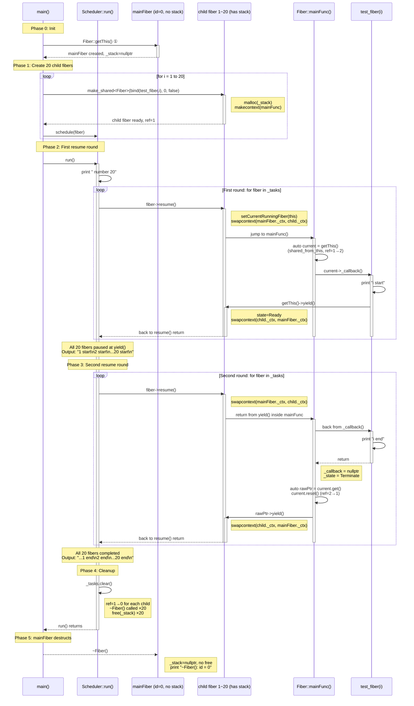

# 线程
## 代码架构
### 分两类线程
- 系统主线程：程序启动时 OS 自动创建，main 函数运行在这上面，没有对应的 Thread 对象
- Thread 类线程：pthread_create 创建，有对应的 Thread 对象
所以为了之后创建协程时协程调度器需要区分不同的线程，知道自己在哪一个线程中，程序通过 main 函数启动，这个线程会被 OS 接管，所以创建
```cpp
static thread_local Thread*  t_thread      = nullptr;   // 指向当前线程的 Thread 对象
static thread_local string   t_thread_name = "UNKNOWN";  // 当前线程的名字
```
每个线程需要自己的名字和 Thread 指针。thread_local 让每个线程有独立副本，互不干扰。
进程->多个线程，切换需要系统调用，
### pthread 库使用
各种 pthread_XXX 函数用来操作 `pthread_t` 类型，pthread_t 是 POSIX 线程库的线程标识符类型，本质是一个不透明类型（通常是 unsigned long 或结构体）。不能直接拿它当整数用，必须通过 API 操作。

| API                                            | 作用                                              |
| ---------------------------------------------- | ----------------------------------------------- |
| pthread_create(&tid, attr, start_routine, arg) | 创建线程，tid 输出线程 ID，start_routine 是入口函数，arg 传给入口函数 |
| pthread_join(tid, &retval)                     | 阻塞等待线程 tid 退出，retval 接收线程返回值                    |
| pthread_detach(tid)                            | 分离线程，退出后自动回收资源（不可 join）                         |
| pthread_self()                                 | 返回当前线程的 pthread_t                               |
| pthread_setname_np(tid, name)                  | 给线程设置名字（_np = non-portable，仅 Linux）             |
这些函数大多返回错误码，表示执行状态
- EAGAIN：资源不足（线程数达到上限）
- EINVAL：参数无效（比如 attr 有问题）
- EPERM：权限不足
### 逻辑设计
```cpp
static thread_local Thread*		t_thread	 = nullptr;
static thread_local std::string t_threadName = "UNINIT";

Thread::Thread(const std::function<void()>& callback, const std::string name) : _callback(callback), _name(name){
    int rt = pthread_create(&_thread, nullptr, &Thread::run, this);
	if(rt){
        std::cerr << "pthread_create thread fail, rt = " << rt
                  << " name = " << name;
		throw std::logic_error("pthread_create error");
	}
    _semaphore.wait();
}

Thread::~Thread() {
	if(_thread) {
		pthread_detach(_thread);
		_thread = 0;
	}
}

void* Thread::run(void* arg) {
	Thread* thread = (Thread*)arg;
	t_thread	   = thread;
	t_threadName   = thread->_name;
	thread->_id	   = getThreadId();
	pthread_setname_np(pthread_self(), thread->_name.substr(0, 15).c_str());
	std::function<void()> callback;
	callback.swap(thread->_callback);
	thread->_semaphore.signal();
	callback();
	return 0;
}
```
```md
主线程 (main)                         新线程 (pthread_create 创建)
│                                      │
① Thread 构造函数开始执行                │
② pthread_create(&m_thread, ...) ──── 创建新线程 → ③ run(arg) 开始执行
④ m_semaphore.wait() [阻塞]            ⑤ 设置 t_thread / t_thread_name (TLS)
                                        ⑥ m_id = gettid()
                                        ⑦ pthread_setname_np(...)
                                        ⑧ m_semaphore.signal() [唤醒主线程]
⑨ 构造函数返回 ◄─────── 唤醒 ────────── ⑩ cb() 执行真正的任务
```
- 需要注意两个 thread_local 变量主线程和创建的线程都有一份独立副本，不要看代码中只有一份
- `thread_local` 关键字一旦用于标记变量，那么在任何线程中都**保有变量符号，并在初次访问符号时初始化值**，这保证了放在局部作用域的 `thread_local` 变量只有在进入局部作用域时才可见（调用函数等操作）
- `pthread_create` 的签名为:
```cpp
int pthread_create(pthread_t *__restrict__ __newthread, 
					const pthread_attr_t *__restrict__ __attr, 
					void *(*__start_routine)(void *), 
					void *__restrict__ __arg) noexcept(true)
```
线程的任务函数指针 `__start_routine` 参数必须是 `std::function<void(void*)>` 的，且不能是类非静态成员函数，因为这需要传入 this 指针作为参数。
`__arg` 是 `void*` 类型，用来表示 `__start_routine` 的参数，**如果需要传入多个参数一般使用结构体封装**。
- 回调函数设置为 `void()` 类型，这种设计有两种原因:
	- 线程自己的信息通过 Thread 的静态方法获取，不需要参数传递（`Thread::getThis()->getId()/getName()`）
	- 线程任务需要的外部数据通过 lambda 捕获得到，**不过这就需要手动控制生命周期**长于线程，如果允许回调函数接受参数，同样需要控制参数的生命周期
### 为什么不使用 atomic 作信号量
 C++17 中，atomic 只提供了读/写/交换三个原子操作，没有提供"阻塞等待"的原语，如果想让线程 A 等线程 B 把 flag 设为 1，你能做的只有：
```cpp
while (flag.load() == 0) {
    // 除了空转，没有别的办法让线程停下来等
}
```
- 这就是自旋锁实现。atomic 本身不提供"让线程休眠，值变了再唤醒"的能力——它只是一段能保证原子访问的内存，不跟操作系统调度器打交道。
- 使用自旋锁实现会让 CPU 空转，仅适用于锁持有时间很短的场景
- 在高优化等级中，**编译器可能会掉这个空循环**，需要 volatile 或者内存屏障实现保护
Semaphore 的本质是 condition_variable + 互斥锁 + 计数器，而 `condition_variable::wait()` 最终调用的是 Linux 的 futex（fast userspace mutex）系统调用
C++20 引入 `atomic::wait / notify_one`，底层用 futex 实现，这时 atomic 也可以阻塞等待了
```cpp
// C++20
std::atomic<int> flag{0};

// 线程 A（等待方）
flag.wait(0);  // 休眠，直到 flag != 0

// 线程 B（通知方）
flag.store(1);
flag.notify_one();  // 唤醒等待方
```
当前 thread 部分仅仅**对一个 count 变量做保护，确实更适合使用 C++20 的 atomic**实现
```cpp
class Semaphore {
    atomic<int> count{0};
public:
    void wait() {
        // 如果 count 为 0，休眠直到 count 变化
        while (count.load() == 0) {
            count.wait(0);
        }
        count.fetch_sub(1);
    }
    void signal() {
        count.fetch_add(1);
        count.notify_one();
    }
};
```
这是 mutex 作用情景变为了:
- 需要既保护共享数据，又保证 wait 的原子性
- 需要同时保护多个变量
- 又复杂的唤醒条件（通过谓词和条件变量的 `wait_XXX` api 设置）
# 协程
参考（主要介绍 ucontext 工具库）
- https://www.chiark.greenend.org.uk/~sgtatham/coroutines.html
- [一个“蝇量级” C 语言协程库 by 左耳朵耗子](http://coolshell.cn/articles/10975.html) 
- [ucontext-人人都可以实现的简单协程库-阿里云开发者社区 (aliyun.com)](https://developer.aliyun.com/article/52886)
较为硬核的汇编语言拆解协程机制
- https://zhuanlan.zhihu.com/p/347445164
- https://jasonkayzk.github.io/2022/06/03/%E6%B5%85%E8%B0%88%E5%8D%8F%E7%A8%8B/
- https://mthli.xyz/stackful-stackless/
- https://mthli.xyz/coroutines-in-c/ 
### 协程概念
协程 = 用户态线程。线程的调度由内核控制（你无法决定它什么时候被切换出去），协程的调度由程序自己控制（切换点在代码中明确写出）。
协程是一种执行过程中可以 **yield（暂停）** 和 **resume（恢复）** 的子程序。也可以说，**协程就是函数 + 函数运行状态的组合**。普通函数一旦开始执行，就会一直运行到结束，中间不会中断，更不会执行到一半跑去执行别的函数。
但协程不同：我们会先为协程绑定一个入口函数，并且可以在函数执行的**任意位置暂停**，转而去执行其他函数，之后再回到暂停点继续执行。因此说协程是函数与其运行状态的结合 —— 协程会绑定入口函数，并完整记录函数的运行状态。 ^c21kde
```cpp
线程：内核调度，抢占式         协程：用户调度，协作式
┌──────────────┐             ┌──────────────┐
│ 线程 A       │             │ 协程 A       │
│  代码段 ...  │   ← 内核     │  代码段 ...  │
│  可能随时    │   强制切换    │  yield() ←──│── 主动让出
│  被切出去    │             │  代码段 ...  │
│  代码段 ...  │             │              │
└──────────────┘             └──────────────┘
```
### 协程上下文
实现用户态切换的关键是: **协程上下文**。当协程执行 yield 暂停时，上下文会记录当前暂停的位置；当执行 resume 恢复时，就从这个位置继续运行
协程的优势： 切换不需要系统调用（不进内核），只是保存/恢复 CPU 寄存器，开销比线程小 1-2 个数量级。一个线程可以管理成千上万个协程。

此外，协程的 yield 和 resume 完全由**应用程序自身控制**，这一点和线程不同。线程的创建、运行与调度由操作系统内核管理；而协程的运行与切换由用户态程序控制，因此协程也被称为**用户态线程**。
**单线程下，协程的 resume 和 yield 一定是同步配对的**。一个协程执行 yield 暂停，必然对应另一个协程执行 resume 恢复，因为线程不能没有执行主体。
意思是**当前线程要么在主协程下工作，要么在其他协程下工作**，未 sleep 的情况下不会空转。

> [!info] C++20 无栈协程
>   编译器在编译期分析出协程中哪些变量在 yield 之后还需要，把它们放到堆上分配的一个帧对象里，而不是放在系统栈上。这样就不需要预分配一个栈了  ——但代价是协程内部不能有深层嵌套调用（因为嵌套调用的栈帧编译器无法分析）。
> 
> |      | 有栈协程（本项目） | 无栈协程（C++20）         |
> | :--- | :-------- | :------------------ |
> | 内存   | 预分配栈，可能浪费 | 按需分配帧，紧凑            |
> | 嵌套调用 | 随意        | 有限制（不能 yield 嵌套函数中） |
> | 切换开销 | ~50ns     | ~5ns                |
> | 实现   | 库即可实现     | 需要编译器支持             |

### 协程的分类
#### 对称协程 
对称协程对称协程允许协程之间直接相互调用和切换，控制流（只有拿到执行权的协程才可以执行）可以在多个协程之间自由转移，类似于函数调用。每个协程可以**显式决定将控制权转移到哪个协程**。
- 自由切换：协程可以显式地将控制权转移到其他协程。
- 平等地位：所有协程在调度时**没有**层级关系，彼此平等。
- 复杂性：因为可以任意切换协程，可能会让程序逻辑变得复杂。
#### 非对称协程
非对称协程会出现类似堆栈的调用方与被调用方关系，也就是形成了层级结构。具体来说：A 调用了 B，B 作为被调用方，在执行 yield 时会把控制权交还给调用它的 A，而不是其他协程。
只有主协程可以决定"下一个跑谁"，主协程 = 调度器
![[Pasted image 20260617210352.png]]
非对称协程会出现类似堆栈的调用方与被调用方关系，也就是形成了层级结构，意味着协程拥有一个“隐式的目标”。当它 `yield` 时，控制流必定回到上一层。**C++原生的协程是非对称的**，C++20标准只支持非对称。不过可以通过标准库的 `std::coroutine_handle` 配合调度器，在**用户态模拟**出对称协程的效果，但语言层面没有原生对称关键字。
这种实现情况下，除了主线程（调度线程）中一般都需要使用栈空间（使不使用是主子线程决定的，而需不需要而外分配是[[#有栈协程|栈分配机制]]决定的）
#### 对称协程 vs 非对称协程（控制流的视角）
**对称协程：**
- 复杂多任务协作：多个任务或子任务需要频繁、直接地相互交互，共同协同完成一个目标。
- 状态机驱动系统：多个状态需要彼此直接切换，减少中间调度步骤。
- 需要频繁切换的计算密集型任务：适合高性能场景，例如游戏开发，一个任务可以主动切换到另一个。
**非对称协程：**
- IO 密集型应用：需要等待大量 IO 事件完成，例如 Web 服务器的请求处理、数据库读写。
- 任务调度：在多线程或任务调度框架中，协程由中心调度器统一调度，例如 Web 框架中的请求 / 响应循环。
- 简单的生产者 - 消费者模型：例如异步事件循环中，非对称协程的启动、暂停、恢复都由调度者统一控制，结构清晰，避免协程之间复杂的相互依赖。

| 维度 | 非对称（本项目） | 对称 |
| --- | --- | --- |
| 控制流 | 星型（中心化） | 网状（去中心化） |
| 调度逻辑 | 集中在主协程 | 分散在各协程 |
| 实现复杂度 | 简单 | 较复杂 |
| 可维护性 | 高（调度路径清晰） | 低（跳转关系混乱） |
| 典型代表 | sylar, libco | Lua 协程，Windows Fiber |
对称协程更灵活，非对称协程更简单。
- 对称协程不仅需要绑定入口函数运行，还要显式指定下一个要切换的协程，**相当于每个协程都承担了部分调度器的工作**。实现较为困难。
- 非对称协程可以依靠专门的调度器统一负责调度，每个协程只需要执行自己的入口函数，执行结束或 yield 时把运行权交回调度器，再由调度器选择下一个要执行的协程即可。
#### 有栈协程
**本质**：每个协程拥有一个**独立的、完整的调用栈**（通常大小固定，如几 MB）。
**原理**：类似于用户态线程。切换协程时，需要保存当前 CPU 的所有寄存器（包括栈指针 RSP/SP），并将栈指针切换到新协程的私有栈空间。
- **特点**：
    - 可以在协程内部的**任意深层嵌套函数**中挂起（例如：`A调用B，B调用C，在C中yield`），因为整个栈都被保存了。
    - 切换开销较大（需要保存大量寄存器，且涉及内存拷贝/栈切换）。
    - 内存占用较高（每个协程预分配固定栈空间，容易浪费或溢出）。
- **C++代表库**：`Boost.Context`、`ucontext`（已废弃）、腾讯的 `libco`。
如何存储这些信息到栈中呢？这就引出*独立栈和共享栈*做法
- 要想暂停协程后还能够恢复过来，那么协程暂停时，整个调用链的栈帧都必须被冻结保存。因为恢复时要精确地从暂停点继续执行——局部变量、函数调用链、返回地址
- 要想保存这些信息，那么就需要一块专门的内存，这就引出了两种方法:
	- 每个协程都有独立的栈（必须设置地很小且协程数很少，否则 OS 栈溢出），并在栈底设置哨兵页检测栈溢出（SIGSEGV），触发溢出**能被操作系统检测到但是无法优雅恢复**
	- libco 使用*共享栈*做法，所有协程共用一个物理栈，yield 时把自己的栈内容拷贝到堆上保存，resume 时再拷贝回来，由于是**固定大小的顺序内存空间无法随意扩容且协程恢复需要恢复之前的数据要从栈中拷贝回去**，所都会较上一种慢点
- 这里的**栈不是线程的系统栈**，也是通过 `malloc` 分配得到的一块普通堆内存，swapcontext 切换协程时，CPU 的 RSP（栈指针寄存器）被改写到这个堆内存上。这一个操作是**主协程在进行调度时的操作，是需要操作系统栈的**，任一时刻只有一个协程在工作，所以系统栈中只会有一个 RSP 指针之象征在工作的协程，只占用一个指针大小
#### 无栈协程
- **本质**：协程**不拥有独立的调用栈**。它的局部变量和挂起状态被存储在**编译器生成的匿名对象（即协程帧，Coroutine Frame）**中，该对象位于堆上。
- **原理**：编译器执行**有状态机转换**。每当遇到 `co_await` 或 `co_yield`，编译器将当前函数拆分成多个片段，局部变量变为该帧对象的成员变量。恢复执行时，直接跳转到当前 `await_suspend` 之后的指令地址，**栈指针依旧使用当前线程的栈**。
- **特点**：
    - **挂起位置受限**：只能在协程**函数体最顶层**挂起。如果协程调用了普通子函数 `B`，在 `B` 内部无法挂起（因为 `B` 没有保存协程帧的指针）。
    - **极致的轻量**：切换开销几乎为零（仅需保存几个必要的寄存器，主要是恢复指令地址），内存分配仅取决于局部变量大小（动态计算），无浪费。
    - **性能极高**：这是 C++20 选择无栈协程的根本原因（追求零开销抽象）。
#### 有栈协程 vs 无栈协程（内存布局视角）
指协程**状态数据（局部变量、栈帧）的存储方式**。这是实现原理上的根本区别。
### 协程与多核
**单线程 + 多协程 = 无法利用多核。** 因为操作系统调度的是线程，不是协程。
```
CPU 核心 0: ┌─线程1: 协程A─协程B─协程A─协程C─┐  (串行切换)
CPU 核心 1: │         空闲                    │  (浪费)
```
协程切换是用户态控制流转移，OS 感知不到协程的存在，也就不会把线程分配到不同核心。单线程永远只在一个核心上跑，这样并没有很好地利用资源，只是相较于线程多任务中减少了切换任务时的资源消耗
**多核利用 = 多线程 + 每个线程内跑协程池：**
```
核心 0: ┌─线程1: 协程A─协程B─协程A─┐
核心 1: ┌─线程2: 协程C─协程D─协程C─┐
```
本项目[[#调度器|调度器部分]] 将调度器与线程池结合，就是这个原因——每个工作线程跑自己的调度循环，OS 分配到不同核心。

> [!note]
> 一个线程**可能在任何一个 CPU 上运行**，而协程只能在一个线程上运行，线程只有一个入
> 口，那就是启动函数，**而协程的入口可以是启动函数，也可以是启动函数中任意一个上次被挂起的点**
> 线程调度还会产生时序上的不确定性。而对于协程来说，“挂起”的概念只不过是转让代码执行权并调用另外的协程，待到转让的协程告一段落后重新得到调用并从挂起点“唤醒”，这种协程间的调用是逻辑上可控的，时序上确定的，可谓一切尽在掌握中

### ucontext 上下文操作
`<ucontext.h>` 定义了两个类型和四个函数，用于在用户态实现协程上下文切换。
#### `ucontext_t` 结构
```cpp
typedef struct ucontext {
    struct ucontext *uc_link;    // 当前上下文执行完后，自动恢复哪个上下文
    sigset_t         uc_sigmask; // 阻塞的信号集合
    stack_t          uc_stack;   // 该上下文使用的栈空间
    mcontext_t       uc_mcontext; // 机器相关的上下文（寄存器值等）
    ...
} ucontext_t;
```
- **uc_link**：指向"后继上下文"。当 `makecontext` 创建的函数执行完毕后，系统自动 `setcontext(uc_link)`。如果 `uc_link == NULL`，线程退出。
- **uc_stack**：指定栈空间。包含 `ss_sp`（栈底指针）、`ss_size`（栈大小）、`ss_flags`。必须提前 `malloc` 分配。**这个栈用来存储这个协程中执行的函数等压栈操作产生的栈帧**
- **uc_mcontext**：保存 CPU 所有寄存器的值（RSP、RIP、RBX 等），由 `getcontext` 写入、`setcontext` 恢复。**不透明**，不能直接读写。
#### `mcontext_t` 类型
机器相关的上下文表示，封装了所有通用寄存器、指令指针、栈指针等。不同 CPU 架构下布局不同，不需要关心内部结构，通过四个函数间接操作。
#### 四个函数
```cpp
int getcontext(ucontext_t *ucp);
```
把当前 CPU 寄存器的值全部保存到 `ucp` 中。成功返回 0。
```cpp
int setcontext(const ucontext_t *ucp);
```
把 `ucp` 保存的上下文恢复到 CPU。**如果成功，不返回**——CPU 直接跳到 `ucp` 记录的位置执行。如果 `ucp` 是通过 `makecontext` 创建的，则跳到入口函数。
```cpp
void makecontext(ucontext_t *ucp, void (*func)(), int argc, ...);
```
- 必须在 `getcontext` 之后调用（先 get 拿到初始上下文，再修改）
- 必须先设置好 `ucp->uc_stack` 和 `ucp->uc_link`
- 将 `ucp` 修改为：当被 `setcontext`/`swapcontext` 激活时，执行 `func(argc, ...)`
- func 执行完毕后，自动 `setcontext(uc_link)`；uc_link 为 NULL 则线程退出，不会自动设置 uc_link 为 NULL
```cpp
int swapcontext(ucontext_t *oucp, ucontext_t *ucp);
```
原子操作：先 `getcontext(oucp)` 保存当前上下文，再 `setcontext(ucp)` 切换到新上下文。
#### 经典不使用循环实现死循环
```cpp
void func1() {
    puts("In func1");
}

int main() {
    ucontext_t context;
    getcontext(&context);
    context.uc_stack.ss_sp = malloc(8192);
    context.uc_stack.ss_size = 8192;
    context.uc_link = NULL;
    makecontext(&context, func1, 0);
    setcontext(&context);
    puts("This will not be printed");
    puts("Hello World");
    return 0;
}
```
- getcontext 给当时线程的工作协程（main）在执行到这里的时刻拍了快照 A，记录着：下一条指令是 puts("This will not...")
- makecontext 本来是用于[[#简单协程库结构|创建一个新的协程]]，这里用来修改保存的上下文，也就是快照 A
- setcontext 用于把 `ucp` 保存的上下文恢复到 CPU，本来这里应该恢复到另一个协程的，这里将 getcontext 运行时保存的上下文，所以又回到了 main 第二行，puts 永远不执行
#### 完整调用链
对于这样一段代码
```cpp
#include <ucontext.h>
#include <stdio.h>

void func1(void * arg) {
    puts("1");
    puts("11");
    puts("111");
    puts("1111");

}
void context_test() {
    // void* stack = char[1024 * 128];
    void* stack = malloc(1024*128);
    ucontext_t child,main;

    getcontext(&child); //获取当前上下文
    child.uc_stack.ss_sp = stack;//指定栈空间
    // child.uc_stack.ss_size = sizeof(stack);//指定栈空间大小(栈上分配协程栈)
    child.uc_stack.ss_size = 1024 * 128;
    child.uc_stack.ss_flags = 0;
    child.uc_link = &main;//设置后继上下文
    
    makecontext(&child,(void (*)(void))func1,0);//修改上下文指向func1函数
    swapcontext(&main,&child);//切换到child上下文，保存当前上下文到main
    free(stack);
    child.uc_stack.ss_sp = nullptr;
    puts("main");//如果设置了后继上下文，func1函数指向完后会返回此处
}

int main() {
    context_test();
    return 0;
}
```
1. getcontext 设初始化了 child 中的各项内容，保存 CPU 寄存器中的值到 ucontext 结构体中的 mcontext_t 类型的 uc_mcontext 成员变量中。
2. 然后手动设置了其他内容，比如协程栈的大小，分配空间和后继上下文
3. 然后再设置makecontext，表示当被 `setcontext` / `swapcontext` 激活时，执行 func1 函数。调用 makecontext 时，当前线程还在主协程（main），没有切换到 child 协程
4. 调用 swapcontext 之后，保存当前协程状态到 main 变量中，然后将当前协程切换到 child 协程，此时 main 协程的下一步就是输出"main"到控制台，只是函数停在了这一步
5. 然后 child 协程进入 func1 函数执行，执行完毕后 child 设置了后继上下文（`uc_link != NULL`），所以 child 协程结束，func1 函数返回**导致 uc_stack 中为 func1 函数和其中的 4 各 puts 函数准备的栈空间内这些函数栈帧被弹出，现在其中存储的是垃圾数据**，访问会导致 UB
6. 在 context_test 返回之前，child，main 结构体中还保存了值，还是能够访问的，但在调用 free 后，栈空间指针被悬空，为保证安全需设置为 nullptr
> [!notice] 协程之间的工作可以看作一种"控制权的争夺"
> swapcontext 函数执行时，完成了当前线程应该在哪一个协程上工作的控制权交接，从 main 中转交到 child（这两个概念是抽象出来的，什么名字都可以），又因为线程没有 sleep 或者阻塞所以必须在工作，那么 main 工作到快要执行 `puts(main)` 了被拿走占用线程工作的资格， child 的 `func1` 开始工作

> [!warning] 注意不要在系统栈中分配协程栈空间
> 这样很快会导致栈空间耗尽，参考[[#有栈协程]]

### 简单协程库结构
参考 https://github.com/Winnerhust/uthread/blob/master
```cpp
#define DEFAULT_STACK_SZIE (1024*128)
#define MAX_UTHREAD_SIZE   1024

enum ThreadState{FREE,RUNNABLE,RUNNING,SUSPEND};

struct schedule_t;
typedef void (*Fun)(void *arg);
typedef struct uthread_t {
    ucontext_t ctx;
    Fun func;
    void *arg;
    enum ThreadState state;
    char stack[DEFAULT_STACK_SZIE];
}uthread_t;

typedef struct schedule_t {
    ucontext_t main;
    int running_thread;
    uthread_t *threads;
    int max_index; // 曾经使用到的最大的index + 1

    schedule_t():running_thread(-1), max_index(0) {
        threads = new uthread_t[MAX_UTHREAD_SIZE];
        for (int i = 0; i < MAX_UTHREAD_SIZE; i++) {
            threads[i].state = FREE;
        }
    }
    
    ~schedule_t() {
        delete [] threads;
    }
}schedule_t;
```
协程结构体（uthread_t）用 ucontext 保存上下文，func 和 args 用来保存协程要执行的任务，分配栈空间给协程（一般不这么做）
调度器（schedule_t）包括
- 主函数的上下文 main
- 当前调度器拥有的所有协程的 vector 类型的 threads，
- 指向当前正在执行的协程的编号 running_thread.如果当前没有正在执行的协程时，`running_thread=-1`
```cpp
void uthread_resume(schedule_t &schedule , int id) {
    if(id < 0 || id >= schedule.max_index){
        return;
    }
    uthread_t *t = &(schedule.threads[id]);
    if (t->state == SUSPEND) {
        swapcontext(&(schedule.main),&(t->ctx));
    }
}

void uthread_yield(schedule_t &schedule) {
    if(schedule.running_thread != -1 ){
        uthread_t *t = &(schedule.threads[schedule.running_thread]);
        t->state = SUSPEND;
        schedule.running_thread = -1;
        swapcontext(&(t->ctx),&(schedule.main));
    }
}

void uthread_body(schedule_t *ps) {
    int id = ps->running_thread;
    if(id != -1){
        uthread_t *t = &(ps->threads[id]);
        t->func(t->arg);
        t->state = FREE;
        ps->running_thread = -1;
    }
}

// 返回创建的线程在schedule中的编号。
int uthread_create(schedule_t &schedule,Fun func,void *arg) {
    int id = 0;    
    for(id = 0; id < schedule.max_index; ++id ){
        if(schedule.threads[id].state == FREE){
            break;
        }
    }
    if (id == schedule.max_index) {  // 这里是一个危险设计，因为max_index可能会超过MAX_THREAD_SIZE溢出，需加边界检查
        schedule.max_index++;
    }
    uthread_t *t = &(schedule.threads[id]);
    t->state = RUNNABLE;
    t->func = func;
    t->arg = arg;
    getcontext(&(t->ctx));
    t->ctx.uc_stack.ss_sp = t->stack;
    t->ctx.uc_stack.ss_size = DEFAULT_STACK_SZIE;
    t->ctx.uc_stack.ss_flags = 0;
    t->ctx.uc_link = &(schedule.main);
    schedule.running_thread = id;
    
    makecontext(&(t->ctx),(void (*)(void))(uthread_body),1,&schedule);
    swapcontext(&(schedule.main), &(t->ctx));
    
    return id;
}

int schedule_finished(const schedule_t &schedule) {
    if (schedule.running_thread != -1){
        return 0;
    }else{
        for(int i = 0; i < schedule.max_index; ++i){
            if(schedule.threads[i].state != FREE){
                return 0; // 有协程还在挂起状态，还没与全部执行完
            }
        }
    }
    return 1; // 全部执行完
}
```
一个非对称协程经典实现
### 代码架构
每个协程状态只设置三种：就绪态、运行态和结束态，一个协程要么正在运行(RUNNING)，要么准备(READY)，要运行结束(TERM)。
代码使用的协程架构是[[#非对称协程]]，在非对称协程架构中，除创建阶段外，协程仅有两种核心控制操作：
***由于原仓库变量命名和代码风格很难看，这里使用我重写后的代码做示例***
- **Resume（恢复）：** 主协程或调度协程将执行权转移至目标协程，从上次挂起点继续运行。
- **Yield（让出）：** 协程主动挂起自身，将执行权交还给调用者（通常是调度协程）。
![[Pasted image 20260618170115.png]]
- ready 表示协程上有任务，但是被挂起（yield ）了，可以继续执行
- running 表示协程正在执行任务
- term 表示协程任务已经执行完成，资源需要回收
```cpp
void Fiber::yield() {
	assert(_state == State::Running || _state == State::Terminate);
	if(_state == State::Running) {
		_state = State::Ready;
	}
	if(_runInScheduler) {
		setCurrentRunningFiber(schedulerFiber);
		if(swapcontext(&_ctx, &(schedulerFiber->_ctx))) {
			fastlog::console.error("yield() to to schedulerFiber failed");
			pthread_exit(nullptr);
		}
	} else {
		setCurrentRunningFiber(mainFiber.get());
		if(swapcontext(&_ctx, &(mainFiber->_ctx))) {
			fastlog::console.error("yield() to to mainFiber failed");
			pthread_exit(nullptr);
		}
	}
}
```
状态机:
```
            resume()
READY ───────────────→ RUNNING
 ↑                       │
 │  yield() (主动让出)     │
 │←──────────────────────│
 │                       │
 │                 MainFunc 回调结束
 │                       ↓
 │                    TERMINATE
 │                       │
 │                 MainFunc 末尾 yield
 │←──────────────────────│
 │                       │
 └── reset() ────────────┘
      (重新绑定新回调)
```
协程没有专门的“停止”指令。当绑定的执行函数运行结束时，协程即告终止。此时，系统会自动触发一次上下文切换，将控制权返回给关联的调度上下文（即主协程或调度器，在 `run_in_scheduler == false` 是就是 mainFiber，且此时 `mainFiber == scheduler`，为 true 时时两者不同
```cpp
static thread_local Fiber* currentRunningFiber			  = nullptr;  // tell you which coroutine am I running
static thread_local std::shared_ptr<Fiber> mainFiber	  = nullptr;
static thread_local Fiber*				   schedulerFiber = nullptr;
static std::atomic<uint64_t>			   fiberIndex{0};
static std::atomic<uint64_t>			   fiberCount{0};
```
底层实现的方式是[[#有栈协程]]中的独立栈（实现简单），并且**没有实现嵌套协程**，这也是可优化的
时序图


#### Phase 0: Initialization
`Fiber::getThis()` 必须在创建子协程前被，否则第一次调用 resume 时 `swapcontext(&(mainFiber->_ctx), &_ctx)` 时，`mainFiber->_ctx == nullptr`，引发 segment fault
1. `currentRunningFiber == nullptr` → 进入默认构造函数分支
2. `new Fiber()` — 默认构造函数：
	- `setCurrentRunningFiber(this)` 把自己设为当前协程
	- `getcontext(&_ctx)` 保存当前线程上下文
	- **不分配栈**（`_stack = nullptr`），因为 mainFiber 直接运行在线程栈上
	- `_id = 0`，`fiberCount++`
#### Phase 1: Create Child Fibers
循环 20 次调用**参数化构造函数**：
1. `malloc(_stacksize)` — 每个子协程分配独立栈
2. `_id` 递增（1~20），`fiberCount++`
3. 存入 `Scheduler::_tasks`，此时子协程指针被 `_task` 拥有，子协程的 ref count = 1
#### Phase 2: First Resume Round (the "start" round)
对每个子协程调用 `resume()`：
1. `setCurrentRunningFiber(this)` — 当前运行协程标记为子协程
2. `swapcontext(&mainFiber->_ctx, &child._ctx)` — **保存 mainFiber 的执行位置**（`resume()` 返回处），切换到子协程
3. 进入 `mainFunc()`：
	- `getThis()` → `shared_from_this()` → **子协程ref count 从 1 升到 2**
	- 调用 `_callback()` → `test_fiber(i)` 打印 `"i start"` 后调用 `yield()`，`_callback` 后所有代码暂停执行
4. `yield()` 切回 mainFiber 回到 `Scheduler::run()` 的 `resume()` 返回处，`it++` 处理下一个子协程
**结果**：20 个协程全部停在 `yield()` 内部等待被切回，输出 20 行 `"i start"`。
#### Phase 3: Second Resume Round (the "end" round)
对每个子协程再次调用 `resume()`：
1. `swapcontext(&mainFiber->_ctx, &child._ctx)` — 切回子协程
2. 从 `yield()` 内部返回（之前保存的位置）
3. `test_fiber` 继续执行 → 打印 `"i end"` → 返回
4. `mainFunc()` 继续：
   - `_callback = nullptr`
   - `_state = Terminate`
   - `auto rawPtr = current.get()`
   - `current.reset()` — **ref count 从 2 降到 1**（`_tasks` 还持有 1 个），这里美誉调用析构函数
   - `rawPtr->yield()` — 再切回 mainFiber
**注意**：此时 ref count 是 1（被 `_tasks` 持有），析构函数尚未调用。
#### Phase 4: Cleanup
1. `_tasks.clear()` — 释放所有 `shared_ptr`，每个子协程的 **ref count 从 1 降到 0**，这里会依次触发 `_task` 中的 Fiber 的析构函数，主协程的析构函数最后触发
2. `Scheduler::run()` 返回
#### Phase 5: mainFiber Destructs
`main()` 返回时 mainFiber 析构：
- `_stack == nullptr` → 不 `free`
- 打印 `"~Fiber(): id = 0"`（最后一行输出）
### 细节问题
```cpp
Fiber::Fiber(std::function<void()> callback, size_t stacksize, bool runInScheduler)
	: _callback(callback)
	, _runInScheduler(runInScheduler)
	, _state(State::Ready)
	, _stacksize(stacksize ? stacksize : 128000) {
	_stack = malloc(_stacksize); // 最好不要放在初始化列表中
}
```
初始化列表的初始化顺序不是列表中的顺序，而是**类成员的声明顺序**
```cpp
void Fiber::mainFunc() {
	auto current = getThis();
	assert(current != nullptr);
	current->_callback();
	current->_callback = nullptr;
	current->_state	   = State::Terminate;

	auto rawPtr = current.get();
	current.reset();
	rawPtr->yield(); // may cause ptr hang up
}
```
内存安全，rawPtr 是裸指针，**能调用 yield 的前提是 current 引用计数>0**，从 [[#Phase 4 Cleanup]] 看到 `_tasks.clear()` 时引用计数=0，如果误操作将清空 `_tasks` 的操作提前，就会导致这里悬空引用
```cpp
#ifdef DEBUG_MESSAGE
#	define DEBUG(...) fastlog::console.debug(__VA_ARGS__)
#else
#	define DEBUG(...) ((void)0)
#endif

#ifdef ENABLE_MESSAGE
    #define DEBUG(str, ...) fastlog::console.debug(str, ##__VA_ARGS__)
#else                                                                          
    #define DEBUG(str, ...) ((void)0)         
#endif
```
- 宏安全，第一个宏更通用一点，捕获所有参数，第二个（clang/GCC only），通过 `##` 拓展-自动删除了前面的 `,` ，保证 fastlog 的*字符占位符参数列表*为空也能编译
- 同时，宏不会受到命名空间影响，并在整个编译单元中可见，放哪里都一样
# 调度器
## 调度器意义
有很多协程的时候，如何把这些协程都消耗掉，这就是协程调度。
[[#协程|fiber 类的模块]]，协程的调度都是由用户进行 resume 或 yield 的，这就好比让用户充当了调度器的工作，显然是不够灵活的。引入了协程调度后，则可以先创建一个协程调度器，然后把这些要调度的协程传递个协程调度器，让其一个个消耗。

**本项目使用的是调度协程的算法是简单的先来先服务**，协程调度器可以看作是[[#协程#代码架构|单线程调度器]]的进阶版本。当调度器配置为仅使用 main 函数所在的线程进行调度时，其工作原理与单线程调度器完全一致

- **调度器任务的定义：**
    - 对于协程调度器而言，**协程**是原生的调度单位，函数作为调度任务。[[FiberLib#^c21kde|原因参考]]
    - 在实际实现中，调度器内部会将传入的函数包装成协程后再进行调度，但对外部接口而言，调度器同时支持协程和函数。
- **多线程调度：**
    - 由于一个线程在同一时刻只能运行一个协程，[[#协程与多核|资源利用率不高]]。为提升调度器的吞吐量和并发能力需引入**多线程调度**机制。通过维护一个线程池，实现多个线程同时运行多个协程，这种 M:N 的调度模型（M 个协程运行在 N 个线程上）在处理高并发 IO 时效率远高于单线程。
- **问题：是否可以将调度器所在的线程（Caller 线程）纳入调度范围？**
    - 答案是肯定的。在 main 函数（或其他线程）中创建调度器时，如果不将该线程纳入调度，则该线程在启动调度器后通常只能处于阻塞等待状态。
    - 将**Caller 线程**作为调度线程之一，不仅可以充分利用现有线程资源，减少额外创建线程的开销，还能让主协程直接参与任务分发与执行，从而提高整体运行效率。
- **调度器的运行机制：**
    - 调度器实例化后，内部会初始化一个线程池。启动调度后，所有调度线程会循环从**任务队列**中获取任务并执行。
    - 调度线程的数量决定了并行执行任务的能力。当任务队列为空时，调度线程不应退出，而是进入等待（或执行 Idle 协程）状态，直到有新任务进入队列。
- **添加调度任务：**
    - 本质是将任务对象（协程或函数）推入调度器的**任务队列**。
    - 仅靠添加任务是不够的，还需要配套的**通知机制（Tickle）**。因为调度线程在无任务时可能处于挂起或阻塞状态，添加任务后必须通过某种方式（如信号量、管道写入或条件变量）唤醒调度线程，以确保新任务能够被及时处理，避免不必要的轮询导致的 CPU 高占用。
- **调度器的停止：**
    - 调度器必须具备优雅停止的能力，以便回收线程资源。只有当任务队列已清空，且所有调度线程都已完成当前任务并安全退出后，调度器才算真正停止。
## 实现机制
调度器内部维护一个**任务队列**和一个**调度线程池**。启动调度后，线程池按序从队列中取出任务执行。调度线程池可灵活包含**Caller 线程**。当所有任务执行完毕且无新任务时，线程池进入空闲状态。一旦新任务到达，通过通知机制唤醒线程池重新开始调度。执行停止逻辑时，各调度线程依次退出，最终完成调度器的资源释放。
***useCall 表示主线程（main 函数所在的线程）是否参与调度（是不是会充当调度线程）***
### 主线程不参与调度
![[Pasted image 20260619140535.png|useCall\=\=false]]
调度器会创建专门的调度线程池，而创建调度器的线程（通常是 main 函数所在的主线程）不参与执行任务。主线程的角色仅限于向调度器添加任务、发起停止指令，并调用 stop()方法等待所有调度线程执行完毕后退出
- **切换机制：** 每一个新创建的调度线程（调度线程可能有多个）都会运行一个入口函数（调度协程，即 run 方法）。在调度线程内部，上下文切换发生在**调度协程**与**任务协程（子协程）**之间。主线程及其主协程不参与此过程。
- **状态判断：** 调度线程会根据调度器的运行状态（ `_stopping`）判断是否继续从任务队列中取任务。此时，新线程的“调度协程”充当了管理者的角色，负责拉起（swapIn）任务协程，并在任务完成后切回（swapOut）调度协程。
### 主线程参与调度
让主线程**除了做初始化工作**也能执行任务，能够调用自身调度协程的 run 方法进行身份转变（主线程->调度线程）
线程数设置为 1 且 `useCall == true` 则回到[[#协程#代码架构]]做法
![[Pasted image 20260619141640.png]] 在单线程环境下，若主线程参与调度，线程内会存在三类协程:
- **主协程**：对应main函数所在的执行上下文。
- **调度协程**：运行调度器run方法的协程，负责任务分发。
- **任务协程**：待执行的业务逻辑函数或协程。
执行逻辑:
* **主协程**运行，创建调度器。
* **主协程**向调度器添加任务。
* **启动调度**：主协程通过调用 stop() 或手动切入调度循环，让出执行权给**调度协程**。调度协程开始从任务队列按顺序获取任务。
* **任务切换**：调度协程取出任务后，切入该**任务协程**。任务执行结束后，必须切回**调度协程**，以便继续调度下一个任务。
* **调度结束**：所有任务执行完毕且满足停止条件后，**调度协程**让出执行权，切回**主协程**，保证程序正常结束。
### 工作模式
两种方式的区别是谁在跑 `Scheduler::run()` 循环

|            | useCaller = true                          | useCaller = false |
| ---------- | ----------------------------------------- | ----------------- |
| 跑 run()的线程 | 2 个工作线程 (pthread)                         | 3个工作线程 (pthread)  |
| 主线程        | 停在 main(), stop() 时 resume_schedulerFiber | 停在 main(), 只做管理   |
| 取任务        | 工作线程抢                                     | 工作线程抢             |
| stop()     | 主线程 resume 调度协程跑最后一轮 + join工作线程           | 只 join 工作线程       |
`useCaller == true` 时主线程同样创建 `_schedulerFiber` 但是控制权不会交给他，只会在关闭程序，停止时（`stopThreadPool`），主线程运行这样的代码:
```cpp
if(_schedulerFiber) {
    _schedulerFiber->resume();   // 主线程切到调度协程
}
```
切换到调度线程让他结束

### 调度协程的归属
**每个线程各自一个调度协程，不跨线程共享。**
```
useCaller = true, threads = 3:

主线程:                          工作线程0:                      工作线程1:
  mainFiber (主协程)                mainFiber (主协程)              mainFiber (主协程)
  ↑                               ↑                             ↑
  _schedulerFiber (调度协程)       mainFiber 自己就是调度协程      mainFiber 自己就是调度协程
  run_in_scheduler = false        因为 t_scheduler_fiber = mainFiber
  与 mainFiber swapcontext         与 t_scheduler_fiber swapcontext
```
关键代码在 `Fiber::getThis()` 中：
```cpp
schedulerFiber = mainFiber.get();  // 默认：主协程 = 调度协程
```
唯一的例外是主线程的 `_schedulerFiber`，它是单独创建的，`run_in_scheduler = false`。其他工作线程的调度协程就是各自的主协程。
### stop() 中的 swap 模式
```cpp
std::vector<std::shared_ptr<Thread>> threads;
{
    std::lock_guard<std::mutex> lock(_mutex);
    threads.swap(_threadsNeedToCreate);  // 持锁移出数据
}
// 释放锁
for(auto& i : threads) {
    i->join();  // 无锁阻塞，不会死锁
}
```
`join()` 是阻塞操作，若持有 `_mutex` 时 join，工作线程无法获取锁取任务导致死锁。swap + 解锁后 join 是标准的"持锁时间最小化"模式。
# 计时器
## 代码实现
### 双向依赖紧耦合
Timer 和 TimerManager 互为友元:
- 首先明确 Timer 离开了 TimerManager 无意义，**关系是 Timer 从属于 TimerManager**
- `Timer::cancel()` 将 TimerManager 设置为友元来模仿类似 Qt 信号槽的机制，调用 cancel 表示**通知 TimerManager 删除对应的计时器**
- TimerManager 的本意是用来管理所有的计时器（Timer 类对象），负责修改/检查计时器的属性，将 Timer 设置为友元直接访问 private/protect，不用写一大堆 getter/setter
- 用户创建 Timer 只能经过 TimerManager，避免暴露细节
互为引用会引出问题:
- Timer 功能无法单独测试，必须配合 TimerManager
- Timer 内部能够访问 TimerManager 的内部细节，作用域和可见范围太大容易引起危险
- 封装被破坏，维护上可能需要同时修改两个类
## 弱引用静默处理生命周期结束问题
### weak_ptr 特性
参考 [[Modern C++#5.3 std weak _ptr]]
### 问题场景
addConditionTimer 的超时回调在触发前先检查一个条件——如果条件对象还活着，才执行回调；如果条件对象已被销毁，回调静默跳过。
考虑这个场景：某个网络连接注册了一个 5 秒超时重传定时器。如果连接在 2 秒后就正常关闭了（对应的对象被销毁），5 秒后定时器触发时不应该再执行重传逻辑，也无法执行，因为执行会导致指针访问已经销毁的内存，UB
weak_ptr 不增加引用计数，只用来判断对象是否存活。
### 解决方法
```cpp
namespace {
void onTimer(std::weak_ptr<void> weakCond, std::function<void()> callback) {
	std::shared_ptr<void> tmp = weakCond.lock();
	if(tmp) {
		callback();
	}
}
}  // namespace
```
将检查对象是否存在（shared_ptr 是否为空）封装在一起，为空也是静默执行
## 如何实现计时器
**常见的实现包括**升序链表**、**高性能时间轮 (Time Wheel)** 和 **时间堆 (Min-Heap)**。在《Linux 高性能服务器编程》第 11 章中有详细介绍
时间超时检测触发方式:
- **固定周期触发**：传统的升序链表或时间轮方案通常依赖一个固定周期的信号（如每 10ms 触发一次），通过不断轮询检查是否有任务超时。
- **动态超时触发（Sylar 方案）**：Sylar 采用动态计算超时时间的思路。每次计算出距离堆顶（最早超时）定时器的剩余时间，并将其作为下一次阻塞等待的超时值。一旦被唤醒，至少有一个定时器必然到期。这种方式避免了无意义的周期性轮询，使定时更加精确且节能。